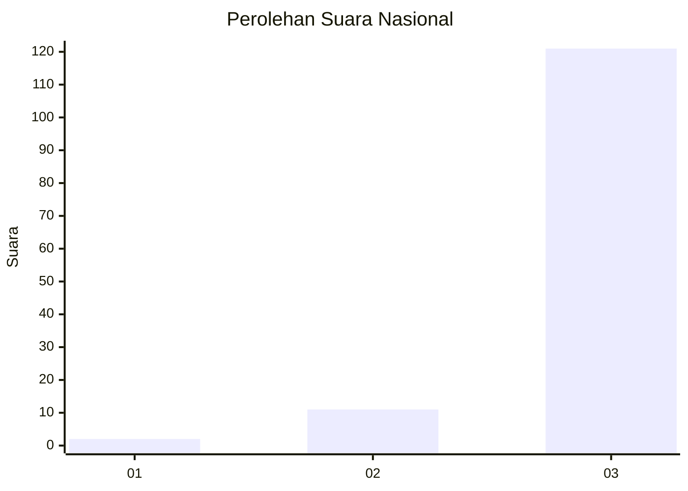
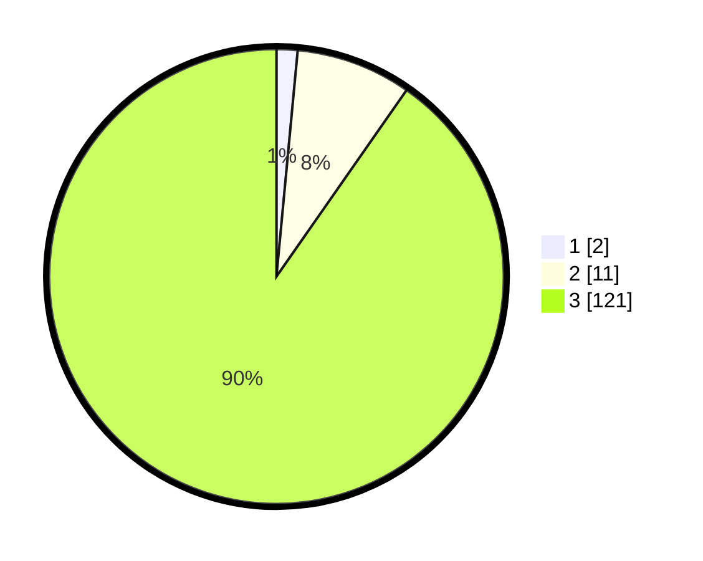

# Hasil

## Grafik

## Tabel

| No. | Nama Paslon    | Suara | Suara (raw) | Persentase |
|:--- |:-------------- | -----:| -----------:| ----------:|
| 1   | ANIES MUHAIMIN | 2     | [2][p-1]    | 1,49       |
| 2   | PRABOWO GIBRAN | 11    | [11][p-2]   | 8,21       |
| 3   | GANJAR MAHFUD  | 121   | [121][p-3]  | 90,30      |

[p-1]: https://github.com/gigit-pemilu/pemilu-2024/blob/main/pilpres/hitung-suara/sub/51-bali/sub/02-tabanan/sub/01-selemadeg/sub/2006-serampingan/sub/004-tps/sub/paslon-1.txt
[p-2]: https://github.com/gigit-pemilu/pemilu-2024/blob/main/pilpres/hitung-suara/sub/51-bali/sub/02-tabanan/sub/01-selemadeg/sub/2006-serampingan/sub/004-tps/sub/paslon-2.txt
[p-3]: https://github.com/gigit-pemilu/pemilu-2024/blob/main/pilpres/hitung-suara/sub/51-bali/sub/02-tabanan/sub/01-selemadeg/sub/2006-serampingan/sub/004-tps/sub/paslon-3.txt

## Foto C Plano

https://sirekap-obj-formc.kpu.go.id/9afa/pemilu/ppwp/51/02/01/20/06/5102012006004-20240214-215727--72f80559-e69c-4c3a-b4c8-875e358e8e04.jpg

https://sirekap-obj-formc.kpu.go.id/9afa/pemilu/ppwp/51/02/01/20/06/5102012006004-20240214-200734--bf17a4b5-9b97-4dd8-b46f-624bcf72da72.jpg

https://sirekap-obj-formc.kpu.go.id/9afa/pemilu/ppwp/51/02/01/20/06/5102012006004-20240214-200936--36bec83a-a840-4d19-bc01-130bd99974d7.jpg

## Metadata

| Key        | Value               |
| ---------- | ------------------- |
| Time Stamp | 2024-02-15 21:30:27 |

## DATA PEMILIH TETAP

Jumlah pemilih dalam DPT: **136**.
 * L: **63**.
 * P: **73**.

## DATA PENGGUNA HAK PILIH

Jumlah pengguna hak pilih dalam DPT: **151**.
 * L: **68**.
 * P: **83**.

Jumlah pengguna hak pilih dalam DPTb: **0**.
 * L: **0**.
 * P: **0**.

Jumlah pengguna hak pilih dalam DPK: **0**.
 * L: **0**.
 * P: **0**.

Jumlah pengguna hak pilih: **151**.
 * L: **68**.
 * P: **83**.

## JUMLAH SUARA SAH DAN TIDAK SAH

JUMLAH SELURUH SUARA SAH: **134**.

JUMLAH SUARA TIDAK SAH: **2**.

JUMLAH SELURUH SUARA SAH DAN SUARA TIDAK SAH: **136**.

