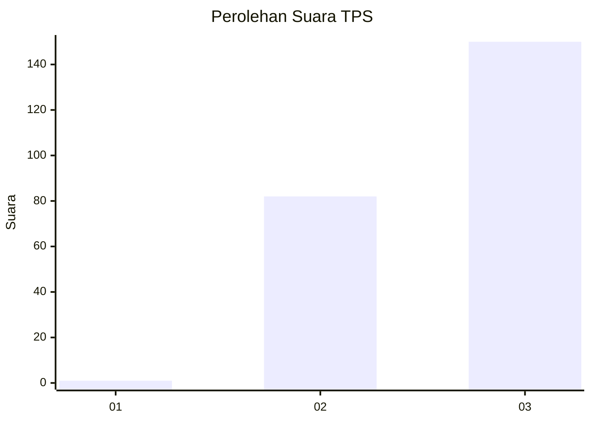
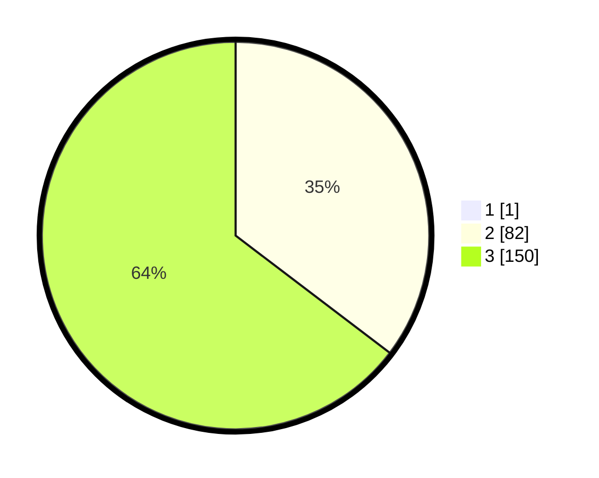

# Hasil

## Grafik

## Tabel

| No. | Nama Paslon    | Suara | Suara (raw) | Persentase |
|:--- |:-------------- | -----:| -----------:| ----------:|
| 1   | ANIES MUHAIMIN | 1     | [1][p-1]    | 0,43       |
| 2   | PRABOWO GIBRAN | 82    | [82][p-2]   | 35,19      |
| 3   | GANJAR MAHFUD  | 150   | [150][p-3]  | 64,38      |

[p-1]: https://github.com/gigit-pemilu/pemilu-2024-51-bali/blob/main/pilpres/hitung-suara/sub/51-bali/sub/02-tabanan/sub/01-selemadeg/sub/2006-serampingan/sub/006-tps/sub/paslon-1.txt
[p-2]: https://github.com/gigit-pemilu/pemilu-2024-51-bali/blob/main/pilpres/hitung-suara/sub/51-bali/sub/02-tabanan/sub/01-selemadeg/sub/2006-serampingan/sub/006-tps/sub/paslon-2.txt
[p-3]: https://github.com/gigit-pemilu/pemilu-2024-51-bali/blob/main/pilpres/hitung-suara/sub/51-bali/sub/02-tabanan/sub/01-selemadeg/sub/2006-serampingan/sub/006-tps/sub/paslon-3.txt

## Foto C Plano

https://sirekap-obj-formc.kpu.go.id/01a8/pemilu/ppwp/51/02/01/20/06/5102012006006-20240216-013831--e230a9d3-eb04-4f43-93e7-440275178a6b.jpg

https://sirekap-obj-formc.kpu.go.id/01a8/pemilu/ppwp/51/02/01/20/06/5102012006006-20240216-013254--de40046a-297c-42c8-81a0-267833017c6e.jpg

https://sirekap-obj-formc.kpu.go.id/01a8/pemilu/ppwp/51/02/01/20/06/5102012006006-20240216-013833--77c3c333-48d3-43f9-8506-e1fa7675f47b.jpg

## Metadata

| Key        | Value               |
| ---------- | ------------------- |
| Time Stamp | 2024-02-16 09:30:28 |

## DATA PEMILIH TETAP

Jumlah pemilih dalam DPT: **271**.
 * L: **125**.
 * P: **146**.

## DATA PENGGUNA HAK PILIH

Jumlah pengguna hak pilih dalam DPT: **236**.
 * L: **114**.
 * P: **122**.

Jumlah pengguna hak pilih dalam DPTb: **0**.
 * L: **0**.
 * P: **0**.

Jumlah pengguna hak pilih dalam DPK: **0**.
 * L: **0**.
 * P: **0**.

Jumlah pengguna hak pilih: **0**.
 * L: **0**.
 * P: **0**.

## JUMLAH SUARA SAH DAN TIDAK SAH

JUMLAH SELURUH SUARA SAH: **233**.

JUMLAH SUARA TIDAK SAH: **3**.

JUMLAH SELURUH SUARA SAH DAN SUARA TIDAK SAH: **236**.

