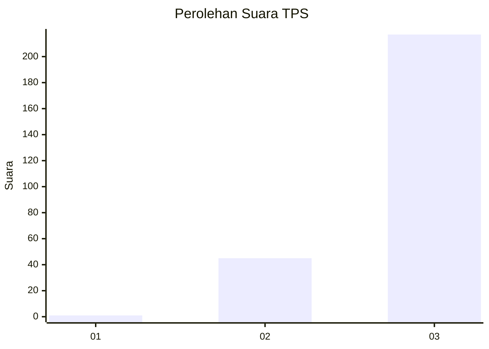
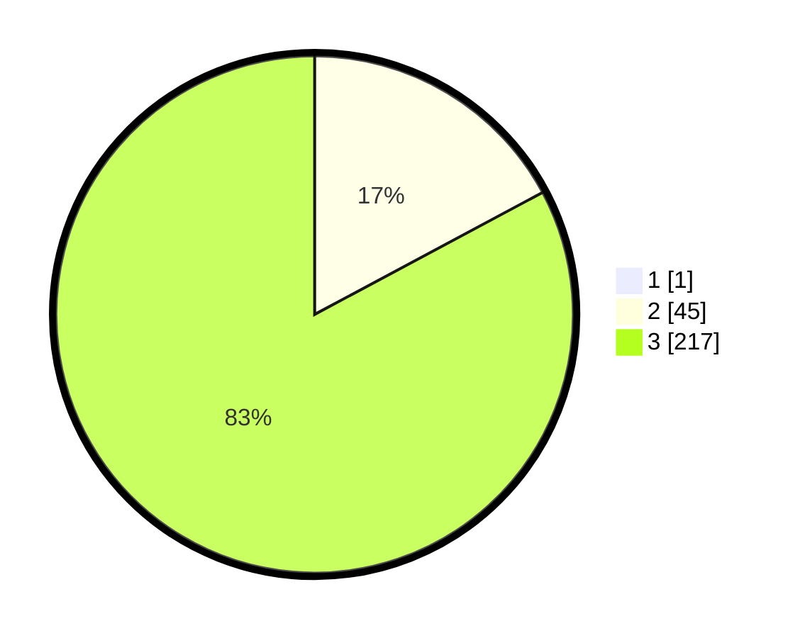

# Hasil

## Grafik

## Tabel

| No. | Nama Paslon    | Suara | Suara (raw) | Persentase |
|:--- |:-------------- | -----:| -----------:| ----------:|
| 1   | ANIES MUHAIMIN | 1     | [1][p-1]    | 0,38       |
| 2   | PRABOWO GIBRAN | 45    | [45][p-2]   | 17,11      |
| 3   | GANJAR MAHFUD  | 217   | [217][p-3]  | 82,51      |

[p-1]: https://github.com/gigit-pemilu/pemilu-2024-51-bali/blob/main/pilpres/hitung-suara/sub/51-bali/sub/02-tabanan/sub/01-selemadeg/sub/2007-antap/sub/001-tps/sub/paslon-1.txt
[p-2]: https://github.com/gigit-pemilu/pemilu-2024-51-bali/blob/main/pilpres/hitung-suara/sub/51-bali/sub/02-tabanan/sub/01-selemadeg/sub/2007-antap/sub/001-tps/sub/paslon-2.txt
[p-3]: https://github.com/gigit-pemilu/pemilu-2024-51-bali/blob/main/pilpres/hitung-suara/sub/51-bali/sub/02-tabanan/sub/01-selemadeg/sub/2007-antap/sub/001-tps/sub/paslon-3.txt

## Foto C Plano

https://sirekap-obj-formc.kpu.go.id/1004/pemilu/ppwp/51/02/01/20/07/5102012007001-20240214-204902--dac657a6-cecb-467a-b956-185464acdebc.jpg

https://sirekap-obj-formc.kpu.go.id/1004/pemilu/ppwp/51/02/01/20/07/5102012007001-20240214-204946--471a33fb-675d-4ddf-9ecf-02b7640f1e50.jpg

https://sirekap-obj-formc.kpu.go.id/1004/pemilu/ppwp/51/02/01/20/07/5102012007001-20240214-205034--5e6b141b-d573-4e99-bfd8-d5e8a5a23c84.jpg

## Metadata

| Key        | Value               |
| ---------- | ------------------- |
| Time Stamp | 2024-02-19 06:16:00 |

## DATA PEMILIH TETAP

Jumlah pemilih dalam DPT: **291**.
 * L: **146**.
 * P: **145**.

## DATA PENGGUNA HAK PILIH

Jumlah pengguna hak pilih dalam DPT: **263**.
 * L: **132**.
 * P: **131**.

Jumlah pengguna hak pilih dalam DPTb: **0**.
 * L: **0**.
 * P: **0**.

Jumlah pengguna hak pilih dalam DPK: **1**.
 * L: **0**.
 * P: **1**.

Jumlah pengguna hak pilih: **264**.
 * L: **132**.
 * P: **132**.

## JUMLAH SUARA SAH DAN TIDAK SAH

JUMLAH SELURUH SUARA SAH: **263**.

JUMLAH SUARA TIDAK SAH: **1**.

JUMLAH SELURUH SUARA SAH DAN SUARA TIDAK SAH: **264**.

