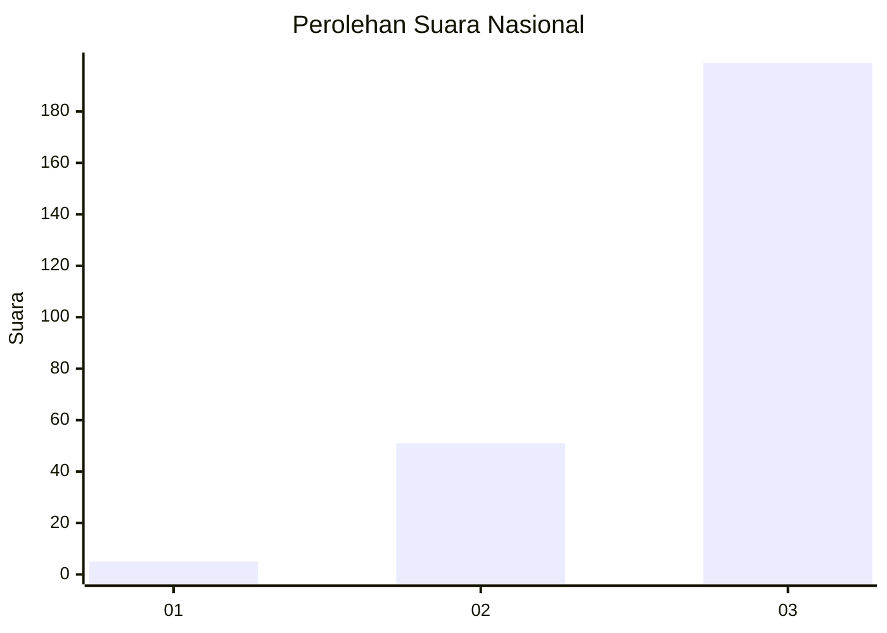
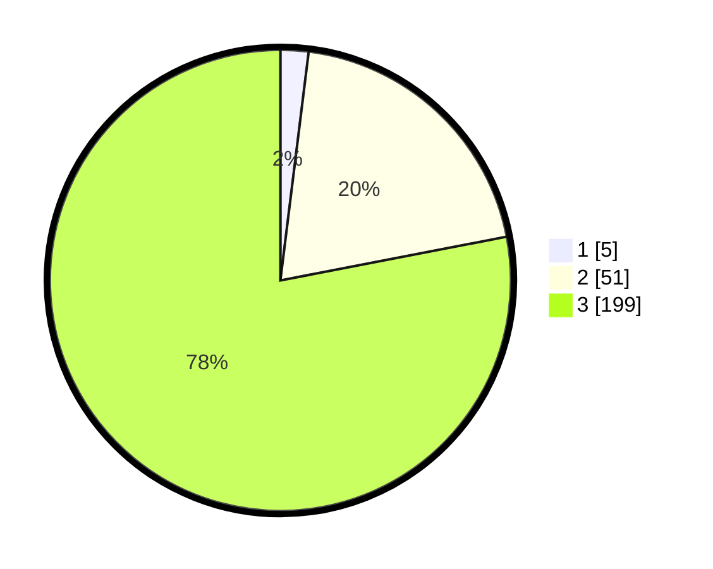

# Hasil

## Grafik

## Tabel

| No. | Nama Paslon    | Suara | Suara (raw) | Persentase |
|:--- |:-------------- | -----:| -----------:| ----------:|
| 1   | ANIES MUHAIMIN | 5     | [5][p-1]    | 1,96       |
| 2   | PRABOWO GIBRAN | 51    | [51][p-2]   | 20,00      |
| 3   | GANJAR MAHFUD  | 199   | [199][p-3]  | 78,04      |

[p-1]: https://github.com/gigit-pemilu/pemilu-2024/blob/main/pilpres/hitung-suara/sub/51-bali/sub/02-tabanan/sub/01-selemadeg/sub/2007-antap/sub/002-tps/sub/paslon-1.txt
[p-2]: https://github.com/gigit-pemilu/pemilu-2024/blob/main/pilpres/hitung-suara/sub/51-bali/sub/02-tabanan/sub/01-selemadeg/sub/2007-antap/sub/002-tps/sub/paslon-2.txt
[p-3]: https://github.com/gigit-pemilu/pemilu-2024/blob/main/pilpres/hitung-suara/sub/51-bali/sub/02-tabanan/sub/01-selemadeg/sub/2007-antap/sub/002-tps/sub/paslon-3.txt

## Foto C Plano

https://sirekap-obj-formc.kpu.go.id/245b/pemilu/ppwp/51/02/01/20/07/5102012007002-20240214-130940--632541c0-973a-45cd-b111-4112b882f115.jpg

https://sirekap-obj-formc.kpu.go.id/245b/pemilu/ppwp/51/02/01/20/07/5102012007002-20240214-131020--c1e5d665-c3ac-4b78-a4be-017857e9a392.jpg

https://sirekap-obj-formc.kpu.go.id/245b/pemilu/ppwp/51/02/01/20/07/5102012007002-20240214-131137--2b307d0e-f934-4e24-a71f-a2f2c4bfd916.jpg

## Metadata

| Key        | Value               |
| ---------- | ------------------- |
| Time Stamp | 2024-02-14 21:46:01 |

## DATA PEMILIH TETAP

Jumlah pemilih dalam DPT: **296**.
 * L: **152**.
 * P: **144**.

## DATA PENGGUNA HAK PILIH

Jumlah pengguna hak pilih dalam DPT: **255**.
 * L: **132**.
 * P: **123**.

Jumlah pengguna hak pilih dalam DPTb: **0**.
 * L: **0**.
 * P: **0**.

Jumlah pengguna hak pilih dalam DPK: **0**.
 * L: **0**.
 * P: **0**.

Jumlah pengguna hak pilih: **255**.
 * L: **132**.
 * P: **123**.

## JUMLAH SUARA SAH DAN TIDAK SAH

JUMLAH SELURUH SUARA SAH: **255**.

JUMLAH SUARA TIDAK SAH: **0**.

JUMLAH SELURUH SUARA SAH DAN SUARA TIDAK SAH: **255**.

