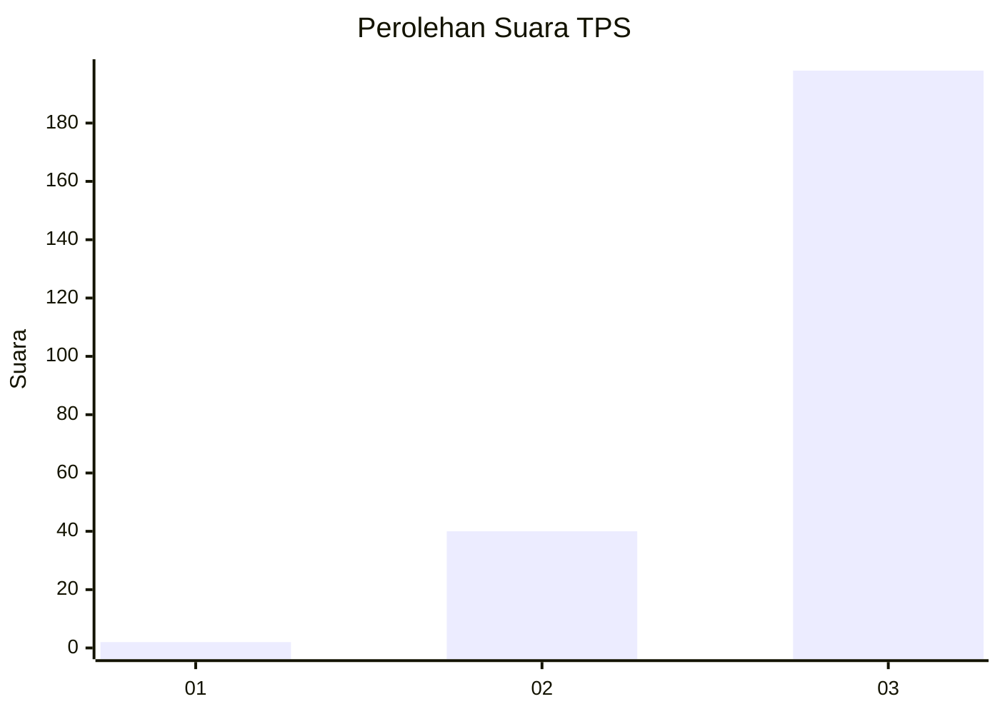
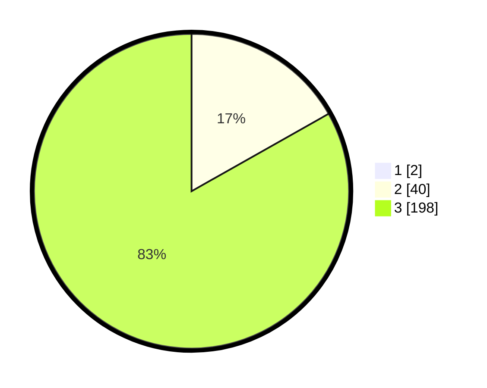

# Hasil

## Grafik

## Tabel

| No. | Nama Paslon    | Suara | Suara (raw) | Persentase |
|:--- |:-------------- | -----:| -----------:| ----------:|
| 1   | ANIES MUHAIMIN | 2     | [2][p-1]    | 0,83       |
| 2   | PRABOWO GIBRAN | 40    | [40][p-2]   | 16,67      |
| 3   | GANJAR MAHFUD  | 198   | [198][p-3]  | 82,50      |

[p-1]: https://github.com/gigit-pemilu/pemilu-2024-51-bali/blob/main/pilpres/hitung-suara/sub/51-bali/sub/02-tabanan/sub/01-selemadeg/sub/2007-antap/sub/003-tps/sub/paslon-1.txt
[p-2]: https://github.com/gigit-pemilu/pemilu-2024-51-bali/blob/main/pilpres/hitung-suara/sub/51-bali/sub/02-tabanan/sub/01-selemadeg/sub/2007-antap/sub/003-tps/sub/paslon-2.txt
[p-3]: https://github.com/gigit-pemilu/pemilu-2024-51-bali/blob/main/pilpres/hitung-suara/sub/51-bali/sub/02-tabanan/sub/01-selemadeg/sub/2007-antap/sub/003-tps/sub/paslon-3.txt

## Foto C Plano

https://sirekap-obj-formc.kpu.go.id/1d0e/pemilu/ppwp/51/02/01/20/07/5102012007003-20240215-000748--6476e380-47db-4270-92d4-f94f02e65a9e.jpg

https://sirekap-obj-formc.kpu.go.id/1d0e/pemilu/ppwp/51/02/01/20/07/5102012007003-20240215-001027--c37427b3-e0e5-4d58-b095-a2430f5ae07f.jpg

https://sirekap-obj-formc.kpu.go.id/1d0e/pemilu/ppwp/51/02/01/20/07/5102012007003-20240215-000946--c0a460ce-e324-4d7a-b831-9c823ce26cc5.jpg

## Metadata

| Key        | Value               |
| ---------- | ------------------- |
| Time Stamp | 2024-02-19 15:00:00 |

## DATA PEMILIH TETAP

Jumlah pemilih dalam DPT: **295**.
 * L: **140**.
 * P: **155**.

## DATA PENGGUNA HAK PILIH

Jumlah pengguna hak pilih dalam DPT: **241**.
 * L: **113**.
 * P: **128**.

Jumlah pengguna hak pilih dalam DPTb: **0**.
 * L: **0**.
 * P: **0**.

Jumlah pengguna hak pilih dalam DPK: **0**.
 * L: **0**.
 * P: **0**.

Jumlah pengguna hak pilih: **241**.
 * L: **113**.
 * P: **128**.

## JUMLAH SUARA SAH DAN TIDAK SAH

JUMLAH SELURUH SUARA SAH: **240**.

JUMLAH SUARA TIDAK SAH: **1**.

JUMLAH SELURUH SUARA SAH DAN SUARA TIDAK SAH: **241**.

