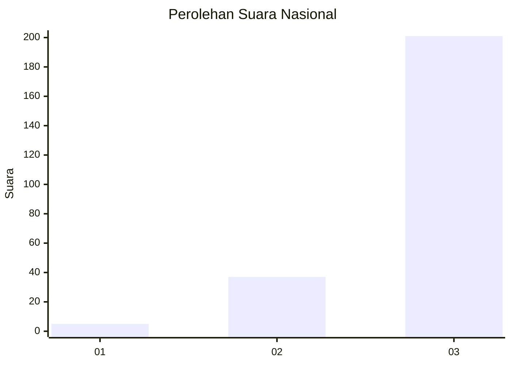
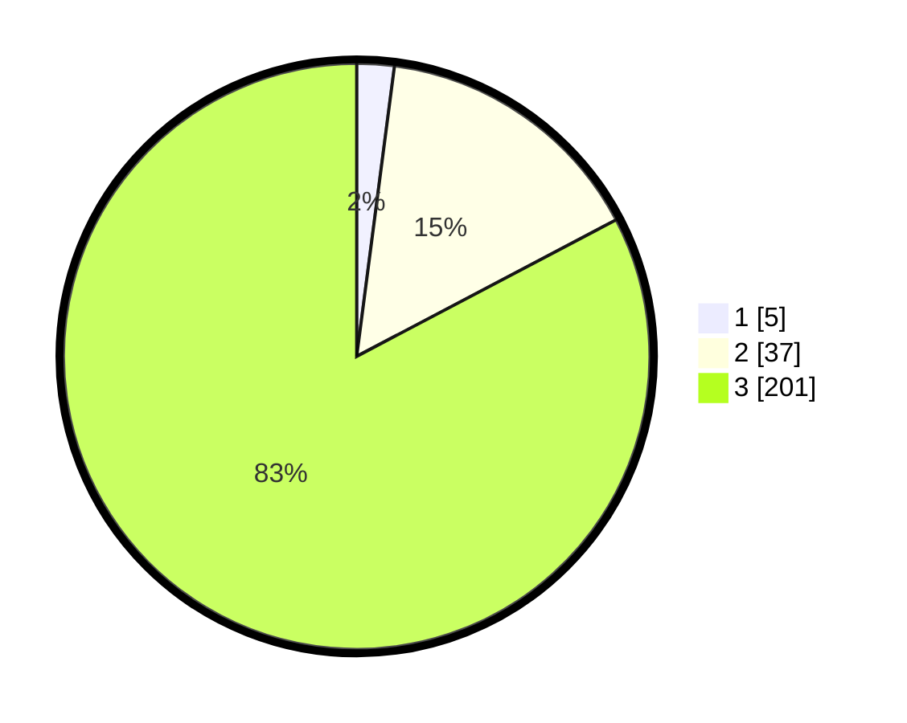

# Hasil

## Grafik

## Tabel

| No. | Nama Paslon    | Suara | Suara (raw) | Persentase |
|:--- |:-------------- | -----:| -----------:| ----------:|
| 1   | ANIES MUHAIMIN | 5     | [5][p-1]    | 2,06       |
| 2   | PRABOWO GIBRAN | 37    | [37][p-2]   | 15,23      |
| 3   | GANJAR MAHFUD  | 201   | [201][p-3]  | 82,72      |

[p-1]: https://github.com/gigit-pemilu/pemilu-2024/blob/main/pilpres/hitung-suara/sub/51-bali/sub/02-tabanan/sub/01-selemadeg/sub/2007-antap/sub/004-tps/sub/paslon-1.txt
[p-2]: https://github.com/gigit-pemilu/pemilu-2024/blob/main/pilpres/hitung-suara/sub/51-bali/sub/02-tabanan/sub/01-selemadeg/sub/2007-antap/sub/004-tps/sub/paslon-2.txt
[p-3]: https://github.com/gigit-pemilu/pemilu-2024/blob/main/pilpres/hitung-suara/sub/51-bali/sub/02-tabanan/sub/01-selemadeg/sub/2007-antap/sub/004-tps/sub/paslon-3.txt

## Foto C Plano

https://sirekap-obj-formc.kpu.go.id/b7c9/pemilu/ppwp/51/02/01/20/07/5102012007004-20240215-005853--3687a5ac-21b0-4aa7-b46e-fd1955e451fc.jpg

https://sirekap-obj-formc.kpu.go.id/b7c9/pemilu/ppwp/51/02/01/20/07/5102012007004-20240215-005950--905352f4-b68e-4c63-8c2c-71fe8d9c13de.jpg

https://sirekap-obj-formc.kpu.go.id/b7c9/pemilu/ppwp/51/02/01/20/07/5102012007004-20240215-010038--88d7c96e-7a95-48ec-bd2d-166b3be84eb7.jpg

## Metadata

| Key        | Value               |
| ---------- | ------------------- |
| Time Stamp | 2024-02-15 12:00:28 |

## DATA PEMILIH TETAP

Jumlah pemilih dalam DPT: **300**.
 * L: **144**.
 * P: **156**.

## DATA PENGGUNA HAK PILIH

Jumlah pengguna hak pilih dalam DPT: **249**.
 * L: **120**.
 * P: **129**.

Jumlah pengguna hak pilih dalam DPTb: **1**.
 * L: **1**.
 * P: **0**.

Jumlah pengguna hak pilih dalam DPK: **0**.
 * L: **0**.
 * P: **0**.

Jumlah pengguna hak pilih: **250**.
 * L: **121**.
 * P: **129**.

## JUMLAH SUARA SAH DAN TIDAK SAH

JUMLAH SELURUH SUARA SAH: **243**.

JUMLAH SUARA TIDAK SAH: **7**.

JUMLAH SELURUH SUARA SAH DAN SUARA TIDAK SAH: **250**.

