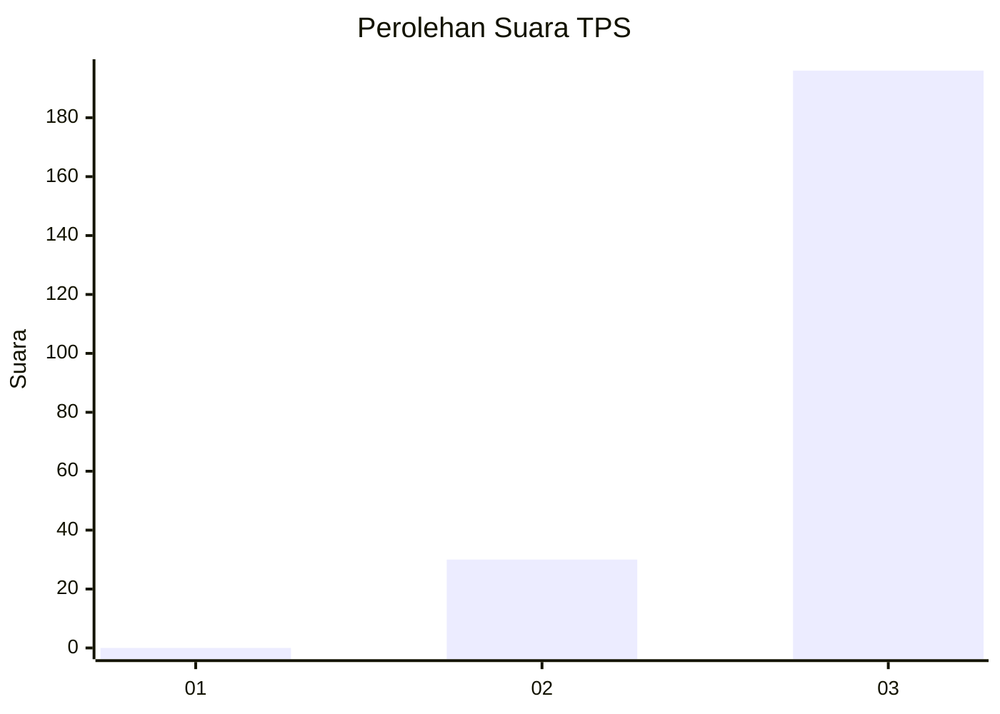
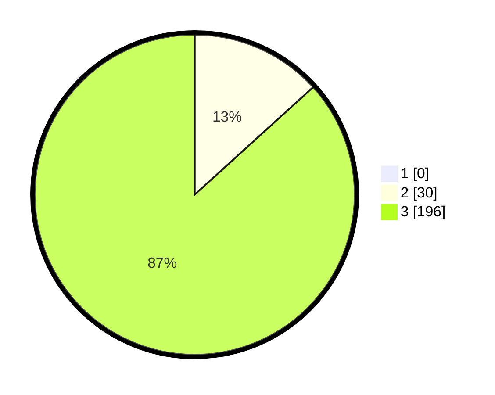

# Hasil

## Grafik

## Tabel

| No. | Nama Paslon    | Suara | Suara (raw) | Persentase |
|:--- |:-------------- | -----:| -----------:| ----------:|
| 1   | ANIES MUHAIMIN | 0     | [0][p-1]    | 0,00       |
| 2   | PRABOWO GIBRAN | 30    | [30][p-2]   | 13,27      |
| 3   | GANJAR MAHFUD  | 196   | [196][p-3]  | 86,73      |

[p-1]: https://github.com/gigit-pemilu/pemilu-2024-51-bali/blob/main/pilpres/hitung-suara/sub/51-bali/sub/02-tabanan/sub/01-selemadeg/sub/2007-antap/sub/007-tps/sub/paslon-1.txt
[p-2]: https://github.com/gigit-pemilu/pemilu-2024-51-bali/blob/main/pilpres/hitung-suara/sub/51-bali/sub/02-tabanan/sub/01-selemadeg/sub/2007-antap/sub/007-tps/sub/paslon-2.txt
[p-3]: https://github.com/gigit-pemilu/pemilu-2024-51-bali/blob/main/pilpres/hitung-suara/sub/51-bali/sub/02-tabanan/sub/01-selemadeg/sub/2007-antap/sub/007-tps/sub/paslon-3.txt

## Foto C Plano

https://sirekap-obj-formc.kpu.go.id/6860/pemilu/ppwp/51/02/01/20/07/5102012007007-20240214-141524--e9e4d506-6530-4f2d-a212-1a9809da3f08.jpg

https://sirekap-obj-formc.kpu.go.id/6860/pemilu/ppwp/51/02/01/20/07/5102012007007-20240214-141258--6385bf29-e3ff-41ad-b3e5-f0fa3f658de4.jpg

https://sirekap-obj-formc.kpu.go.id/6860/pemilu/ppwp/51/02/01/20/07/5102012007007-20240214-141809--d8dc1710-1ea7-46ba-815f-32328883d231.jpg

## Metadata

| Key        | Value               |
| ---------- | ------------------- |
| Time Stamp | 2024-02-14 21:46:01 |

## DATA PEMILIH TETAP

Jumlah pemilih dalam DPT: **246**.
 * L: **124**.
 * P: **122**.

## DATA PENGGUNA HAK PILIH

Jumlah pengguna hak pilih dalam DPT: **226**.
 * L: **113**.
 * P: **113**.

Jumlah pengguna hak pilih dalam DPTb: **1**.
 * L: **0**.
 * P: **1**.

Jumlah pengguna hak pilih dalam DPK: **0**.
 * L: **0**.
 * P: **0**.

Jumlah pengguna hak pilih: **227**.
 * L: **113**.
 * P: **114**.

## JUMLAH SUARA SAH DAN TIDAK SAH

JUMLAH SELURUH SUARA SAH: **226**.

JUMLAH SUARA TIDAK SAH: **1**.

JUMLAH SELURUH SUARA SAH DAN SUARA TIDAK SAH: **227**.

