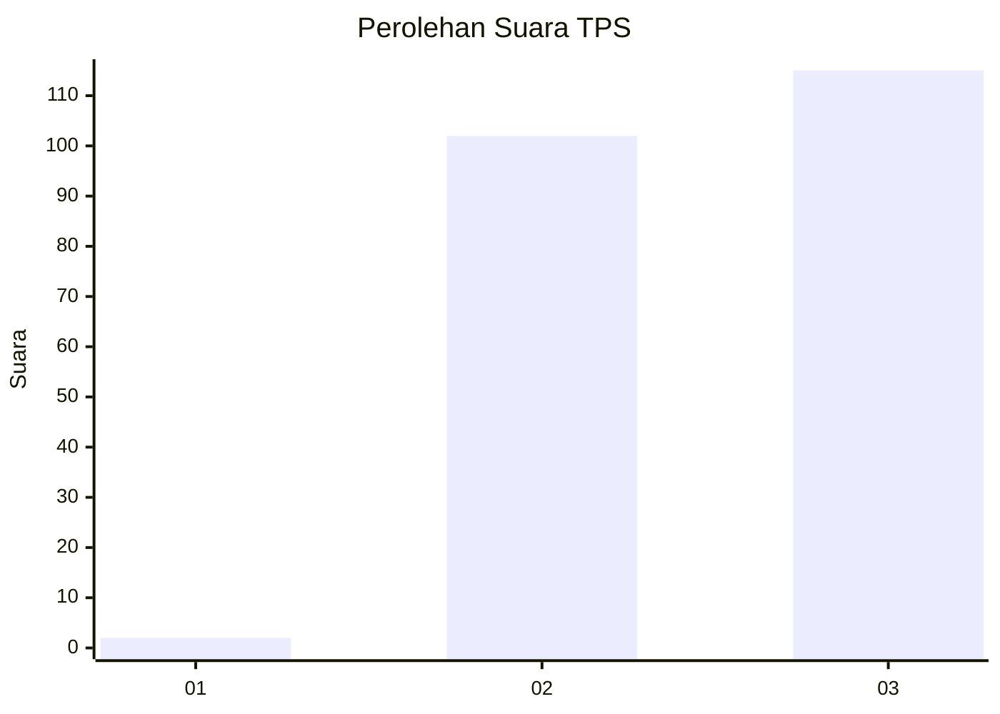
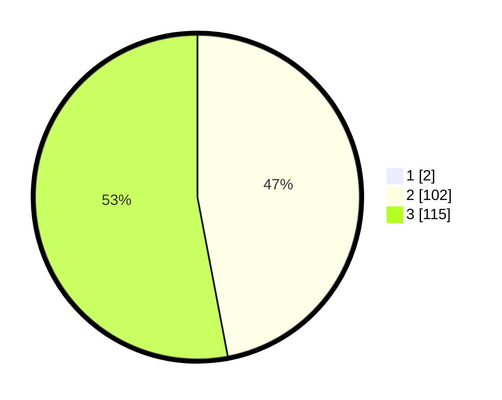

# Hasil

## Grafik

## Tabel

| No. | Nama Paslon    | Suara | Suara (raw) | Persentase |
|:--- |:-------------- | -----:| -----------:| ----------:|
| 1   | ANIES MUHAIMIN | 2     | [2][p-1]    | 0,91       |
| 2   | PRABOWO GIBRAN | 102   | [102][p-2]  | 46,58      |
| 3   | GANJAR MAHFUD  | 115   | [115][p-3]  | 52,51      |

[p-1]: https://github.com/gigit-pemilu/pemilu-2024-51-bali/blob/main/pilpres/hitung-suara/sub/51-bali/sub/02-tabanan/sub/01-selemadeg/sub/2007-antap/sub/009-tps/sub/paslon-1.txt
[p-2]: https://github.com/gigit-pemilu/pemilu-2024-51-bali/blob/main/pilpres/hitung-suara/sub/51-bali/sub/02-tabanan/sub/01-selemadeg/sub/2007-antap/sub/009-tps/sub/paslon-2.txt
[p-3]: https://github.com/gigit-pemilu/pemilu-2024-51-bali/blob/main/pilpres/hitung-suara/sub/51-bali/sub/02-tabanan/sub/01-selemadeg/sub/2007-antap/sub/009-tps/sub/paslon-3.txt

## Foto C Plano

https://sirekap-obj-formc.kpu.go.id/0d74/pemilu/ppwp/51/02/01/20/07/5102012007009-20240215-012956--aab2542f-290a-4211-8701-418cfd68e1b8.jpg

https://sirekap-obj-formc.kpu.go.id/0d74/pemilu/ppwp/51/02/01/20/07/5102012007009-20240215-013034--2723b712-cb3b-4240-a437-2d5325d42bd1.jpg

https://sirekap-obj-formc.kpu.go.id/0d74/pemilu/ppwp/51/02/01/20/07/5102012007009-20240214-222215--f64f6084-e525-4fba-b38c-f7ae9655fc3f.jpg

## Metadata

| Key        | Value               |
| ---------- | ------------------- |
| Time Stamp | 2024-02-15 21:30:27 |

