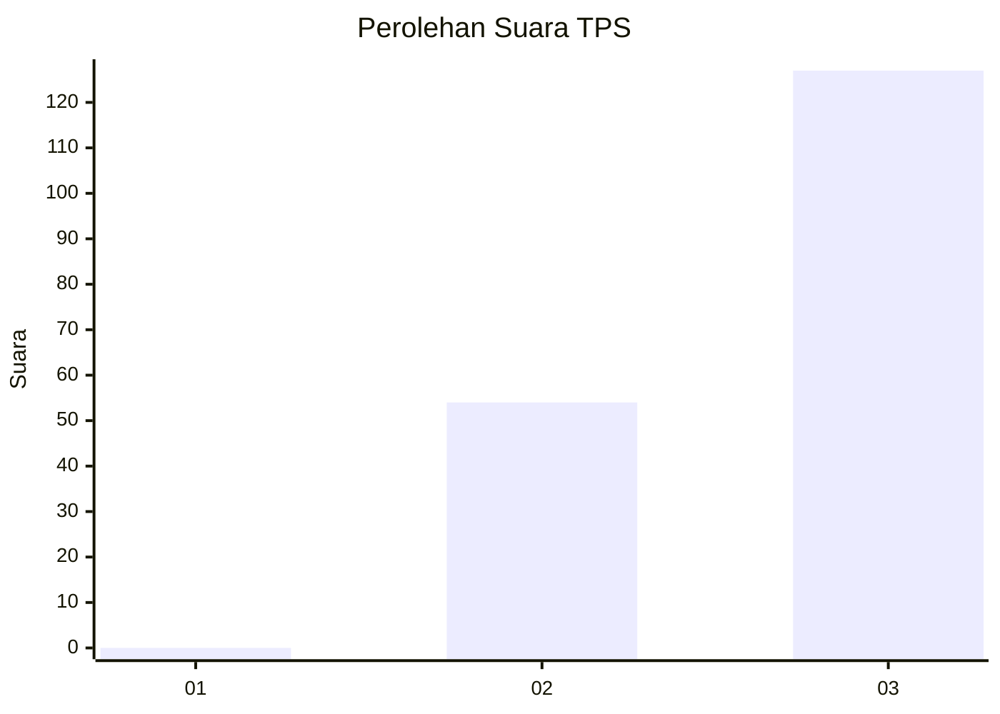
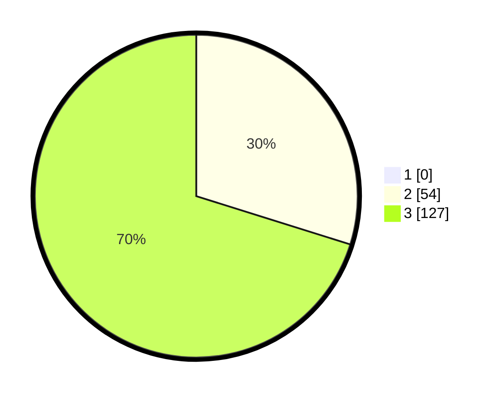

# Hasil

## Grafik

## Tabel

| No. | Nama Paslon    | Suara | Suara (raw) | Persentase |
|:--- |:-------------- | -----:| -----------:| ----------:|
| 1   | ANIES MUHAIMIN | 0     | [0][p-1]    | 0,00       |
| 2   | PRABOWO GIBRAN | 54    | [54][p-2]   | 29,83      |
| 3   | GANJAR MAHFUD  | 127   | [127][p-3]  | 70,17      |

[p-1]: https://github.com/gigit-pemilu/pemilu-2024-51-bali/blob/main/pilpres/hitung-suara/sub/51-bali/sub/02-tabanan/sub/01-selemadeg/sub/2008-wanagiri-kauh/sub/004-tps/sub/paslon-1.txt
[p-2]: https://github.com/gigit-pemilu/pemilu-2024-51-bali/blob/main/pilpres/hitung-suara/sub/51-bali/sub/02-tabanan/sub/01-selemadeg/sub/2008-wanagiri-kauh/sub/004-tps/sub/paslon-2.txt
[p-3]: https://github.com/gigit-pemilu/pemilu-2024-51-bali/blob/main/pilpres/hitung-suara/sub/51-bali/sub/02-tabanan/sub/01-selemadeg/sub/2008-wanagiri-kauh/sub/004-tps/sub/paslon-3.txt

## Foto C Plano

https://sirekap-obj-formc.kpu.go.id/081a/pemilu/ppwp/51/02/01/20/08/5102012008004-20240214-132721--dc271757-d7c0-4e92-ba12-bde4ac2c9cc8.jpg

https://sirekap-obj-formc.kpu.go.id/081a/pemilu/ppwp/51/02/01/20/08/5102012008004-20240214-133014--dcfc8080-7e68-41f3-aa05-407b27c732e2.jpg

https://sirekap-obj-formc.kpu.go.id/081a/pemilu/ppwp/51/02/01/20/08/5102012008004-20240214-133352--7a5912b0-7c99-41ac-8964-f955c94cd50c.jpg

## Metadata

| Key        | Value               |
| ---------- | ------------------- |
| Time Stamp | 2024-02-14 21:46:01 |

## DATA PEMILIH TETAP

Jumlah pemilih dalam DPT: **193**.
 * L: **95**.
 * P: **98**.

## DATA PENGGUNA HAK PILIH

Jumlah pengguna hak pilih dalam DPT: **181**.
 * L: **87**.
 * P: **94**.

Jumlah pengguna hak pilih dalam DPTb: **0**.
 * L: **0**.
 * P: **0**.

Jumlah pengguna hak pilih dalam DPK: **0**.
 * L: **0**.
 * P: **0**.

Jumlah pengguna hak pilih: **181**.
 * L: **87**.
 * P: **94**.

## JUMLAH SUARA SAH DAN TIDAK SAH

JUMLAH SELURUH SUARA SAH: **181**.

JUMLAH SUARA TIDAK SAH: **0**.

JUMLAH SELURUH SUARA SAH DAN SUARA TIDAK SAH: **181**.

