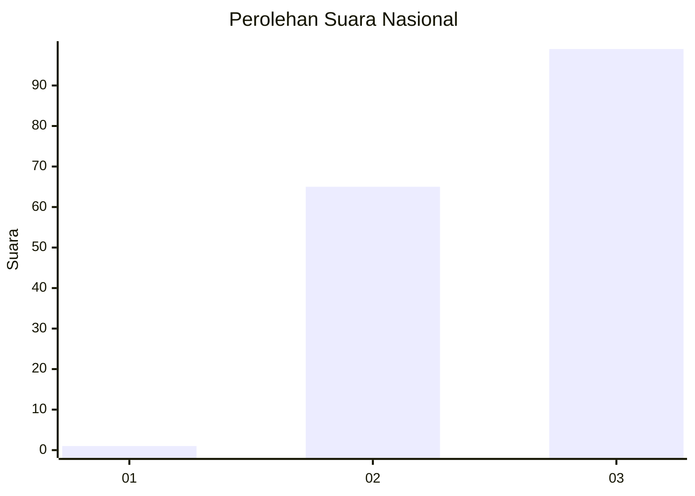
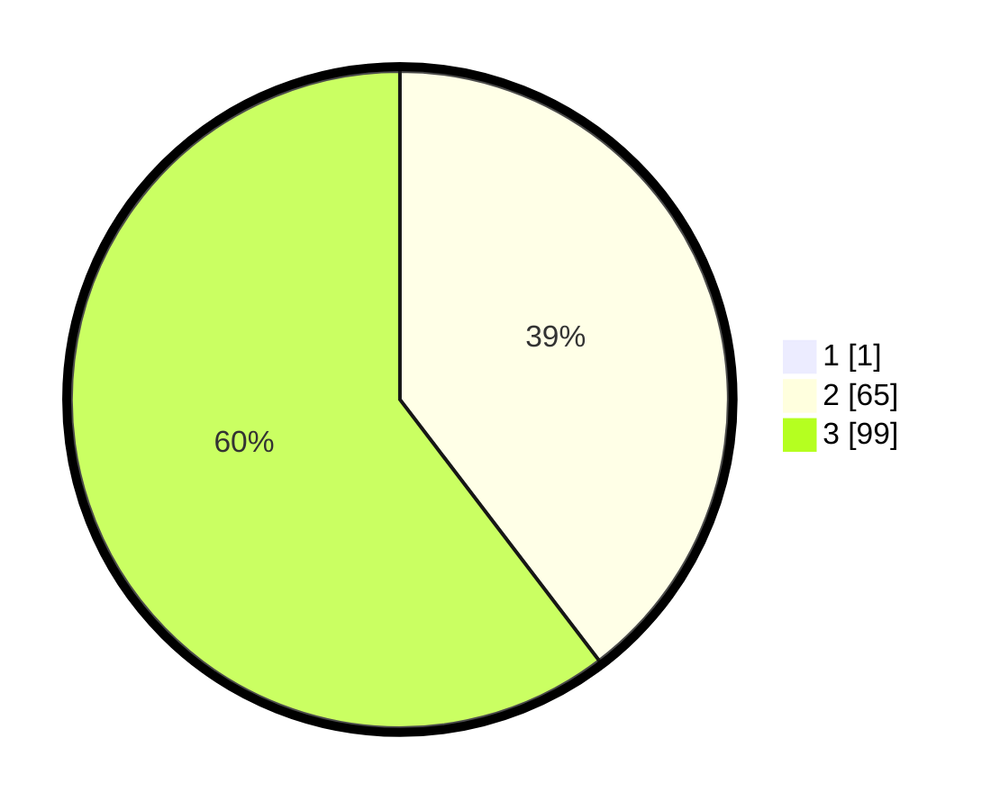

# Hasil

## Grafik

## Tabel

| No. | Nama Paslon    | Suara | Suara (raw) | Persentase |
|:--- |:-------------- | -----:| -----------:| ----------:|
| 1   | ANIES MUHAIMIN | 1     | [1][p-1]    | 0,61       |
| 2   | PRABOWO GIBRAN | 65    | [65][p-2]   | 39,39      |
| 3   | GANJAR MAHFUD  | 99    | [99][p-3]   | 60,00      |

[p-1]: https://github.com/gigit-pemilu/pemilu-2024/blob/main/pilpres/hitung-suara/sub/51-bali/sub/02-tabanan/sub/01-selemadeg/sub/2008-wanagiri-kauh/sub/005-tps/sub/paslon-1.txt
[p-2]: https://github.com/gigit-pemilu/pemilu-2024/blob/main/pilpres/hitung-suara/sub/51-bali/sub/02-tabanan/sub/01-selemadeg/sub/2008-wanagiri-kauh/sub/005-tps/sub/paslon-2.txt
[p-3]: https://github.com/gigit-pemilu/pemilu-2024/blob/main/pilpres/hitung-suara/sub/51-bali/sub/02-tabanan/sub/01-selemadeg/sub/2008-wanagiri-kauh/sub/005-tps/sub/paslon-3.txt

## Foto C Plano

https://sirekap-obj-formc.kpu.go.id/fd96/pemilu/ppwp/51/02/01/20/08/5102012008005-20240214-131938--207e0d55-e5dc-408b-b296-22c9801e098b.jpg

https://sirekap-obj-formc.kpu.go.id/fd96/pemilu/ppwp/51/02/01/20/08/5102012008005-20240214-132304--ca223efa-d565-4c99-8c38-b27857e8c59a.jpg

https://sirekap-obj-formc.kpu.go.id/fd96/pemilu/ppwp/51/02/01/20/08/5102012008005-20240214-132551--9f78d7d3-557a-41c5-8fa6-71f730cbe92d.jpg

## Metadata

| Key        | Value               |
| ---------- | ------------------- |
| Time Stamp | 2024-02-15 21:30:27 |

## DATA PEMILIH TETAP

Jumlah pemilih dalam DPT: **174**.
 * L: **84**.
 * P: **90**.

## DATA PENGGUNA HAK PILIH

Jumlah pengguna hak pilih dalam DPT: **165**.
 * L: **81**.
 * P: **84**.

Jumlah pengguna hak pilih dalam DPTb: **0**.
 * L: **0**.
 * P: **0**.

Jumlah pengguna hak pilih dalam DPK: **0**.
 * L: **0**.
 * P: **0**.

Jumlah pengguna hak pilih: **165**.
 * L: **81**.
 * P: **84**.

## JUMLAH SUARA SAH DAN TIDAK SAH

JUMLAH SELURUH SUARA SAH: **165**.

JUMLAH SUARA TIDAK SAH: **0**.

JUMLAH SELURUH SUARA SAH DAN SUARA TIDAK SAH: **165**.

