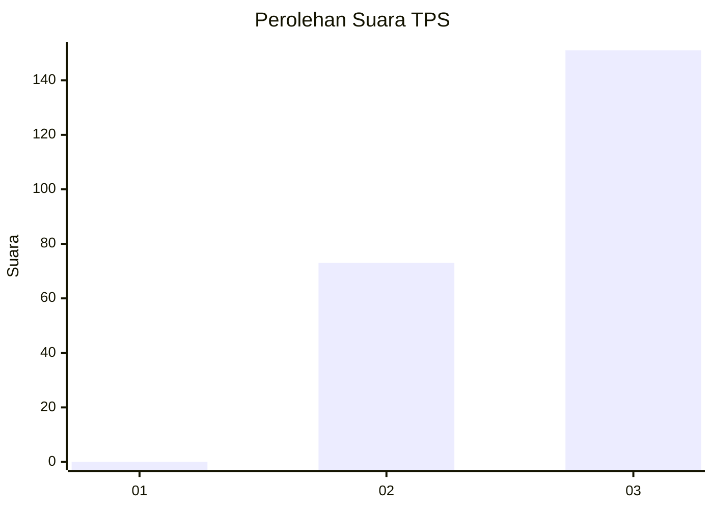
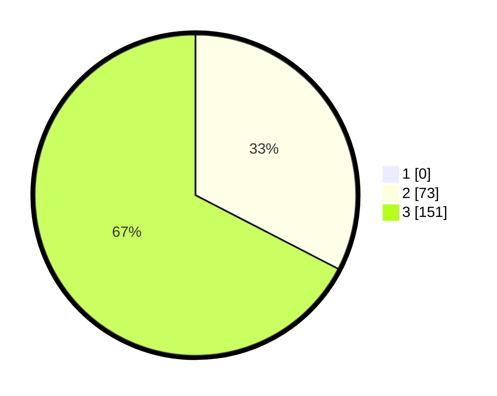

# Hasil

## Grafik

## Tabel

| No. | Nama Paslon    | Suara | Suara (raw) | Persentase |
|:--- |:-------------- | -----:| -----------:| ----------:|
| 1   | ANIES MUHAIMIN | 0     | [0][p-1]    | 0,00       |
| 2   | PRABOWO GIBRAN | 73    | [73][p-2]   | 32,59      |
| 3   | GANJAR MAHFUD  | 151   | [151][p-3]  | 67,41      |

[p-1]: https://github.com/gigit-pemilu/pemilu-2024-51-bali/blob/main/pilpres/hitung-suara/sub/51-bali/sub/02-tabanan/sub/01-selemadeg/sub/2008-wanagiri-kauh/sub/006-tps/sub/paslon-1.txt
[p-2]: https://github.com/gigit-pemilu/pemilu-2024-51-bali/blob/main/pilpres/hitung-suara/sub/51-bali/sub/02-tabanan/sub/01-selemadeg/sub/2008-wanagiri-kauh/sub/006-tps/sub/paslon-2.txt
[p-3]: https://github.com/gigit-pemilu/pemilu-2024-51-bali/blob/main/pilpres/hitung-suara/sub/51-bali/sub/02-tabanan/sub/01-selemadeg/sub/2008-wanagiri-kauh/sub/006-tps/sub/paslon-3.txt

## Foto C Plano

https://sirekap-obj-formc.kpu.go.id/ac20/pemilu/ppwp/51/02/01/20/08/5102012008006-20240214-125304--7010489e-6990-4bde-9ac3-7cff309b84c9.jpg

https://sirekap-obj-formc.kpu.go.id/ac20/pemilu/ppwp/51/02/01/20/08/5102012008006-20240214-130001--d87ad57c-46d8-43f5-9564-e7059462f733.jpg

https://sirekap-obj-formc.kpu.go.id/ac20/pemilu/ppwp/51/02/01/20/08/5102012008006-20240214-130237--69b0ceca-f098-4f6d-b5c5-47ea0ed8dbf8.jpg

## Metadata

| Key        | Value               |
| ---------- | ------------------- |
| Time Stamp | 2024-02-14 21:46:01 |

## DATA PEMILIH TETAP

Jumlah pemilih dalam DPT: **238**.
 * L: **119**.
 * P: **119**.

## DATA PENGGUNA HAK PILIH

Jumlah pengguna hak pilih dalam DPT: **233**.
 * L: **117**.
 * P: **116**.

Jumlah pengguna hak pilih dalam DPTb: **0**.
 * L: **0**.
 * P: **0**.

Jumlah pengguna hak pilih dalam DPK: **0**.
 * L: **0**.
 * P: **0**.

Jumlah pengguna hak pilih: **233**.
 * L: **117**.
 * P: **116**.

## JUMLAH SUARA SAH DAN TIDAK SAH

JUMLAH SELURUH SUARA SAH: **224**.

JUMLAH SUARA TIDAK SAH: **9**.

JUMLAH SELURUH SUARA SAH DAN SUARA TIDAK SAH: **233**.

