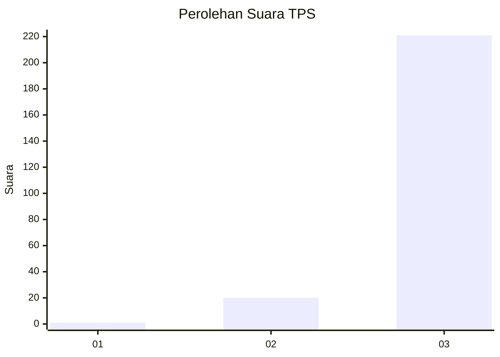
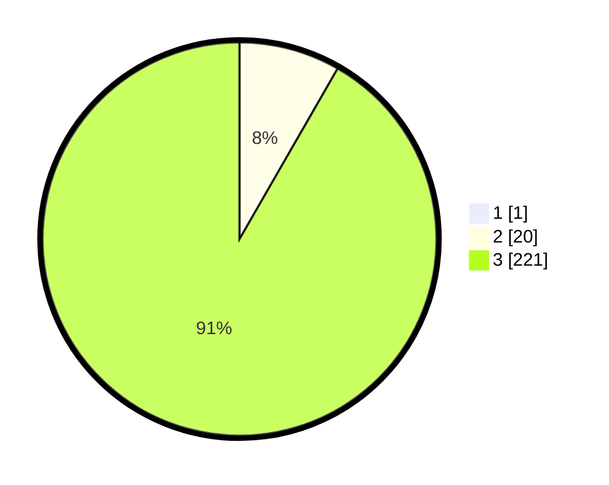

# Hasil

## Grafik

## Tabel

| No. | Nama Paslon    | Suara | Suara (raw) | Persentase |
|:--- |:-------------- | -----:| -----------:| ----------:|
| 1   | ANIES MUHAIMIN | 1     | [1][p-1]    | 0,41       |
| 2   | PRABOWO GIBRAN | 20    | [20][p-2]   | 8,26       |
| 3   | GANJAR MAHFUD  | 221   | [221][p-3]  | 91,32      |

[p-1]: https://github.com/gigit-pemilu/pemilu-2024-51-bali/blob/main/pilpres/hitung-suara/sub/51-bali/sub/02-tabanan/sub/01-selemadeg/sub/2008-wanagiri-kauh/sub/007-tps/sub/paslon-1.txt
[p-2]: https://github.com/gigit-pemilu/pemilu-2024-51-bali/blob/main/pilpres/hitung-suara/sub/51-bali/sub/02-tabanan/sub/01-selemadeg/sub/2008-wanagiri-kauh/sub/007-tps/sub/paslon-2.txt
[p-3]: https://github.com/gigit-pemilu/pemilu-2024-51-bali/blob/main/pilpres/hitung-suara/sub/51-bali/sub/02-tabanan/sub/01-selemadeg/sub/2008-wanagiri-kauh/sub/007-tps/sub/paslon-3.txt

## Foto C Plano

https://sirekap-obj-formc.kpu.go.id/7394/pemilu/ppwp/51/02/01/20/08/5102012008007-20240214-141317--580c3132-7dcb-4bd6-8761-aa69523484df.jpg

https://sirekap-obj-formc.kpu.go.id/7394/pemilu/ppwp/51/02/01/20/08/5102012008007-20240214-141455--aea959b9-341b-4d5e-9fc1-2c83bd37df0f.jpg

https://sirekap-obj-formc.kpu.go.id/7394/pemilu/ppwp/51/02/01/20/08/5102012008007-20240215-014451--f0348e61-8c27-41cd-bdc7-f8ae3b9c38f1.jpg

## Metadata

| Key        | Value               |
| ---------- | ------------------- |
| Time Stamp | 2024-02-15 21:30:27 |

## DATA PEMILIH TETAP

Jumlah pemilih dalam DPT: **245**.
 * L: **128**.
 * P: **117**.

## DATA PENGGUNA HAK PILIH

Jumlah pengguna hak pilih dalam DPT: **243**.
 * L: **127**.
 * P: **116**.

Jumlah pengguna hak pilih dalam DPTb: **0**.
 * L: **0**.
 * P: **0**.

Jumlah pengguna hak pilih dalam DPK: **0**.
 * L: **0**.
 * P: **0**.

Jumlah pengguna hak pilih: **243**.
 * L: **127**.
 * P: **116**.

## JUMLAH SUARA SAH DAN TIDAK SAH

JUMLAH SELURUH SUARA SAH: **242**.

JUMLAH SUARA TIDAK SAH: **1**.

JUMLAH SELURUH SUARA SAH DAN SUARA TIDAK SAH: **243**.

