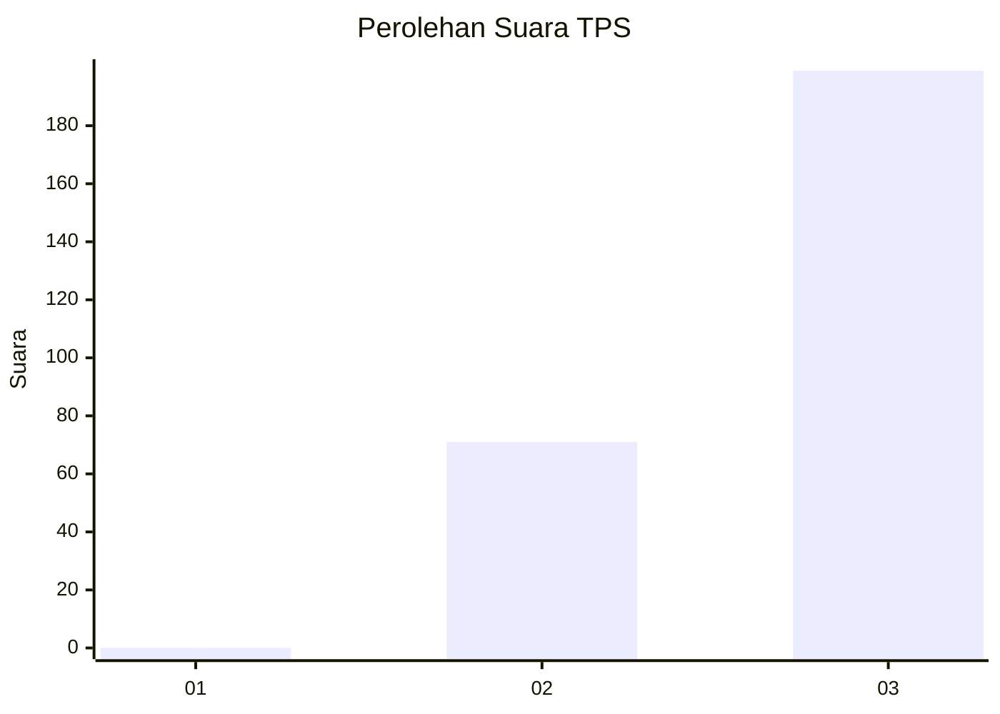
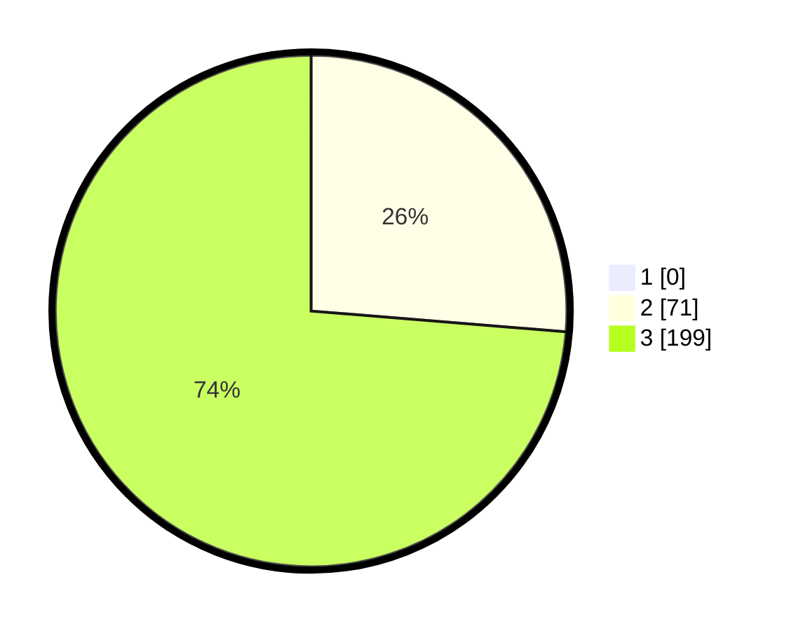

# Hasil

## Grafik

## Tabel

| No. | Nama Paslon    | Suara | Suara (raw) | Persentase |
|:--- |:-------------- | -----:| -----------:| ----------:|
| 1   | ANIES MUHAIMIN | 0     | [0][p-1]    | 0,00       |
| 2   | PRABOWO GIBRAN | 71    | [71][p-2]   | 26,30      |
| 3   | GANJAR MAHFUD  | 199   | [199][p-3]  | 73,70      |

[p-1]: https://github.com/gigit-pemilu/pemilu-2024-51-bali/blob/main/pilpres/hitung-suara/sub/51-bali/sub/02-tabanan/sub/01-selemadeg/sub/2009-manikyang/sub/001-tps/sub/paslon-1.txt
[p-2]: https://github.com/gigit-pemilu/pemilu-2024-51-bali/blob/main/pilpres/hitung-suara/sub/51-bali/sub/02-tabanan/sub/01-selemadeg/sub/2009-manikyang/sub/001-tps/sub/paslon-2.txt
[p-3]: https://github.com/gigit-pemilu/pemilu-2024-51-bali/blob/main/pilpres/hitung-suara/sub/51-bali/sub/02-tabanan/sub/01-selemadeg/sub/2009-manikyang/sub/001-tps/sub/paslon-3.txt

## Foto C Plano

https://sirekap-obj-formc.kpu.go.id/1c9d/pemilu/ppwp/51/02/01/20/09/5102012009001-20240216-132136--28ed9200-1fd2-4b4d-8d35-6d4822a25b92.jpg

https://sirekap-obj-formc.kpu.go.id/1c9d/pemilu/ppwp/51/02/01/20/09/5102012009001-20240216-132138--f4e44fa5-53e8-4e54-b271-53cc9d74ad69.jpg

https://sirekap-obj-formc.kpu.go.id/1c9d/pemilu/ppwp/51/02/01/20/09/5102012009001-20240216-132137--6dd9084b-d12b-4b8e-beb6-ab4f1e23ca5f.jpg

## Metadata

| Key        | Value               |
| ---------- | ------------------- |
| Time Stamp | 2024-02-16 14:00:34 |

## DATA PEMILIH TETAP

Jumlah pemilih dalam DPT: **291**.
 * L: **136**.
 * P: **155**.

## DATA PENGGUNA HAK PILIH

Jumlah pengguna hak pilih dalam DPT: **272**.
 * L: **126**.
 * P: **146**.

Jumlah pengguna hak pilih dalam DPTb: **0**.
 * L: **0**.
 * P: **0**.

Jumlah pengguna hak pilih dalam DPK: **0**.
 * L: **0**.
 * P: **0**.

Jumlah pengguna hak pilih: **272**.
 * L: **126**.
 * P: **146**.

## JUMLAH SUARA SAH DAN TIDAK SAH

JUMLAH SELURUH SUARA SAH: **270**.

JUMLAH SUARA TIDAK SAH: **2**.

JUMLAH SELURUH SUARA SAH DAN SUARA TIDAK SAH: **272**.

