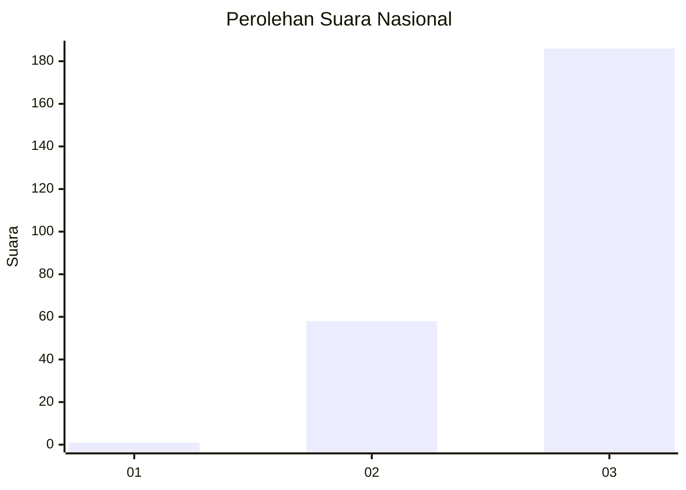
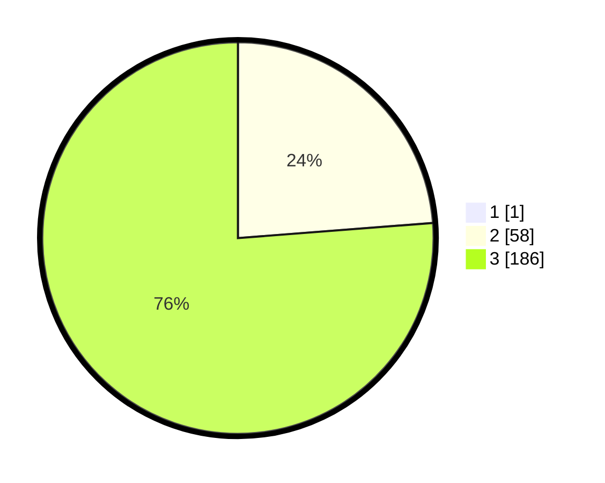

# Hasil

## Grafik

## Tabel

| No. | Nama Paslon    | Suara | Suara (raw) | Persentase |
|:--- |:-------------- | -----:| -----------:| ----------:|
| 1   | ANIES MUHAIMIN | 1     | [1][p-1]    | 0,41       |
| 2   | PRABOWO GIBRAN | 58    | [58][p-2]   | 23,67      |
| 3   | GANJAR MAHFUD  | 186   | [186][p-3]  | 75,92      |

[p-1]: https://github.com/gigit-pemilu/pemilu-2024/blob/main/pilpres/hitung-suara/sub/51-bali/sub/02-tabanan/sub/01-selemadeg/sub/2009-manikyang/sub/002-tps/sub/paslon-1.txt
[p-2]: https://github.com/gigit-pemilu/pemilu-2024/blob/main/pilpres/hitung-suara/sub/51-bali/sub/02-tabanan/sub/01-selemadeg/sub/2009-manikyang/sub/002-tps/sub/paslon-2.txt
[p-3]: https://github.com/gigit-pemilu/pemilu-2024/blob/main/pilpres/hitung-suara/sub/51-bali/sub/02-tabanan/sub/01-selemadeg/sub/2009-manikyang/sub/002-tps/sub/paslon-3.txt

## Foto C Plano

https://sirekap-obj-formc.kpu.go.id/81aa/pemilu/ppwp/51/02/01/20/09/5102012009002-20240216-145528--ede10994-2a7e-4d2a-a223-b0577c5c6355.jpg

https://sirekap-obj-formc.kpu.go.id/81aa/pemilu/ppwp/51/02/01/20/09/5102012009002-20240216-145529--cc57fd8c-ae90-46c4-b5a0-3d0833414db1.jpg

https://sirekap-obj-formc.kpu.go.id/81aa/pemilu/ppwp/51/02/01/20/09/5102012009002-20240216-145529--cd4b92d4-43dd-4b98-8e68-d13fb25b3351.jpg

## Metadata

| Key        | Value               |
| ---------- | ------------------- |
| Time Stamp | 2024-02-16 16:25:10 |

## DATA PEMILIH TETAP

Jumlah pemilih dalam DPT: **266**.
 * L: **137**.
 * P: **129**.

## DATA PENGGUNA HAK PILIH

Jumlah pengguna hak pilih dalam DPT: **250**.
 * L: **129**.
 * P: **121**.

Jumlah pengguna hak pilih dalam DPTb: **0**.
 * L: **0**.
 * P: **0**.

Jumlah pengguna hak pilih dalam DPK: **0**.
 * L: **0**.
 * P: **0**.

Jumlah pengguna hak pilih: **250**.
 * L: **129**.
 * P: **121**.

## JUMLAH SUARA SAH DAN TIDAK SAH

JUMLAH SELURUH SUARA SAH: **245**.

JUMLAH SUARA TIDAK SAH: **5**.

JUMLAH SELURUH SUARA SAH DAN SUARA TIDAK SAH: **250**.

