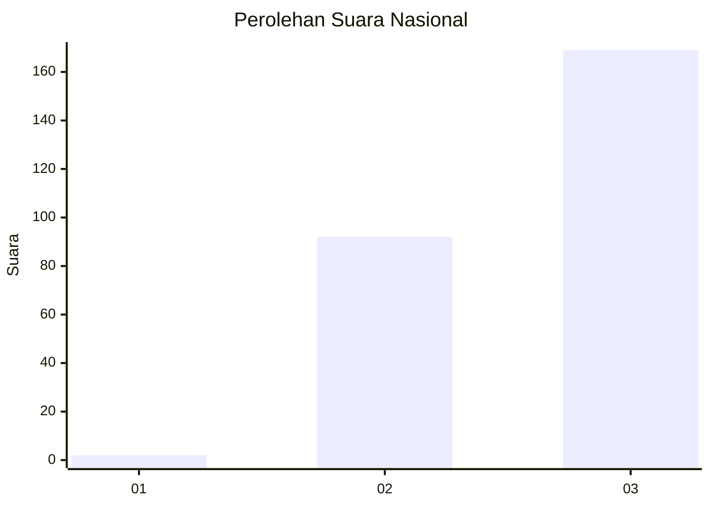
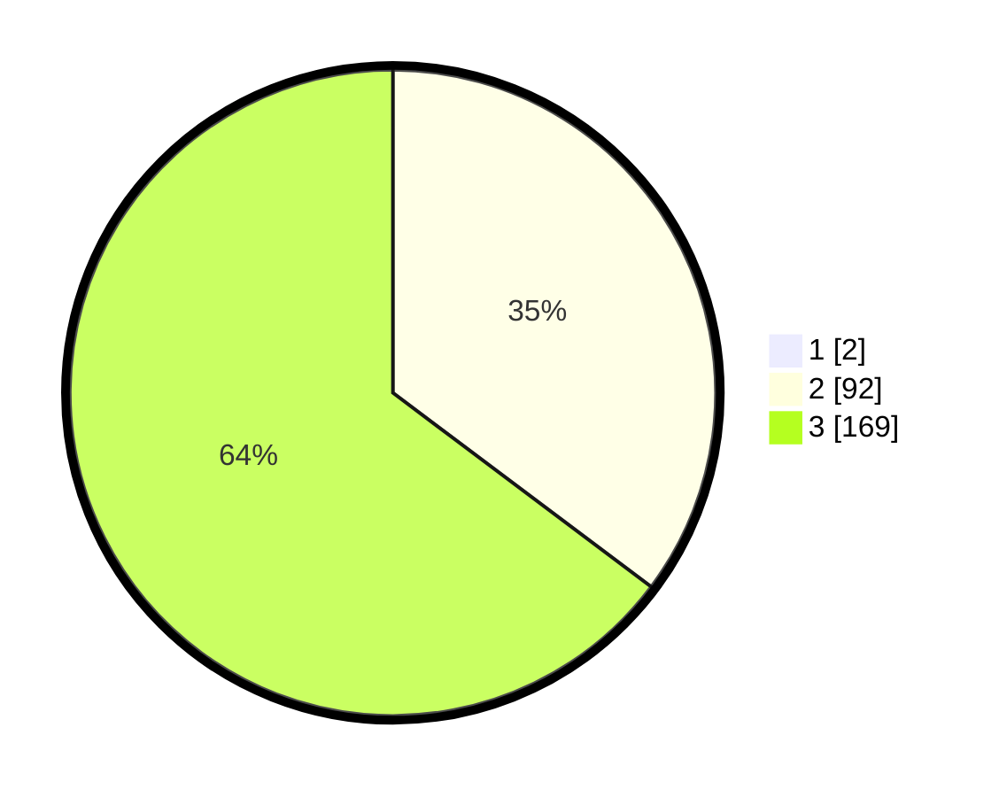

# Hasil

## Grafik

## Tabel

| No. | Nama Paslon    | Suara | Suara (raw) | Persentase |
|:--- |:-------------- | -----:| -----------:| ----------:|
| 1   | ANIES MUHAIMIN | 2     | [2][p-1]    | 0,76       |
| 2   | PRABOWO GIBRAN | 92    | [92][p-2]   | 34,98      |
| 3   | GANJAR MAHFUD  | 169   | [169][p-3]  | 64,26      |

[p-1]: https://github.com/gigit-pemilu/pemilu-2024/blob/main/pilpres/hitung-suara/sub/51-bali/sub/02-tabanan/sub/01-selemadeg/sub/2009-manikyang/sub/003-tps/sub/paslon-1.txt
[p-2]: https://github.com/gigit-pemilu/pemilu-2024/blob/main/pilpres/hitung-suara/sub/51-bali/sub/02-tabanan/sub/01-selemadeg/sub/2009-manikyang/sub/003-tps/sub/paslon-2.txt
[p-3]: https://github.com/gigit-pemilu/pemilu-2024/blob/main/pilpres/hitung-suara/sub/51-bali/sub/02-tabanan/sub/01-selemadeg/sub/2009-manikyang/sub/003-tps/sub/paslon-3.txt

## Foto C Plano

https://sirekap-obj-formc.kpu.go.id/99d5/pemilu/ppwp/51/02/01/20/09/5102012009003-20240215-201758--be2fbe6a-d88d-489c-9b77-1a757ab21b4e.jpg

https://sirekap-obj-formc.kpu.go.id/99d5/pemilu/ppwp/51/02/01/20/09/5102012009003-20240215-201820--33b98e08-8fa0-4734-b2a9-d86b5cf4c3ab.jpg

https://sirekap-obj-formc.kpu.go.id/99d5/pemilu/ppwp/51/02/01/20/09/5102012009003-20240215-201809--6eb6c4f0-1507-4f6c-9513-fd3888287631.jpg

## Metadata

| Key        | Value               |
| ---------- | ------------------- |
| Time Stamp | 2024-02-15 21:30:27 |

## DATA PEMILIH TETAP

Jumlah pemilih dalam DPT: **285**.
 * L: **140**.
 * P: **145**.

## DATA PENGGUNA HAK PILIH

Jumlah pengguna hak pilih dalam DPT: **267**.
 * L: **132**.
 * P: **135**.

Jumlah pengguna hak pilih dalam DPTb: **0**.
 * L: **0**.
 * P: **0**.

Jumlah pengguna hak pilih dalam DPK: **0**.
 * L: **0**.
 * P: **0**.

Jumlah pengguna hak pilih: **267**.
 * L: **132**.
 * P: **135**.

## JUMLAH SUARA SAH DAN TIDAK SAH

JUMLAH SELURUH SUARA SAH: **263**.

JUMLAH SUARA TIDAK SAH: **4**.

JUMLAH SELURUH SUARA SAH DAN SUARA TIDAK SAH: **267**.

