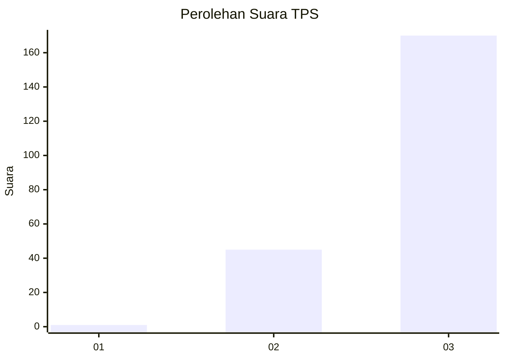
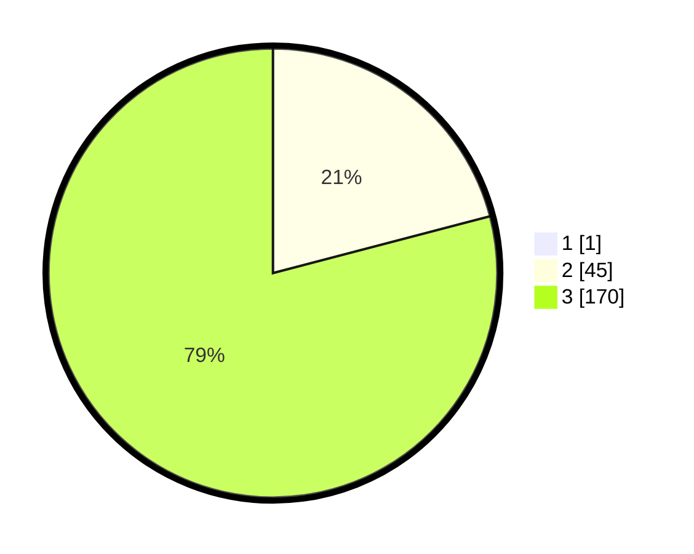

# Hasil

## Grafik

## Tabel

| No. | Nama Paslon    | Suara | Suara (raw) | Persentase |
|:--- |:-------------- | -----:| -----------:| ----------:|
| 1   | ANIES MUHAIMIN | 1     | [1][p-1]    | 0,46       |
| 2   | PRABOWO GIBRAN | 45    | [45][p-2]   | 20,83      |
| 3   | GANJAR MAHFUD  | 170   | [170][p-3]  | 78,70      |

[p-1]: https://github.com/gigit-pemilu/pemilu-2024-51-bali/blob/main/pilpres/hitung-suara/sub/51-bali/sub/02-tabanan/sub/01-selemadeg/sub/2010-bajera-utara/sub/002-tps/sub/paslon-1.txt
[p-2]: https://github.com/gigit-pemilu/pemilu-2024-51-bali/blob/main/pilpres/hitung-suara/sub/51-bali/sub/02-tabanan/sub/01-selemadeg/sub/2010-bajera-utara/sub/002-tps/sub/paslon-2.txt
[p-3]: https://github.com/gigit-pemilu/pemilu-2024-51-bali/blob/main/pilpres/hitung-suara/sub/51-bali/sub/02-tabanan/sub/01-selemadeg/sub/2010-bajera-utara/sub/002-tps/sub/paslon-3.txt

## Foto C Plano

https://sirekap-obj-formc.kpu.go.id/1b11/pemilu/ppwp/51/02/01/20/10/5102012010002-20240216-082406--50fc7d32-39bc-4190-bf6e-1264703d540b.jpg

https://sirekap-obj-formc.kpu.go.id/1b11/pemilu/ppwp/51/02/01/20/10/5102012010002-20240216-083438--a5743bb8-103b-4c26-a3a7-3c13de485358.jpg

https://sirekap-obj-formc.kpu.go.id/1b11/pemilu/ppwp/51/02/01/20/10/5102012010002-20240216-082417--44ed4911-9dec-4962-8422-357980acf031.jpg

## Metadata

| Key        | Value               |
| ---------- | ------------------- |
| Time Stamp | 2024-02-16 09:30:28 |

## DATA PEMILIH TETAP

Jumlah pemilih dalam DPT: **224**.
 * L: **102**.
 * P: **122**.

## DATA PENGGUNA HAK PILIH

Jumlah pengguna hak pilih dalam DPT: **217**.
 * L: **98**.
 * P: **119**.

Jumlah pengguna hak pilih dalam DPTb: **1**.
 * L: **0**.
 * P: **1**.

Jumlah pengguna hak pilih dalam DPK: **0**.
 * L: **0**.
 * P: **0**.

Jumlah pengguna hak pilih: **218**.
 * L: **98**.
 * P: **120**.

## JUMLAH SUARA SAH DAN TIDAK SAH

JUMLAH SELURUH SUARA SAH: **216**.

JUMLAH SUARA TIDAK SAH: **2**.

JUMLAH SELURUH SUARA SAH DAN SUARA TIDAK SAH: **218**.

