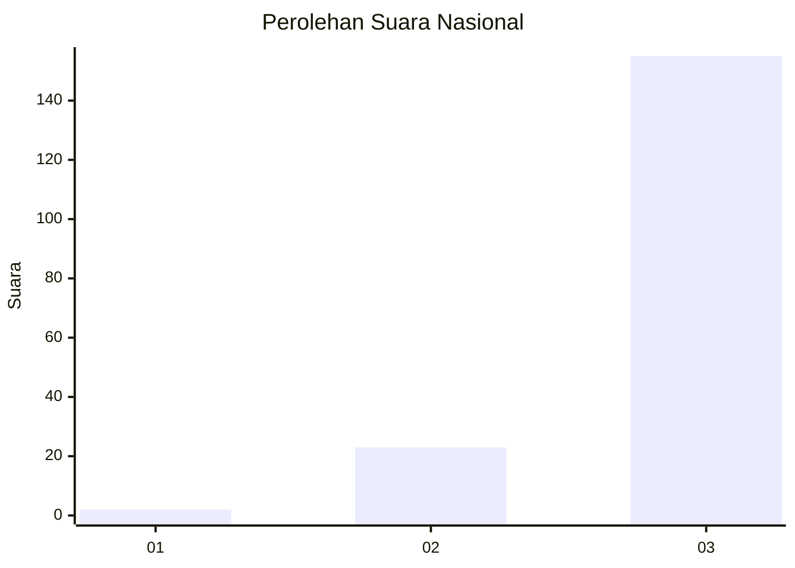
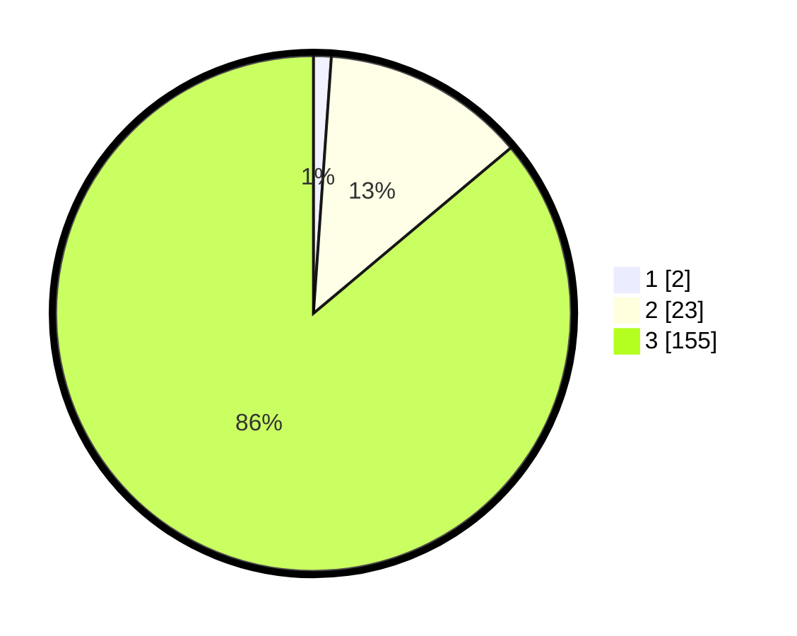

# Hasil

## Grafik

## Tabel

| No. | Nama Paslon    | Suara | Suara (raw) | Persentase |
|:--- |:-------------- | -----:| -----------:| ----------:|
| 1   | ANIES MUHAIMIN | 2     | [2][p-1]    | 1,11       |
| 2   | PRABOWO GIBRAN | 23    | [23][p-2]   | 12,78      |
| 3   | GANJAR MAHFUD  | 155   | [155][p-3]  | 86,11      |

[p-1]: https://github.com/gigit-pemilu/pemilu-2024/blob/main/pilpres/hitung-suara/sub/51-bali/sub/02-tabanan/sub/02-selemadeg-timur/sub/2001-gunung-salak/sub/001-tps/sub/paslon-1.txt
[p-2]: https://github.com/gigit-pemilu/pemilu-2024/blob/main/pilpres/hitung-suara/sub/51-bali/sub/02-tabanan/sub/02-selemadeg-timur/sub/2001-gunung-salak/sub/001-tps/sub/paslon-2.txt
[p-3]: https://github.com/gigit-pemilu/pemilu-2024/blob/main/pilpres/hitung-suara/sub/51-bali/sub/02-tabanan/sub/02-selemadeg-timur/sub/2001-gunung-salak/sub/001-tps/sub/paslon-3.txt

## Foto C Plano

https://sirekap-obj-formc.kpu.go.id/a7a1/pemilu/ppwp/51/02/02/20/01/5102022001001-20240215-222305--c41ec45e-9d88-4889-9ea4-f54440627a4e.jpg

https://sirekap-obj-formc.kpu.go.id/a7a1/pemilu/ppwp/51/02/02/20/01/5102022001001-20240215-222307--4cecf263-ce63-4862-8a54-9f82e6027f66.jpg

https://sirekap-obj-formc.kpu.go.id/a7a1/pemilu/ppwp/51/02/02/20/01/5102022001001-20240215-222306--c38c77a1-0366-4ef8-955f-209e4737feee.jpg

## Metadata

| Key        | Value               |
| ---------- | ------------------- |
| Time Stamp | 2024-02-16 09:30:28 |

## DATA PEMILIH TETAP

Jumlah pemilih dalam DPT: **202**.
 * L: **101**.
 * P: **101**.

## DATA PENGGUNA HAK PILIH

Jumlah pengguna hak pilih dalam DPT: **180**.
 * L: **92**.
 * P: **88**.

Jumlah pengguna hak pilih dalam DPTb: **2**.
 * L: **1**.
 * P: **1**.

Jumlah pengguna hak pilih dalam DPK: **0**.
 * L: **0**.
 * P: **0**.

Jumlah pengguna hak pilih: **182**.
 * L: **93**.
 * P: **89**.

## JUMLAH SUARA SAH DAN TIDAK SAH

JUMLAH SELURUH SUARA SAH: **180**.

JUMLAH SUARA TIDAK SAH: **2**.

JUMLAH SELURUH SUARA SAH DAN SUARA TIDAK SAH: **182**.

