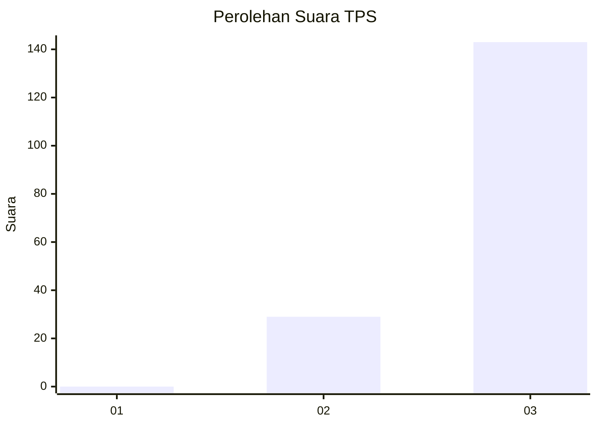
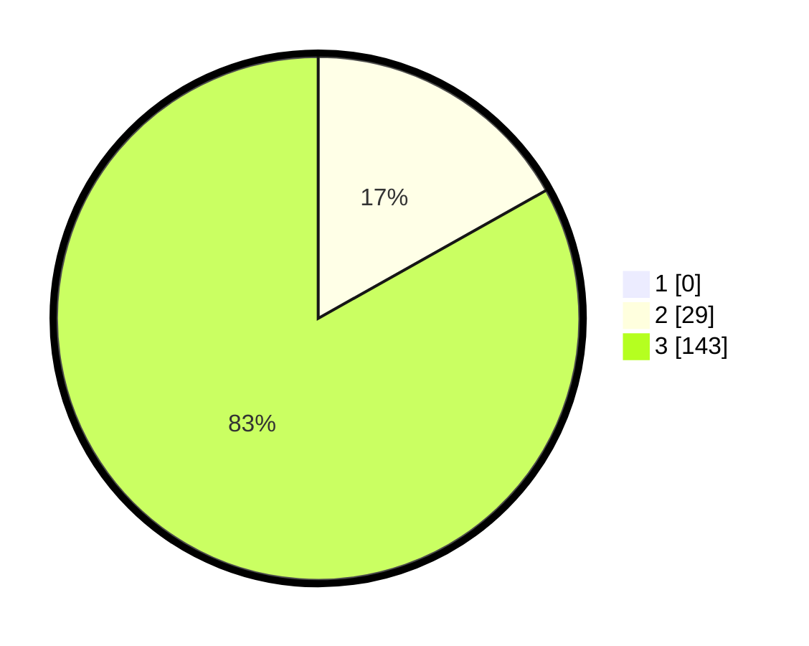

# Hasil

## Grafik

## Tabel

| No. | Nama Paslon    | Suara | Suara (raw) | Persentase |
|:--- |:-------------- | -----:| -----------:| ----------:|
| 1   | ANIES MUHAIMIN | 0     | [0][p-1]    | 0,00       |
| 2   | PRABOWO GIBRAN | 29    | [29][p-2]   | 16,86      |
| 3   | GANJAR MAHFUD  | 143   | [143][p-3]  | 83,14      |

[p-1]: https://github.com/gigit-pemilu/pemilu-2024-51-bali/blob/main/pilpres/hitung-suara/sub/51-bali/sub/02-tabanan/sub/02-selemadeg-timur/sub/2001-gunung-salak/sub/002-tps/sub/paslon-1.txt
[p-2]: https://github.com/gigit-pemilu/pemilu-2024-51-bali/blob/main/pilpres/hitung-suara/sub/51-bali/sub/02-tabanan/sub/02-selemadeg-timur/sub/2001-gunung-salak/sub/002-tps/sub/paslon-2.txt
[p-3]: https://github.com/gigit-pemilu/pemilu-2024-51-bali/blob/main/pilpres/hitung-suara/sub/51-bali/sub/02-tabanan/sub/02-selemadeg-timur/sub/2001-gunung-salak/sub/002-tps/sub/paslon-3.txt

## Foto C Plano

https://sirekap-obj-formc.kpu.go.id/5e99/pemilu/ppwp/51/02/02/20/01/5102022001002-20240214-125601--f7125135-47fe-48e4-a701-7ed45eca7318.jpg

https://sirekap-obj-formc.kpu.go.id/5e99/pemilu/ppwp/51/02/02/20/01/5102022001002-20240214-130516--a79436b4-2f5e-4c6a-b485-ebbb4c42ffbf.jpg

https://sirekap-obj-formc.kpu.go.id/5e99/pemilu/ppwp/51/02/02/20/01/5102022001002-20240214-125950--40b05d6f-7a2b-4a33-9c64-79e1fd7e17e0.jpg

## Metadata

| Key        | Value               |
| ---------- | ------------------- |
| Time Stamp | 2024-02-14 21:46:01 |

## DATA PEMILIH TETAP

Jumlah pemilih dalam DPT: **191**.
 * L: **96**.
 * P: **95**.

## DATA PENGGUNA HAK PILIH

Jumlah pengguna hak pilih dalam DPT: **176**.
 * L: **90**.
 * P: **86**.

Jumlah pengguna hak pilih dalam DPTb: **0**.
 * L: **0**.
 * P: **0**.

Jumlah pengguna hak pilih dalam DPK: **0**.
 * L: **0**.
 * P: **0**.

Jumlah pengguna hak pilih: **176**.
 * L: **90**.
 * P: **86**.

## JUMLAH SUARA SAH DAN TIDAK SAH

JUMLAH SELURUH SUARA SAH: **172**.

JUMLAH SUARA TIDAK SAH: **4**.

JUMLAH SELURUH SUARA SAH DAN SUARA TIDAK SAH: **176**.

