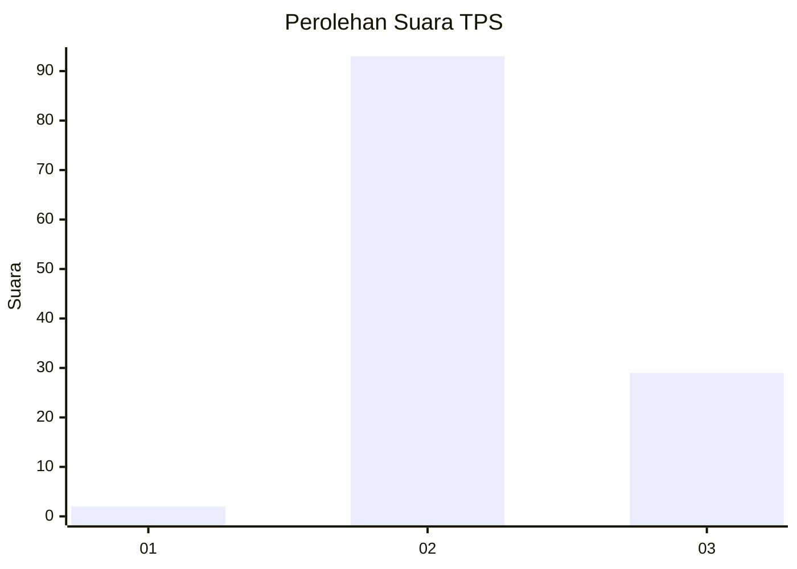
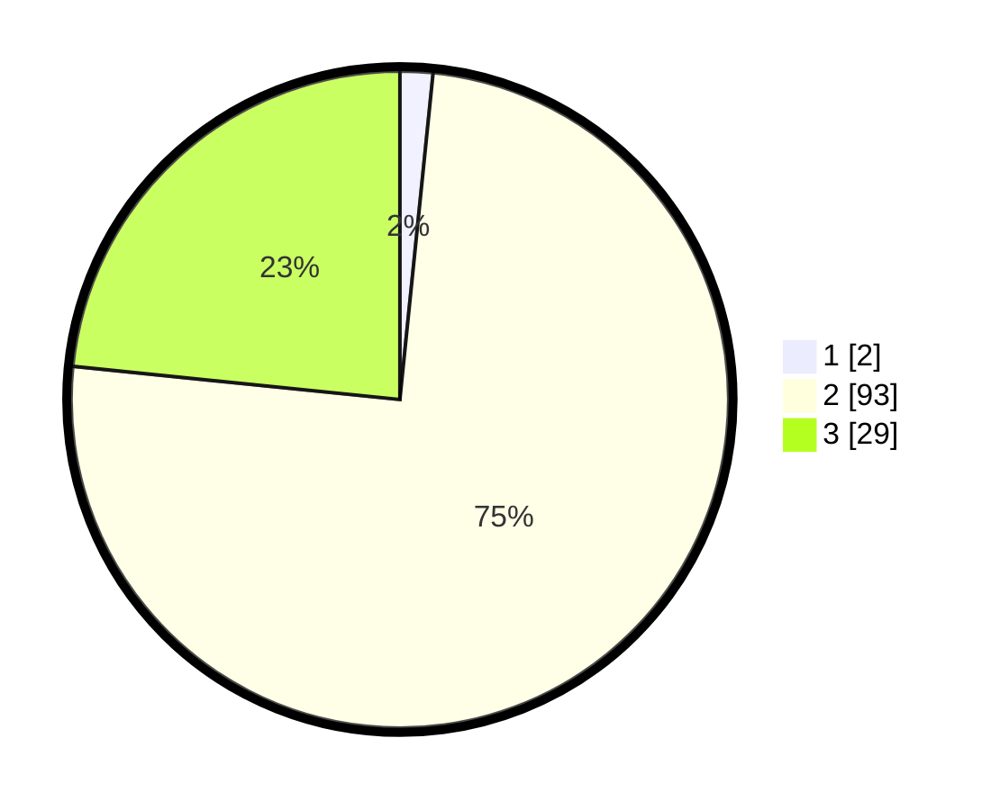

# Hasil

## Grafik

## Tabel

| No. | Nama Paslon    | Suara | Suara (raw) | Persentase |
|:--- |:-------------- | -----:| -----------:| ----------:|
| 1   | ANIES MUHAIMIN | 2     | [2][p-1]    | 1,61       |
| 2   | PRABOWO GIBRAN | 93    | [93][p-2]   | 75,00      |
| 3   | GANJAR MAHFUD  | 29    | [29][p-3]   | 23,39      |

[p-1]: https://github.com/gigit-pemilu/pemilu-2024-51-bali/blob/main/pilpres/hitung-suara/sub/51-bali/sub/02-tabanan/sub/02-selemadeg-timur/sub/2001-gunung-salak/sub/003-tps/sub/paslon-1.txt
[p-2]: https://github.com/gigit-pemilu/pemilu-2024-51-bali/blob/main/pilpres/hitung-suara/sub/51-bali/sub/02-tabanan/sub/02-selemadeg-timur/sub/2001-gunung-salak/sub/003-tps/sub/paslon-2.txt
[p-3]: https://github.com/gigit-pemilu/pemilu-2024-51-bali/blob/main/pilpres/hitung-suara/sub/51-bali/sub/02-tabanan/sub/02-selemadeg-timur/sub/2001-gunung-salak/sub/003-tps/sub/paslon-3.txt

## Foto C Plano

https://sirekap-obj-formc.kpu.go.id/c787/pemilu/ppwp/51/02/02/20/01/5102022001003-20240215-135846--50382608-f86f-415f-9f96-5881837c4e10.jpg

https://sirekap-obj-formc.kpu.go.id/c787/pemilu/ppwp/51/02/02/20/01/5102022001003-20240216-141720--3311c682-f998-4e11-8273-b62f3b566cc1.jpg

https://sirekap-obj-formc.kpu.go.id/c787/pemilu/ppwp/51/02/02/20/01/5102022001003-20240215-140009--7eefa07a-14d4-48f1-b0bd-6783a3221ab0.jpg

## Metadata

| Key        | Value               |
| ---------- | ------------------- |
| Time Stamp | 2024-02-16 16:25:10 |

## DATA PEMILIH TETAP

Jumlah pemilih dalam DPT: **149**.
 * L: **67**.
 * P: **82**.

## DATA PENGGUNA HAK PILIH

Jumlah pengguna hak pilih dalam DPT: **127**.
 * L: **59**.
 * P: **68**.

Jumlah pengguna hak pilih dalam DPTb: **0**.
 * L: **0**.
 * P: **0**.

Jumlah pengguna hak pilih dalam DPK: **0**.
 * L: **0**.
 * P: **0**.

Jumlah pengguna hak pilih: **127**.
 * L: **59**.
 * P: **68**.

## JUMLAH SUARA SAH DAN TIDAK SAH

JUMLAH SELURUH SUARA SAH: **124**.

JUMLAH SUARA TIDAK SAH: **3**.

JUMLAH SELURUH SUARA SAH DAN SUARA TIDAK SAH: **127**.

