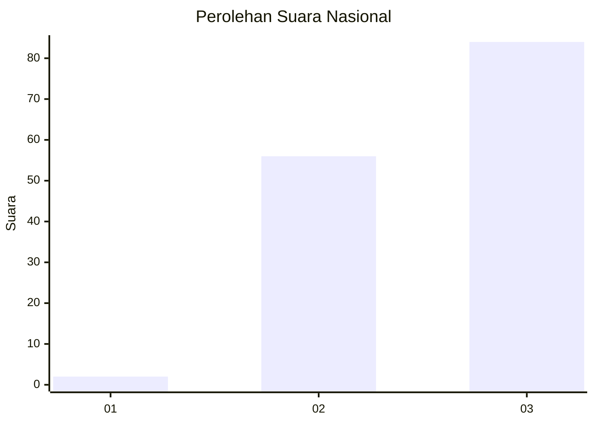
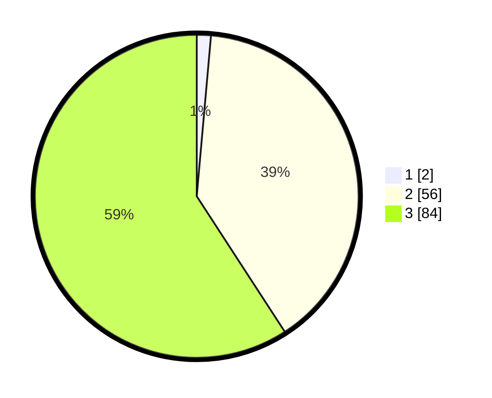

# Hasil

## Grafik

## Tabel

| No. | Nama Paslon    | Suara | Suara (raw) | Persentase |
|:--- |:-------------- | -----:| -----------:| ----------:|
| 1   | ANIES MUHAIMIN | 2     | [2][p-1]    | 1,41       |
| 2   | PRABOWO GIBRAN | 56    | [56][p-2]   | 39,44      |
| 3   | GANJAR MAHFUD  | 84    | [84][p-3]   | 59,15      |

[p-1]: https://github.com/gigit-pemilu/pemilu-2024/blob/main/pilpres/hitung-suara/sub/51-bali/sub/02-tabanan/sub/02-selemadeg-timur/sub/2001-gunung-salak/sub/004-tps/sub/paslon-1.txt
[p-2]: https://github.com/gigit-pemilu/pemilu-2024/blob/main/pilpres/hitung-suara/sub/51-bali/sub/02-tabanan/sub/02-selemadeg-timur/sub/2001-gunung-salak/sub/004-tps/sub/paslon-2.txt
[p-3]: https://github.com/gigit-pemilu/pemilu-2024/blob/main/pilpres/hitung-suara/sub/51-bali/sub/02-tabanan/sub/02-selemadeg-timur/sub/2001-gunung-salak/sub/004-tps/sub/paslon-3.txt

## Foto C Plano

https://sirekap-obj-formc.kpu.go.id/e0fe/pemilu/ppwp/51/02/02/20/01/5102022001004-20240216-152415--cd0a757b-7dd6-4023-90b4-044a26fed71c.jpg

https://sirekap-obj-formc.kpu.go.id/e0fe/pemilu/ppwp/51/02/02/20/01/5102022001004-20240216-152417--4e4ec5a5-aac1-4676-9696-8297f8afdf24.jpg

https://sirekap-obj-formc.kpu.go.id/e0fe/pemilu/ppwp/51/02/02/20/01/5102022001004-20240216-152416--60c9a5c2-8871-4cce-869e-33675a9e881d.jpg

## Metadata

| Key        | Value               |
| ---------- | ------------------- |
| Time Stamp | 2024-02-16 16:25:10 |

## DATA PEMILIH TETAP

Jumlah pemilih dalam DPT: **157**.
 * L: **75**.
 * P: **82**.

## DATA PENGGUNA HAK PILIH

Jumlah pengguna hak pilih dalam DPT: **146**.
 * L: **73**.
 * P: **73**.

Jumlah pengguna hak pilih dalam DPTb: **0**.
 * L: **0**.
 * P: **0**.

Jumlah pengguna hak pilih dalam DPK: **0**.
 * L: **0**.
 * P: **0**.

Jumlah pengguna hak pilih: **146**.
 * L: **73**.
 * P: **73**.

## JUMLAH SUARA SAH DAN TIDAK SAH

JUMLAH SELURUH SUARA SAH: **142**.

JUMLAH SUARA TIDAK SAH: **4**.

JUMLAH SELURUH SUARA SAH DAN SUARA TIDAK SAH: **146**.

