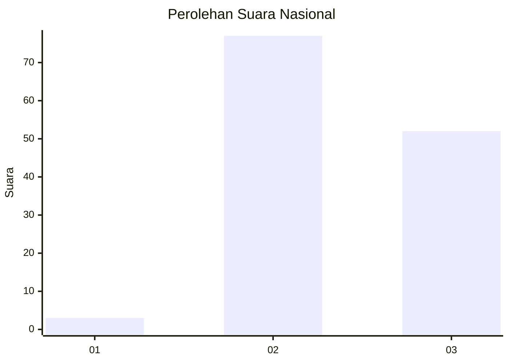
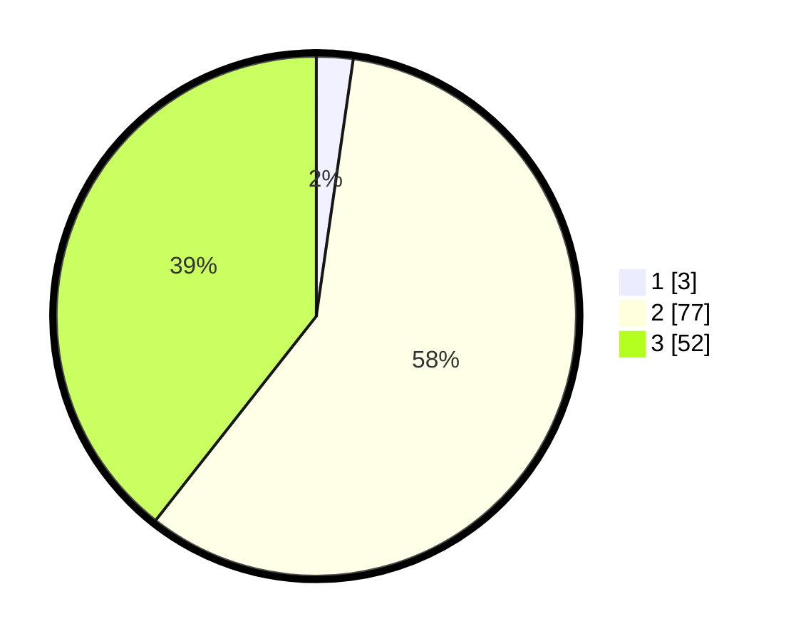

# Hasil

## Grafik

## Tabel

| No. | Nama Paslon    | Suara | Suara (raw) | Persentase |
|:--- |:-------------- | -----:| -----------:| ----------:|
| 1   | ANIES MUHAIMIN | 3     | [3][p-1]    | 2,27       |
| 2   | PRABOWO GIBRAN | 77    | [77][p-2]   | 58,33      |
| 3   | GANJAR MAHFUD  | 52    | [52][p-3]   | 39,39      |

[p-1]: https://github.com/gigit-pemilu/pemilu-2024/blob/main/pilpres/hitung-suara/sub/51-bali/sub/02-tabanan/sub/02-selemadeg-timur/sub/2001-gunung-salak/sub/005-tps/sub/paslon-1.txt
[p-2]: https://github.com/gigit-pemilu/pemilu-2024/blob/main/pilpres/hitung-suara/sub/51-bali/sub/02-tabanan/sub/02-selemadeg-timur/sub/2001-gunung-salak/sub/005-tps/sub/paslon-2.txt
[p-3]: https://github.com/gigit-pemilu/pemilu-2024/blob/main/pilpres/hitung-suara/sub/51-bali/sub/02-tabanan/sub/02-selemadeg-timur/sub/2001-gunung-salak/sub/005-tps/sub/paslon-3.txt

## Foto C Plano

https://sirekap-obj-formc.kpu.go.id/bab2/pemilu/ppwp/51/02/02/20/01/5102022001005-20240216-152246--61fba60f-85d3-4ae2-9bb1-45ccd75a4f3b.jpg

https://sirekap-obj-formc.kpu.go.id/bab2/pemilu/ppwp/51/02/02/20/01/5102022001005-20240216-152248--08bab593-31f7-41e6-a023-335c6825f338.jpg

https://sirekap-obj-formc.kpu.go.id/bab2/pemilu/ppwp/51/02/02/20/01/5102022001005-20240216-152247--e4c5a7e0-1d61-41d8-b0d7-06ad5e1c51a4.jpg

## Metadata

| Key        | Value               |
| ---------- | ------------------- |
| Time Stamp | 2024-02-16 16:25:10 |

## DATA PEMILIH TETAP

Jumlah pemilih dalam DPT: **161**.
 * L: **73**.
 * P: **88**.

## DATA PENGGUNA HAK PILIH

Jumlah pengguna hak pilih dalam DPT: **138**.
 * L: **67**.
 * P: **71**.

Jumlah pengguna hak pilih dalam DPTb: **0**.
 * L: **0**.
 * P: **0**.

Jumlah pengguna hak pilih dalam DPK: **0**.
 * L: **0**.
 * P: **0**.

Jumlah pengguna hak pilih: **138**.
 * L: **67**.
 * P: **71**.

## JUMLAH SUARA SAH DAN TIDAK SAH

JUMLAH SELURUH SUARA SAH: **132**.

JUMLAH SUARA TIDAK SAH: **6**.

JUMLAH SELURUH SUARA SAH DAN SUARA TIDAK SAH: **138**.

