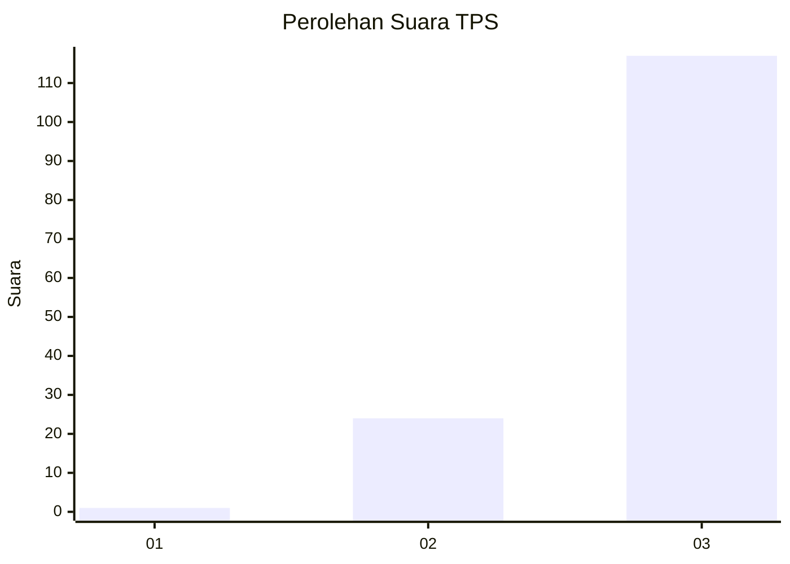
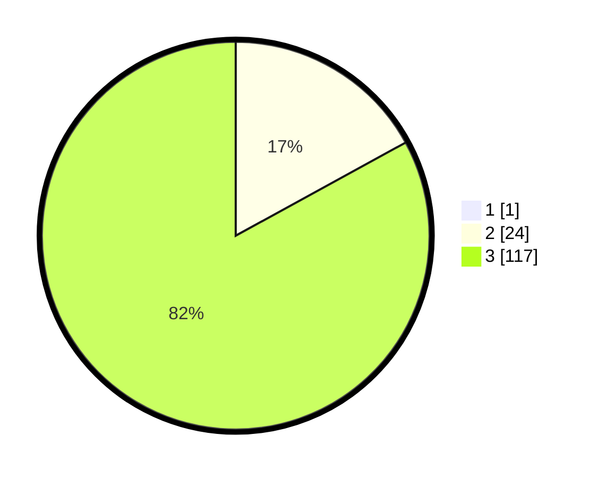

# Hasil

## Grafik

## Tabel

| No. | Nama Paslon    | Suara | Suara (raw) | Persentase |
|:--- |:-------------- | -----:| -----------:| ----------:|
| 1   | ANIES MUHAIMIN | 1     | [1][p-1]    | 0,70       |
| 2   | PRABOWO GIBRAN | 24    | [24][p-2]   | 16,90      |
| 3   | GANJAR MAHFUD  | 117   | [117][p-3]  | 82,39      |

[p-1]: https://github.com/gigit-pemilu/pemilu-2024-51-bali/blob/main/pilpres/hitung-suara/sub/51-bali/sub/02-tabanan/sub/02-selemadeg-timur/sub/2001-gunung-salak/sub/006-tps/sub/paslon-1.txt
[p-2]: https://github.com/gigit-pemilu/pemilu-2024-51-bali/blob/main/pilpres/hitung-suara/sub/51-bali/sub/02-tabanan/sub/02-selemadeg-timur/sub/2001-gunung-salak/sub/006-tps/sub/paslon-2.txt
[p-3]: https://github.com/gigit-pemilu/pemilu-2024-51-bali/blob/main/pilpres/hitung-suara/sub/51-bali/sub/02-tabanan/sub/02-selemadeg-timur/sub/2001-gunung-salak/sub/006-tps/sub/paslon-3.txt

## Foto C Plano

https://sirekap-obj-formc.kpu.go.id/1dfb/pemilu/ppwp/51/02/02/20/01/5102022001006-20240216-100535--b084357a-00fe-4a9d-892d-ddc1f072c27a.jpg

https://sirekap-obj-formc.kpu.go.id/1dfb/pemilu/ppwp/51/02/02/20/01/5102022001006-20240216-100538--f250a8a9-4f93-4f75-bfd3-19d10b87a8c1.jpg

https://sirekap-obj-formc.kpu.go.id/1dfb/pemilu/ppwp/51/02/02/20/01/5102022001006-20240216-100536--3566bc6e-b44a-4c88-ba0d-f3bee2635790.jpg

## Metadata

| Key        | Value               |
| ---------- | ------------------- |
| Time Stamp | 2024-02-16 14:00:34 |

## DATA PEMILIH TETAP

Jumlah pemilih dalam DPT: **166**.
 * L: **77**.
 * P: **89**.

## DATA PENGGUNA HAK PILIH

Jumlah pengguna hak pilih dalam DPT: **143**.
 * L: **66**.
 * P: **77**.

Jumlah pengguna hak pilih dalam DPTb: **0**.
 * L: **0**.
 * P: **0**.

Jumlah pengguna hak pilih dalam DPK: **0**.
 * L: **0**.
 * P: **0**.

Jumlah pengguna hak pilih: **143**.
 * L: **66**.
 * P: **77**.

## JUMLAH SUARA SAH DAN TIDAK SAH

JUMLAH SELURUH SUARA SAH: **142**.

JUMLAH SUARA TIDAK SAH: **1**.

JUMLAH SELURUH SUARA SAH DAN SUARA TIDAK SAH: **143**.

