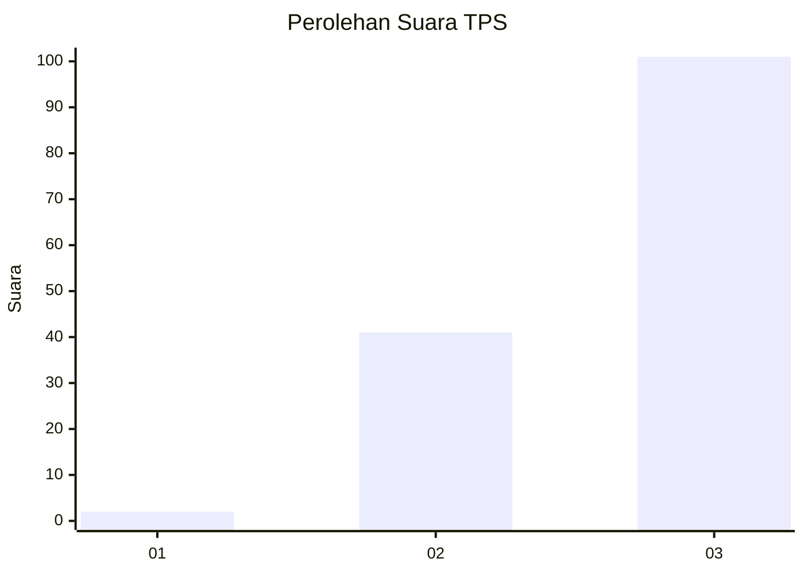
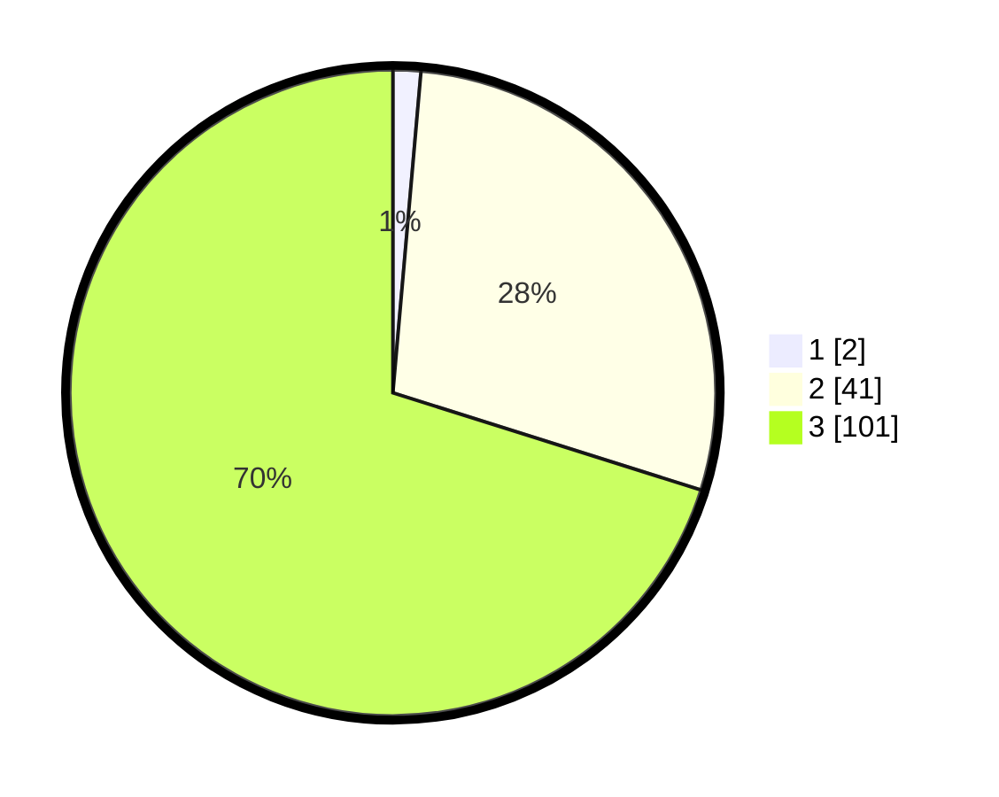

# Hasil

## Grafik

## Tabel

| No. | Nama Paslon    | Suara | Suara (raw) | Persentase |
|:--- |:-------------- | -----:| -----------:| ----------:|
| 1   | ANIES MUHAIMIN | 2     | [2][p-1]    | 1,39       |
| 2   | PRABOWO GIBRAN | 41    | [41][p-2]   | 28,47      |
| 3   | GANJAR MAHFUD  | 101   | [101][p-3]  | 70,14      |

[p-1]: https://github.com/gigit-pemilu/pemilu-2024-51-bali/blob/main/pilpres/hitung-suara/sub/51-bali/sub/02-tabanan/sub/02-selemadeg-timur/sub/2001-gunung-salak/sub/007-tps/sub/paslon-1.txt
[p-2]: https://github.com/gigit-pemilu/pemilu-2024-51-bali/blob/main/pilpres/hitung-suara/sub/51-bali/sub/02-tabanan/sub/02-selemadeg-timur/sub/2001-gunung-salak/sub/007-tps/sub/paslon-2.txt
[p-3]: https://github.com/gigit-pemilu/pemilu-2024-51-bali/blob/main/pilpres/hitung-suara/sub/51-bali/sub/02-tabanan/sub/02-selemadeg-timur/sub/2001-gunung-salak/sub/007-tps/sub/paslon-3.txt

## Foto C Plano

https://sirekap-obj-formc.kpu.go.id/15d5/pemilu/ppwp/51/02/02/20/01/5102022001007-20240216-042547--8b0a71f6-72ed-4947-a32e-0e1fbb019d12.jpg

https://sirekap-obj-formc.kpu.go.id/15d5/pemilu/ppwp/51/02/02/20/01/5102022001007-20240216-042555--0cbd7114-d1fc-4841-841f-4380eff626b3.jpg

https://sirekap-obj-formc.kpu.go.id/15d5/pemilu/ppwp/51/02/02/20/01/5102022001007-20240216-042549--b98ba3ac-06a5-4824-9ae6-53ff1265007b.jpg

## Metadata

| Key        | Value               |
| ---------- | ------------------- |
| Time Stamp | 2024-02-16 09:30:28 |

## DATA PEMILIH TETAP

Jumlah pemilih dalam DPT: **160**.
 * L: **80**.
 * P: **80**.

## DATA PENGGUNA HAK PILIH

Jumlah pengguna hak pilih dalam DPT: **143**.
 * L: **70**.
 * P: **73**.

Jumlah pengguna hak pilih dalam DPTb: **0**.
 * L: **0**.
 * P: **0**.

Jumlah pengguna hak pilih dalam DPK: **1**.
 * L: **0**.
 * P: **1**.

Jumlah pengguna hak pilih: **144**.
 * L: **70**.
 * P: **74**.

## JUMLAH SUARA SAH DAN TIDAK SAH

JUMLAH SELURUH SUARA SAH: **144**.

JUMLAH SUARA TIDAK SAH: **0**.

JUMLAH SELURUH SUARA SAH DAN SUARA TIDAK SAH: **144**.

