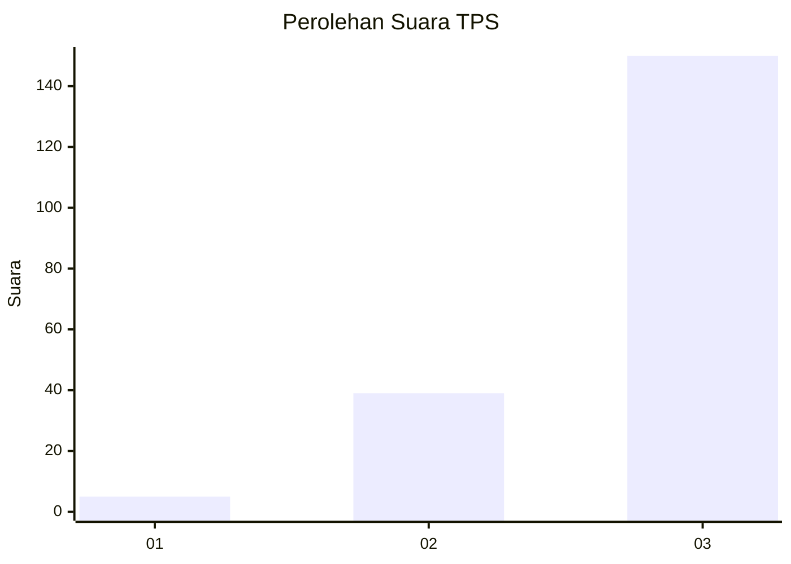
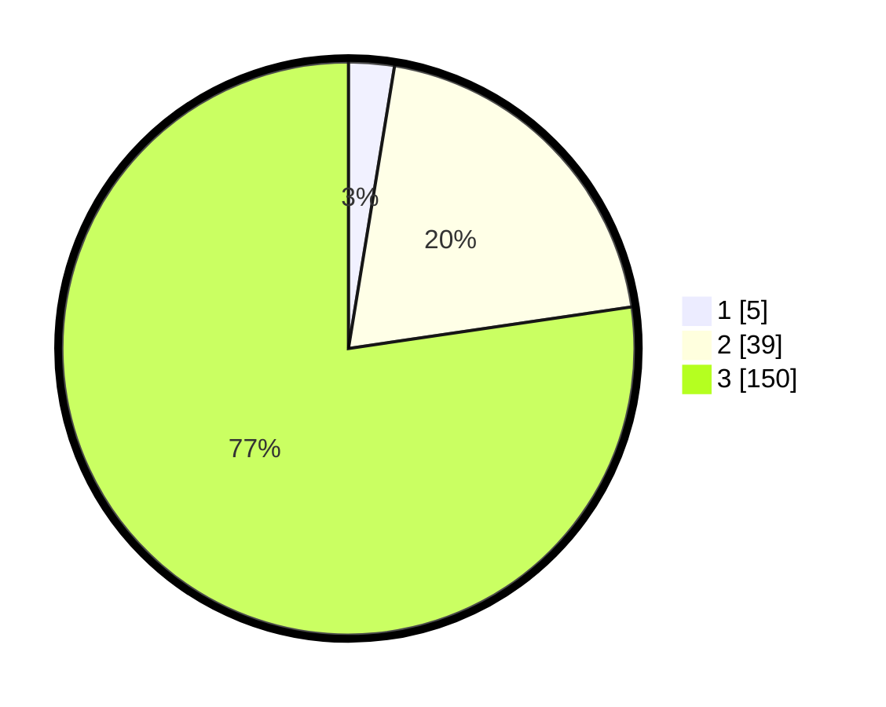

# Hasil

## Grafik

## Tabel

| No. | Nama Paslon    | Suara | Suara (raw) | Persentase |
|:--- |:-------------- | -----:| -----------:| ----------:|
| 1   | ANIES MUHAIMIN | 5     | [5][p-1]    | 2,58       |
| 2   | PRABOWO GIBRAN | 39    | [39][p-2]   | 20,10      |
| 3   | GANJAR MAHFUD  | 150   | [150][p-3]  | 77,32      |

[p-1]: https://github.com/gigit-pemilu/pemilu-2024-51-bali/blob/main/pilpres/hitung-suara/sub/51-bali/sub/02-tabanan/sub/02-selemadeg-timur/sub/2001-gunung-salak/sub/008-tps/sub/paslon-1.txt
[p-2]: https://github.com/gigit-pemilu/pemilu-2024-51-bali/blob/main/pilpres/hitung-suara/sub/51-bali/sub/02-tabanan/sub/02-selemadeg-timur/sub/2001-gunung-salak/sub/008-tps/sub/paslon-2.txt
[p-3]: https://github.com/gigit-pemilu/pemilu-2024-51-bali/blob/main/pilpres/hitung-suara/sub/51-bali/sub/02-tabanan/sub/02-selemadeg-timur/sub/2001-gunung-salak/sub/008-tps/sub/paslon-3.txt

## Foto C Plano

https://sirekap-obj-formc.kpu.go.id/468f/pemilu/ppwp/51/02/02/20/01/5102022001008-20240215-211347--a00f4dc4-de8e-4601-9fd0-aff79405652c.jpg

https://sirekap-obj-formc.kpu.go.id/468f/pemilu/ppwp/51/02/02/20/01/5102022001008-20240215-211350--87a3dbb4-b8fd-4108-b440-7959771e9cc8.jpg

https://sirekap-obj-formc.kpu.go.id/468f/pemilu/ppwp/51/02/02/20/01/5102022001008-20240215-211348--726f7b30-139c-4f30-9460-6241702be9a8.jpg

## Metadata

| Key        | Value               |
| ---------- | ------------------- |
| Time Stamp | 2024-02-15 21:30:27 |

## DATA PEMILIH TETAP

Jumlah pemilih dalam DPT: **224**.
 * L: **106**.
 * P: **118**.

## DATA PENGGUNA HAK PILIH

Jumlah pengguna hak pilih dalam DPT: **195**.
 * L: **95**.
 * P: **100**.

Jumlah pengguna hak pilih dalam DPTb: **0**.
 * L: **0**.
 * P: **0**.

Jumlah pengguna hak pilih dalam DPK: **0**.
 * L: **0**.
 * P: **0**.

Jumlah pengguna hak pilih: **195**.
 * L: **95**.
 * P: **100**.

## JUMLAH SUARA SAH DAN TIDAK SAH

JUMLAH SELURUH SUARA SAH: **194**.

JUMLAH SUARA TIDAK SAH: **1**.

JUMLAH SELURUH SUARA SAH DAN SUARA TIDAK SAH: **195**.

