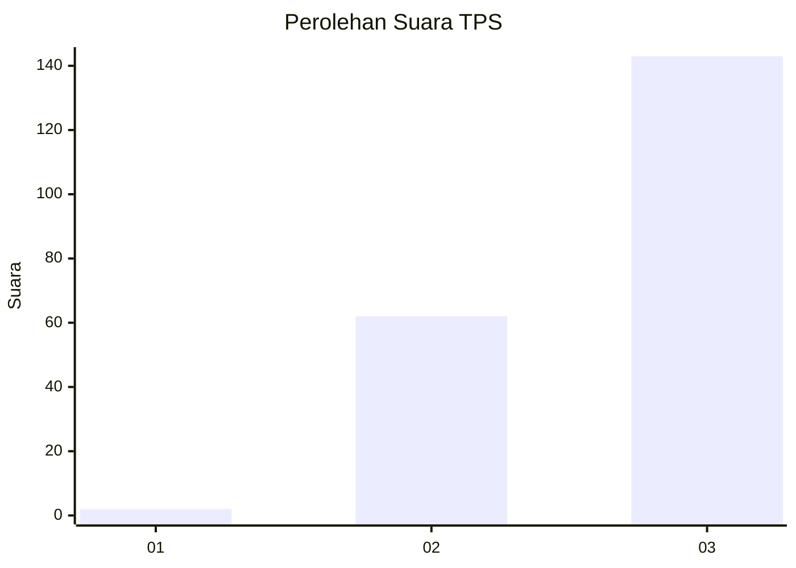
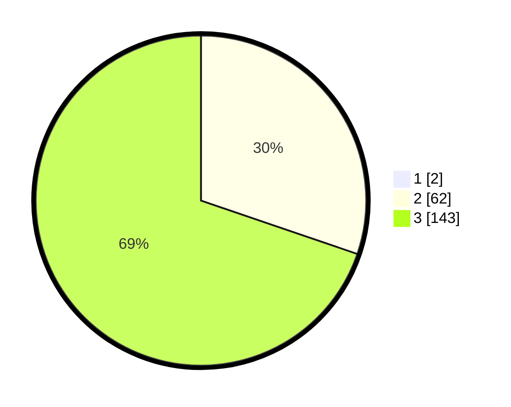

# Hasil

## Grafik

## Tabel

| No. | Nama Paslon    | Suara | Suara (raw) | Persentase |
|:--- |:-------------- | -----:| -----------:| ----------:|
| 1   | ANIES MUHAIMIN | 2     | [2][p-1]    | 0,97       |
| 2   | PRABOWO GIBRAN | 62    | [62][p-2]   | 29,95      |
| 3   | GANJAR MAHFUD  | 143   | [143][p-3]  | 69,08      |

[p-1]: https://github.com/gigit-pemilu/pemilu-2024-51-bali/blob/main/pilpres/hitung-suara/sub/51-bali/sub/02-tabanan/sub/02-selemadeg-timur/sub/2002-gadungan/sub/001-tps/sub/paslon-1.txt
[p-2]: https://github.com/gigit-pemilu/pemilu-2024-51-bali/blob/main/pilpres/hitung-suara/sub/51-bali/sub/02-tabanan/sub/02-selemadeg-timur/sub/2002-gadungan/sub/001-tps/sub/paslon-2.txt
[p-3]: https://github.com/gigit-pemilu/pemilu-2024-51-bali/blob/main/pilpres/hitung-suara/sub/51-bali/sub/02-tabanan/sub/02-selemadeg-timur/sub/2002-gadungan/sub/001-tps/sub/paslon-3.txt

## Foto C Plano

https://sirekap-obj-formc.kpu.go.id/0464/pemilu/ppwp/51/02/02/20/02/5102022002001-20240216-085236--360cd543-d0bc-4bc8-bc73-62478b7cca84.jpg

https://sirekap-obj-formc.kpu.go.id/0464/pemilu/ppwp/51/02/02/20/02/5102022002001-20240216-085239--99e365a9-803e-4913-bc24-a5a1baa98513.jpg

https://sirekap-obj-formc.kpu.go.id/0464/pemilu/ppwp/51/02/02/20/02/5102022002001-20240216-085237--39e78e5e-0ec4-48a2-b93c-3ea76acc40cb.jpg

## Metadata

| Key        | Value               |
| ---------- | ------------------- |
| Time Stamp | 2024-02-16 09:30:28 |

## DATA PEMILIH TETAP

Jumlah pemilih dalam DPT: **247**.
 * L: **110**.
 * P: **137**.

## DATA PENGGUNA HAK PILIH

Jumlah pengguna hak pilih dalam DPT: **207**.
 * L: **96**.
 * P: **111**.

Jumlah pengguna hak pilih dalam DPTb: **1**.
 * L: **0**.
 * P: **1**.

Jumlah pengguna hak pilih dalam DPK: **0**.
 * L: **0**.
 * P: **0**.

Jumlah pengguna hak pilih: **208**.
 * L: **96**.
 * P: **112**.

## JUMLAH SUARA SAH DAN TIDAK SAH

JUMLAH SELURUH SUARA SAH: **207**.

JUMLAH SUARA TIDAK SAH: **1**.

JUMLAH SELURUH SUARA SAH DAN SUARA TIDAK SAH: **208**.

