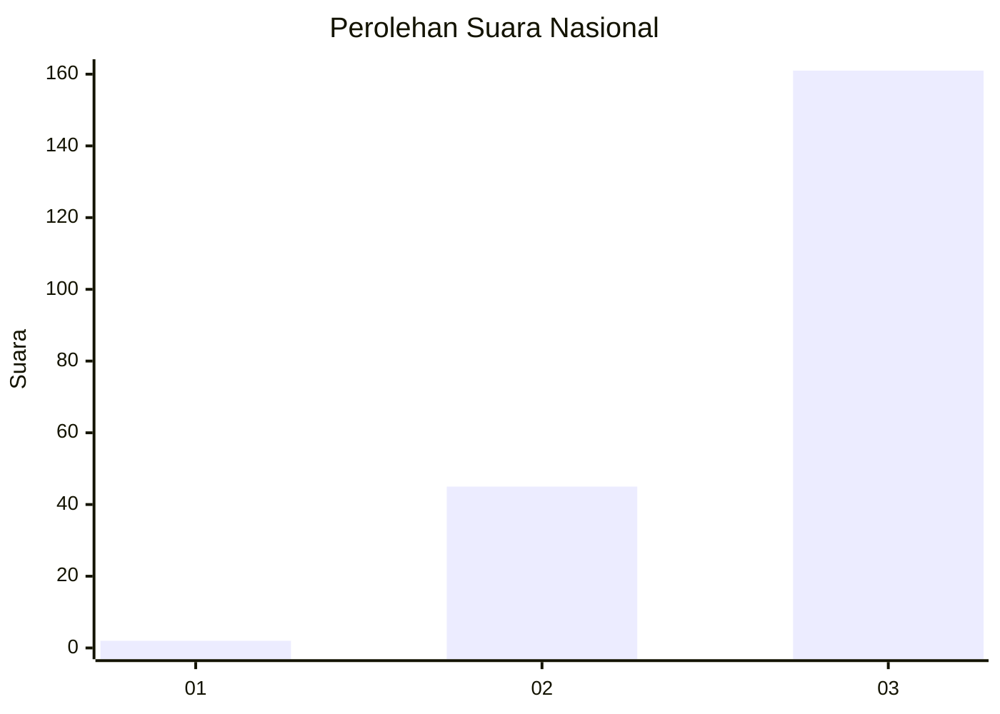
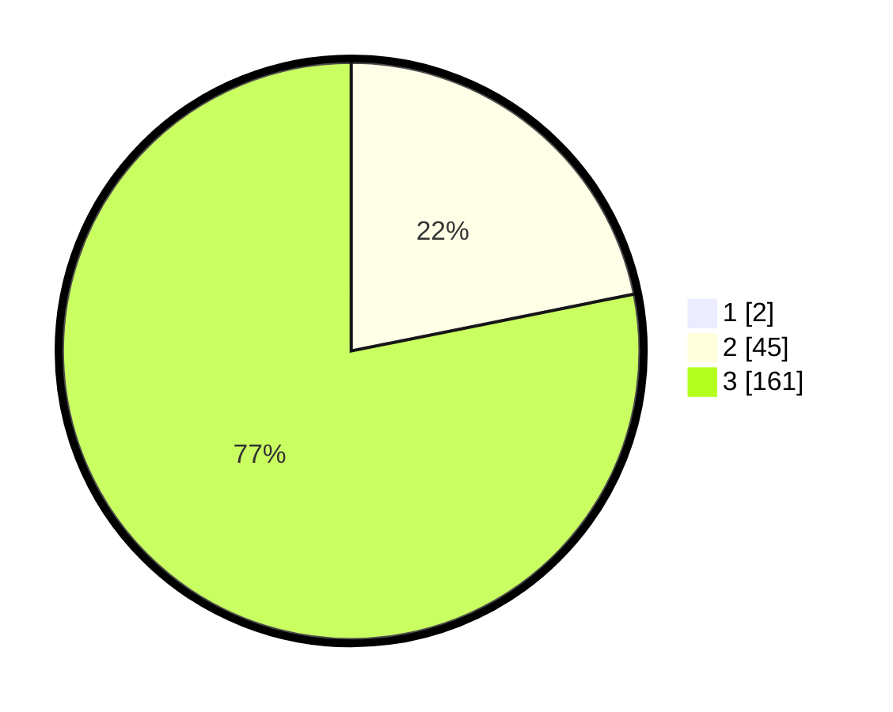

# Hasil

## Grafik

## Tabel

| No. | Nama Paslon    | Suara | Suara (raw) | Persentase |
|:--- |:-------------- | -----:| -----------:| ----------:|
| 1   | ANIES MUHAIMIN | 2     | [2][p-1]    | 0,96       |
| 2   | PRABOWO GIBRAN | 45    | [45][p-2]   | 21,63      |
| 3   | GANJAR MAHFUD  | 161   | [161][p-3]  | 77,40      |

[p-1]: https://github.com/gigit-pemilu/pemilu-2024/blob/main/pilpres/hitung-suara/sub/51-bali/sub/02-tabanan/sub/02-selemadeg-timur/sub/2002-gadungan/sub/002-tps/sub/paslon-1.txt
[p-2]: https://github.com/gigit-pemilu/pemilu-2024/blob/main/pilpres/hitung-suara/sub/51-bali/sub/02-tabanan/sub/02-selemadeg-timur/sub/2002-gadungan/sub/002-tps/sub/paslon-2.txt
[p-3]: https://github.com/gigit-pemilu/pemilu-2024/blob/main/pilpres/hitung-suara/sub/51-bali/sub/02-tabanan/sub/02-selemadeg-timur/sub/2002-gadungan/sub/002-tps/sub/paslon-3.txt

## Foto C Plano

https://sirekap-obj-formc.kpu.go.id/53be/pemilu/ppwp/51/02/02/20/02/5102022002002-20240215-221328--542aef5f-acf6-489e-9ef7-cdf81d140249.jpg

https://sirekap-obj-formc.kpu.go.id/53be/pemilu/ppwp/51/02/02/20/02/5102022002002-20240215-221337--bcb47d8e-7607-427f-98c9-fcc026f777ea.jpg

https://sirekap-obj-formc.kpu.go.id/53be/pemilu/ppwp/51/02/02/20/02/5102022002002-20240215-221329--aa0bfe30-73ea-4037-8cdd-232a559f848f.jpg

## Metadata

| Key        | Value               |
| ---------- | ------------------- |
| Time Stamp | 2024-02-16 09:30:28 |

## DATA PEMILIH TETAP

Jumlah pemilih dalam DPT: **231**.
 * L: **106**.
 * P: **125**.

## DATA PENGGUNA HAK PILIH

Jumlah pengguna hak pilih dalam DPT: **206**.
 * L: **97**.
 * P: **109**.

Jumlah pengguna hak pilih dalam DPTb: **2**.
 * L: **1**.
 * P: **1**.

Jumlah pengguna hak pilih dalam DPK: **0**.
 * L: **0**.
 * P: **0**.

Jumlah pengguna hak pilih: **208**.
 * L: **98**.
 * P: **110**.

## JUMLAH SUARA SAH DAN TIDAK SAH

JUMLAH SELURUH SUARA SAH: **208**.

JUMLAH SUARA TIDAK SAH: **0**.

JUMLAH SELURUH SUARA SAH DAN SUARA TIDAK SAH: **208**.

