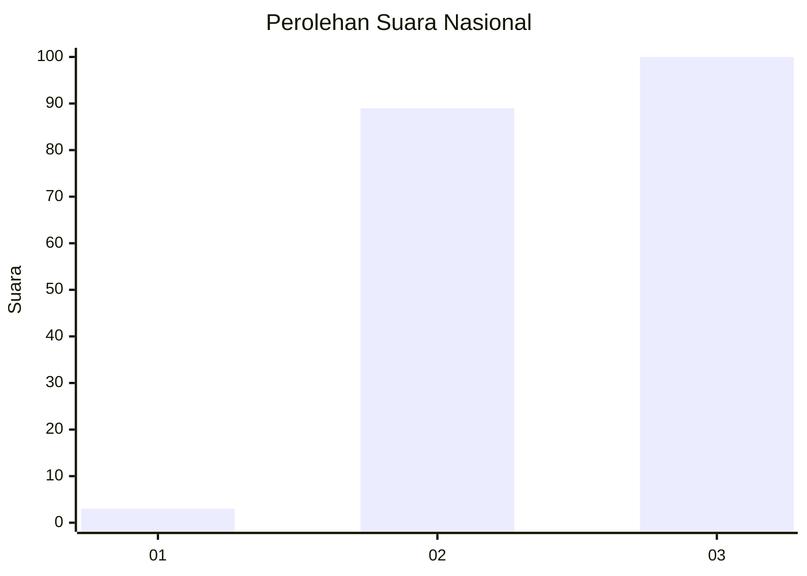
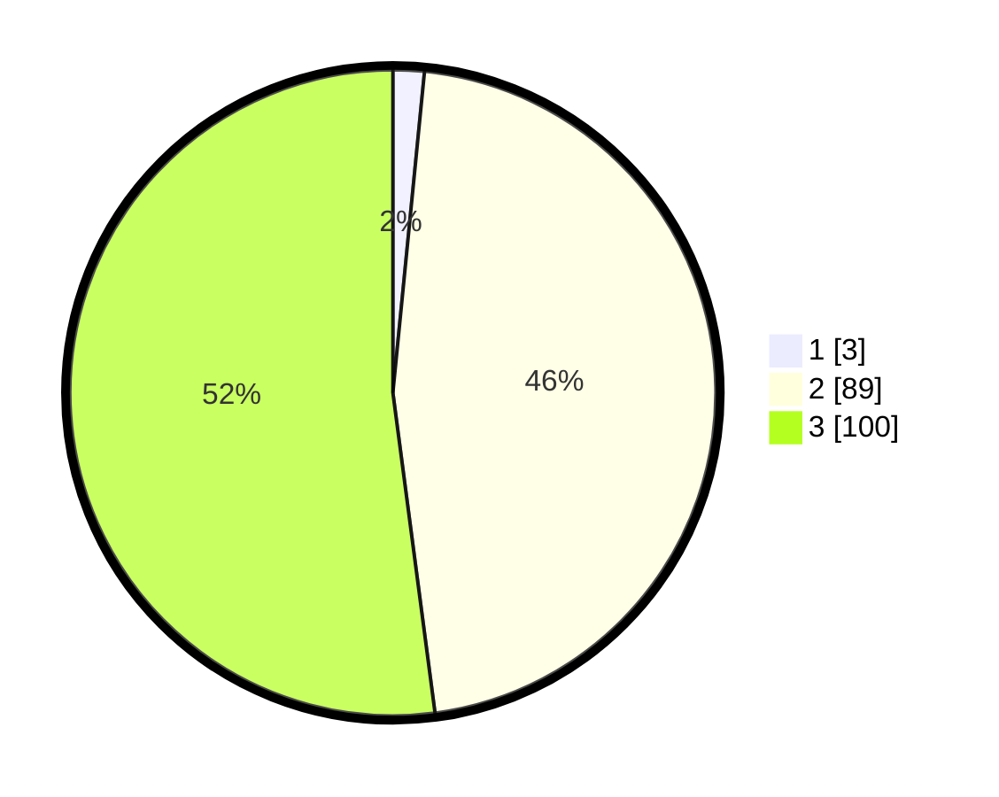

# Hasil

## Grafik

## Tabel

| No. | Nama Paslon    | Suara | Suara (raw) | Persentase |
|:--- |:-------------- | -----:| -----------:| ----------:|
| 1   | ANIES MUHAIMIN | 3     | [3][p-1]    | 1,56       |
| 2   | PRABOWO GIBRAN | 89    | [89][p-2]   | 46,35      |
| 3   | GANJAR MAHFUD  | 100   | [100][p-3]  | 52,08      |

[p-1]: https://github.com/gigit-pemilu/pemilu-2024/blob/main/pilpres/hitung-suara/sub/51-bali/sub/02-tabanan/sub/02-selemadeg-timur/sub/2002-gadungan/sub/003-tps/sub/paslon-1.txt
[p-2]: https://github.com/gigit-pemilu/pemilu-2024/blob/main/pilpres/hitung-suara/sub/51-bali/sub/02-tabanan/sub/02-selemadeg-timur/sub/2002-gadungan/sub/003-tps/sub/paslon-2.txt
[p-3]: https://github.com/gigit-pemilu/pemilu-2024/blob/main/pilpres/hitung-suara/sub/51-bali/sub/02-tabanan/sub/02-selemadeg-timur/sub/2002-gadungan/sub/003-tps/sub/paslon-3.txt

## Foto C Plano

https://sirekap-obj-formc.kpu.go.id/87b1/pemilu/ppwp/51/02/02/20/02/5102022002003-20240216-062219--6688764b-bafb-4519-a55b-59fcfe78cc07.jpg

https://sirekap-obj-formc.kpu.go.id/87b1/pemilu/ppwp/51/02/02/20/02/5102022002003-20240216-062220--3e2b7f11-f6cc-45db-af26-61b75c0225df.jpg

https://sirekap-obj-formc.kpu.go.id/87b1/pemilu/ppwp/51/02/02/20/02/5102022002003-20240216-062220--306382b3-4a2c-449b-82e8-3a088335c7d5.jpg

## Metadata

| Key        | Value               |
| ---------- | ------------------- |
| Time Stamp | 2024-02-16 09:30:28 |

## DATA PEMILIH TETAP

Jumlah pemilih dalam DPT: **220**.
 * L: **109**.
 * P: **111**.

## DATA PENGGUNA HAK PILIH

Jumlah pengguna hak pilih dalam DPT: **191**.
 * L: **98**.
 * P: **93**.

Jumlah pengguna hak pilih dalam DPTb: **2**.
 * L: **0**.
 * P: **2**.

Jumlah pengguna hak pilih dalam DPK: **0**.
 * L: **0**.
 * P: **0**.

Jumlah pengguna hak pilih: **193**.
 * L: **98**.
 * P: **95**.

## JUMLAH SUARA SAH DAN TIDAK SAH

JUMLAH SELURUH SUARA SAH: **192**.

JUMLAH SUARA TIDAK SAH: **1**.

JUMLAH SELURUH SUARA SAH DAN SUARA TIDAK SAH: **193**.

