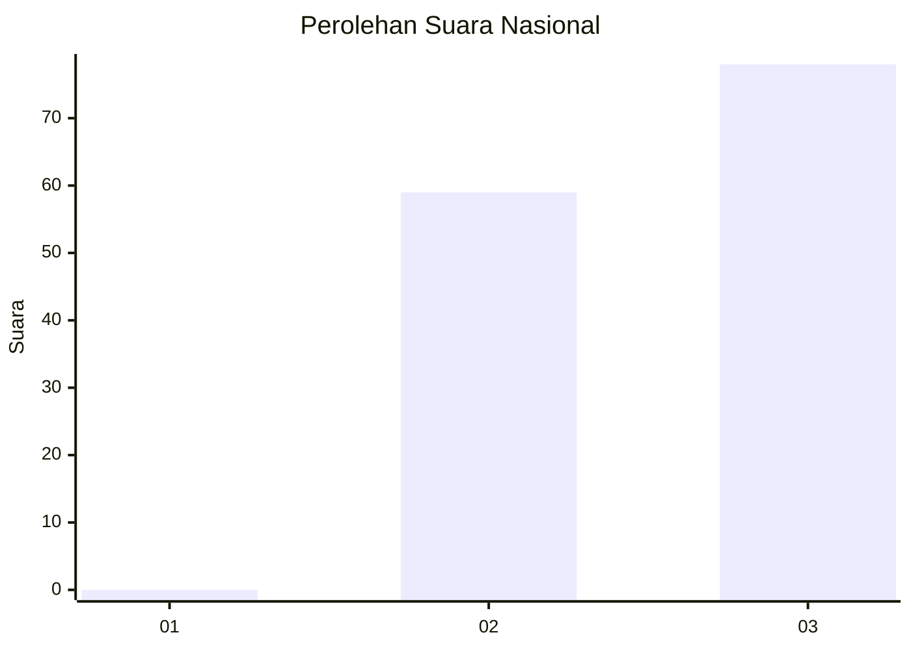
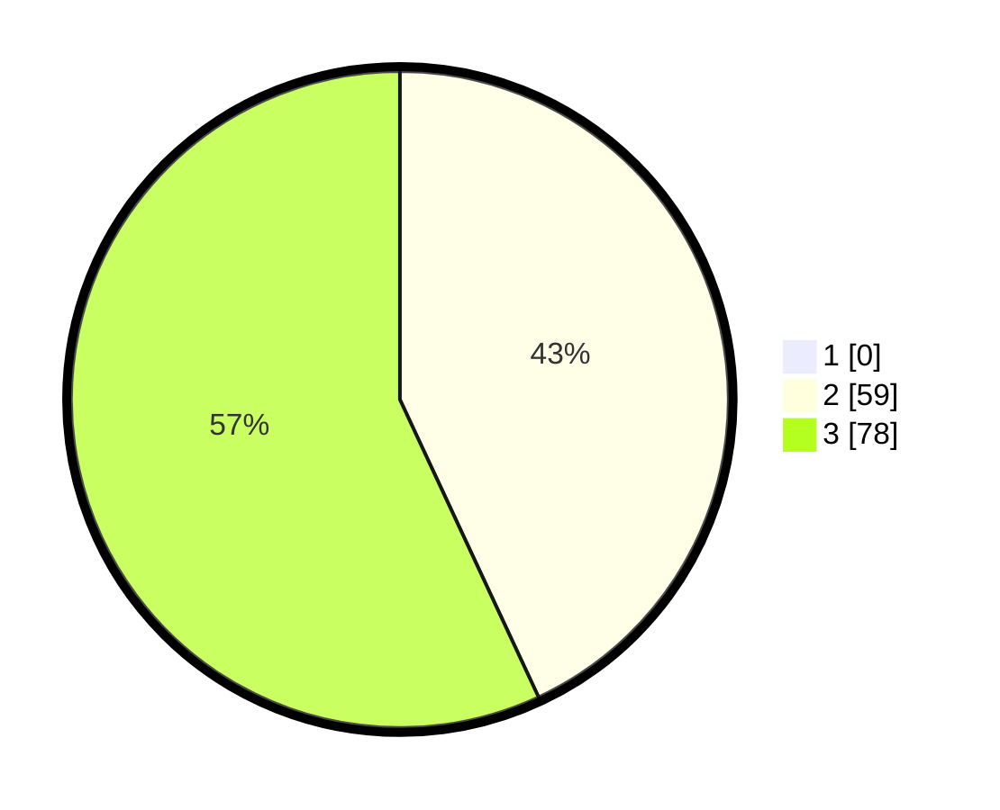

# Hasil

## Grafik

## Tabel

| No. | Nama Paslon    | Suara | Suara (raw) | Persentase |
|:--- |:-------------- | -----:| -----------:| ----------:|
| 1   | ANIES MUHAIMIN | 0     | [0][p-1]    | 0,00       |
| 2   | PRABOWO GIBRAN | 59    | [59][p-2]   | 43,07      |
| 3   | GANJAR MAHFUD  | 78    | [78][p-3]   | 56,93      |

[p-1]: https://github.com/gigit-pemilu/pemilu-2024/blob/main/pilpres/hitung-suara/sub/51-bali/sub/02-tabanan/sub/02-selemadeg-timur/sub/2002-gadungan/sub/004-tps/sub/paslon-1.txt
[p-2]: https://github.com/gigit-pemilu/pemilu-2024/blob/main/pilpres/hitung-suara/sub/51-bali/sub/02-tabanan/sub/02-selemadeg-timur/sub/2002-gadungan/sub/004-tps/sub/paslon-2.txt
[p-3]: https://github.com/gigit-pemilu/pemilu-2024/blob/main/pilpres/hitung-suara/sub/51-bali/sub/02-tabanan/sub/02-selemadeg-timur/sub/2002-gadungan/sub/004-tps/sub/paslon-3.txt

## Foto C Plano

https://sirekap-obj-formc.kpu.go.id/d0e1/pemilu/ppwp/51/02/02/20/02/5102022002004-20240214-131247--e0873a10-6a3e-410e-b0f2-ea6bf022fe36.jpg

https://sirekap-obj-formc.kpu.go.id/d0e1/pemilu/ppwp/51/02/02/20/02/5102022002004-20240214-131509--2e72cb86-fe83-49e0-b4dc-a3ec26fa6812.jpg

https://sirekap-obj-formc.kpu.go.id/d0e1/pemilu/ppwp/51/02/02/20/02/5102022002004-20240214-131628--637fbf62-bec1-49a1-ba62-63e00d982364.jpg

## Metadata

| Key        | Value               |
| ---------- | ------------------- |
| Time Stamp | 2024-02-14 21:46:01 |

## DATA PEMILIH TETAP

Jumlah pemilih dalam DPT: **163**.
 * L: **77**.
 * P: **86**.

## DATA PENGGUNA HAK PILIH

Jumlah pengguna hak pilih dalam DPT: **138**.
 * L: **70**.
 * P: **68**.

Jumlah pengguna hak pilih dalam DPTb: **0**.
 * L: **0**.
 * P: **0**.

Jumlah pengguna hak pilih dalam DPK: **0**.
 * L: **0**.
 * P: **0**.

Jumlah pengguna hak pilih: **138**.
 * L: **70**.
 * P: **68**.

## JUMLAH SUARA SAH DAN TIDAK SAH

JUMLAH SELURUH SUARA SAH: **137**.

JUMLAH SUARA TIDAK SAH: **1**.

JUMLAH SELURUH SUARA SAH DAN SUARA TIDAK SAH: **138**.

