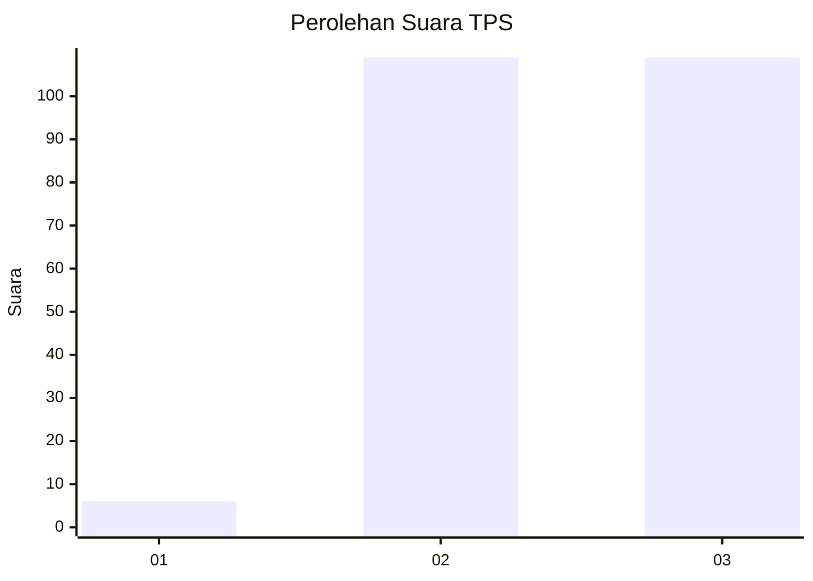
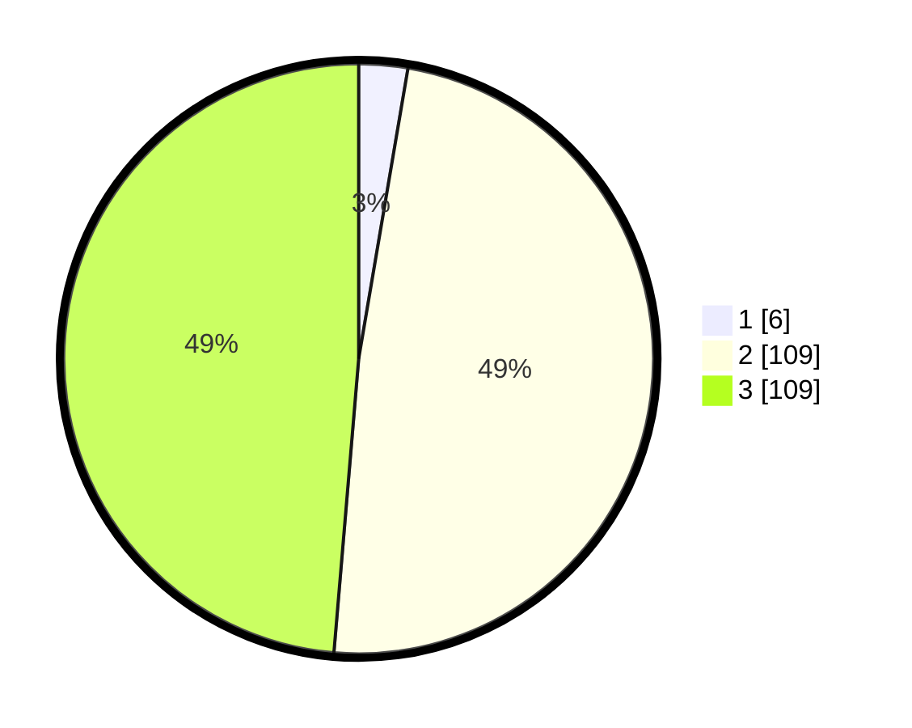

# Hasil

## Grafik

## Tabel

| No. | Nama Paslon    | Suara | Suara (raw) | Persentase |
|:--- |:-------------- | -----:| -----------:| ----------:|
| 1   | ANIES MUHAIMIN | 6     | [6][p-1]    | 2,68       |
| 2   | PRABOWO GIBRAN | 109   | [109][p-2]  | 48,66      |
| 3   | GANJAR MAHFUD  | 109   | [109][p-3]  | 48,66      |

[p-1]: https://github.com/gigit-pemilu/pemilu-2024-51-bali/blob/main/pilpres/hitung-suara/sub/51-bali/sub/02-tabanan/sub/02-selemadeg-timur/sub/2002-gadungan/sub/006-tps/sub/paslon-1.txt
[p-2]: https://github.com/gigit-pemilu/pemilu-2024-51-bali/blob/main/pilpres/hitung-suara/sub/51-bali/sub/02-tabanan/sub/02-selemadeg-timur/sub/2002-gadungan/sub/006-tps/sub/paslon-2.txt
[p-3]: https://github.com/gigit-pemilu/pemilu-2024-51-bali/blob/main/pilpres/hitung-suara/sub/51-bali/sub/02-tabanan/sub/02-selemadeg-timur/sub/2002-gadungan/sub/006-tps/sub/paslon-3.txt

## Foto C Plano

https://sirekap-obj-formc.kpu.go.id/dbff/pemilu/ppwp/51/02/02/20/02/5102022002006-20240214-132739--41dd4672-1318-4235-b045-7debbb6c19e1.jpg

https://sirekap-obj-formc.kpu.go.id/dbff/pemilu/ppwp/51/02/02/20/02/5102022002006-20240214-132312--93c14efd-abbd-4a60-b49e-68de5225e87f.jpg

https://sirekap-obj-formc.kpu.go.id/dbff/pemilu/ppwp/51/02/02/20/02/5102022002006-20240214-132131--a35bd19b-2a4f-4273-8a24-75001975e300.jpg

## Metadata

| Key        | Value               |
| ---------- | ------------------- |
| Time Stamp | 2024-02-14 21:46:01 |

## DATA PEMILIH TETAP

Jumlah pemilih dalam DPT: **250**.
 * L: **124**.
 * P: **126**.

## DATA PENGGUNA HAK PILIH

Jumlah pengguna hak pilih dalam DPT: **222**.
 * L: **111**.
 * P: **111**.

Jumlah pengguna hak pilih dalam DPTb: **1**.
 * L: **0**.
 * P: **1**.

Jumlah pengguna hak pilih dalam DPK: **1**.
 * L: **1**.
 * P: **0**.

Jumlah pengguna hak pilih: **224**.
 * L: **112**.
 * P: **112**.

## JUMLAH SUARA SAH DAN TIDAK SAH

JUMLAH SELURUH SUARA SAH: **224**.

JUMLAH SUARA TIDAK SAH: **0**.

JUMLAH SELURUH SUARA SAH DAN SUARA TIDAK SAH: **224**.

