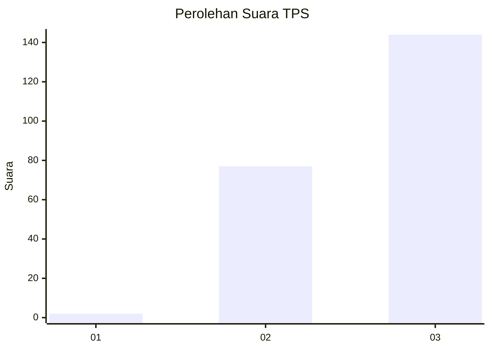
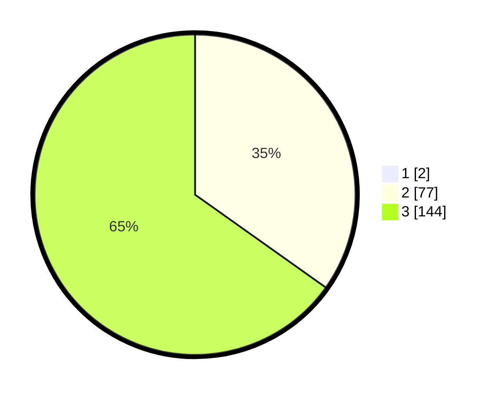

# Hasil

## Grafik

## Tabel

| No. | Nama Paslon    | Suara | Suara (raw) | Persentase |
|:--- |:-------------- | -----:| -----------:| ----------:|
| 1   | ANIES MUHAIMIN | 2     | [2][p-1]    | 0,90       |
| 2   | PRABOWO GIBRAN | 77    | [77][p-2]   | 34,53      |
| 3   | GANJAR MAHFUD  | 144   | [144][p-3]  | 64,57      |

[p-1]: https://github.com/gigit-pemilu/pemilu-2024-51-bali/blob/main/pilpres/hitung-suara/sub/51-bali/sub/02-tabanan/sub/02-selemadeg-timur/sub/2002-gadungan/sub/007-tps/sub/paslon-1.txt
[p-2]: https://github.com/gigit-pemilu/pemilu-2024-51-bali/blob/main/pilpres/hitung-suara/sub/51-bali/sub/02-tabanan/sub/02-selemadeg-timur/sub/2002-gadungan/sub/007-tps/sub/paslon-2.txt
[p-3]: https://github.com/gigit-pemilu/pemilu-2024-51-bali/blob/main/pilpres/hitung-suara/sub/51-bali/sub/02-tabanan/sub/02-selemadeg-timur/sub/2002-gadungan/sub/007-tps/sub/paslon-3.txt

## Foto C Plano

https://sirekap-obj-formc.kpu.go.id/a7b9/pemilu/ppwp/51/02/02/20/02/5102022002007-20240214-132236--7edb7a76-3c03-4863-98cc-07d22124bd47.jpg

https://sirekap-obj-formc.kpu.go.id/a7b9/pemilu/ppwp/51/02/02/20/02/5102022002007-20240214-133027--ca0d723a-9370-40b6-a2ca-e61fd6484c17.jpg

https://sirekap-obj-formc.kpu.go.id/a7b9/pemilu/ppwp/51/02/02/20/02/5102022002007-20240216-115252--63c89d34-d323-40cf-9521-d40e0c33a70f.jpg

## Metadata

| Key        | Value               |
| ---------- | ------------------- |
| Time Stamp | 2024-02-16 12:51:22 |

## DATA PEMILIH TETAP

Jumlah pemilih dalam DPT: **247**.
 * L: **121**.
 * P: **126**.

## DATA PENGGUNA HAK PILIH

Jumlah pengguna hak pilih dalam DPT: **225**.
 * L: **109**.
 * P: **116**.

Jumlah pengguna hak pilih dalam DPTb: **0**.
 * L: **0**.
 * P: **0**.

Jumlah pengguna hak pilih dalam DPK: **0**.
 * L: **0**.
 * P: **0**.

Jumlah pengguna hak pilih: **225**.
 * L: **109**.
 * P: **116**.

## JUMLAH SUARA SAH DAN TIDAK SAH

JUMLAH SELURUH SUARA SAH: **223**.

JUMLAH SUARA TIDAK SAH: **2**.

JUMLAH SELURUH SUARA SAH DAN SUARA TIDAK SAH: **225**.

