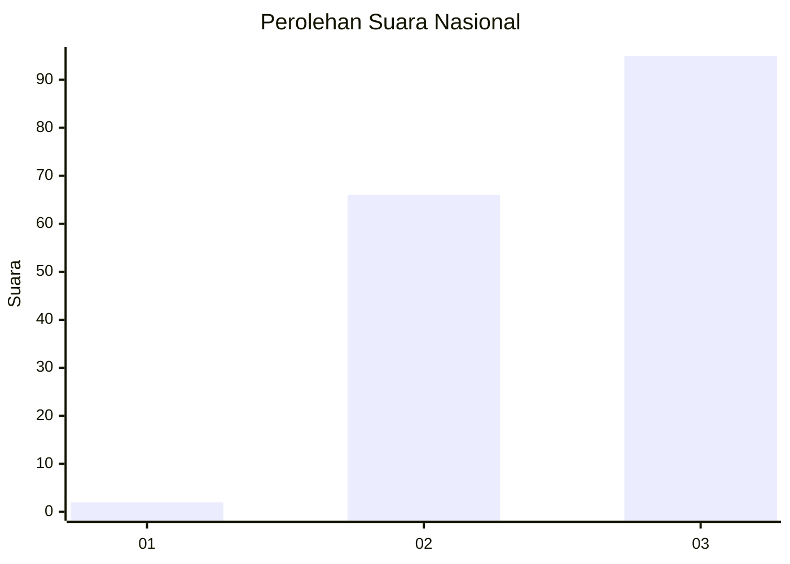
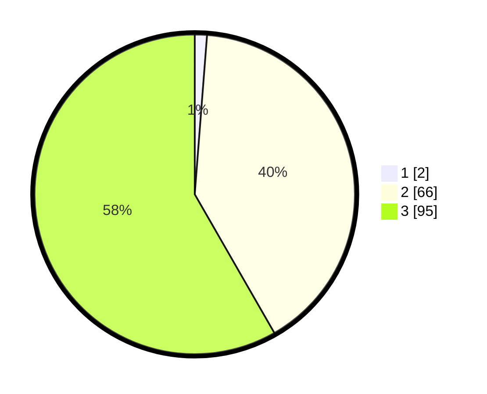

# Hasil

## Grafik

## Tabel

| No. | Nama Paslon    | Suara | Suara (raw) | Persentase |
|:--- |:-------------- | -----:| -----------:| ----------:|
| 1   | ANIES MUHAIMIN | 2     | [2][p-1]    | 1,23       |
| 2   | PRABOWO GIBRAN | 66    | [66][p-2]   | 40,49      |
| 3   | GANJAR MAHFUD  | 95    | [95][p-3]   | 58,28      |

[p-1]: https://github.com/gigit-pemilu/pemilu-2024/blob/main/pilpres/hitung-suara/sub/51-bali/sub/02-tabanan/sub/02-selemadeg-timur/sub/2002-gadungan/sub/008-tps/sub/paslon-1.txt
[p-2]: https://github.com/gigit-pemilu/pemilu-2024/blob/main/pilpres/hitung-suara/sub/51-bali/sub/02-tabanan/sub/02-selemadeg-timur/sub/2002-gadungan/sub/008-tps/sub/paslon-2.txt
[p-3]: https://github.com/gigit-pemilu/pemilu-2024/blob/main/pilpres/hitung-suara/sub/51-bali/sub/02-tabanan/sub/02-selemadeg-timur/sub/2002-gadungan/sub/008-tps/sub/paslon-3.txt

## Foto C Plano

https://sirekap-obj-formc.kpu.go.id/9281/pemilu/ppwp/51/02/02/20/02/5102022002008-20240216-150758--e7f66914-e59c-4225-8a59-b5226900f0c9.jpg

https://sirekap-obj-formc.kpu.go.id/9281/pemilu/ppwp/51/02/02/20/02/5102022002008-20240216-150759--0fdc2961-561f-4c2f-86db-b54b348331f2.jpg

https://sirekap-obj-formc.kpu.go.id/9281/pemilu/ppwp/51/02/02/20/02/5102022002008-20240216-150759--a980035b-ffb8-482f-88b2-b4ac3b927c1a.jpg

## Metadata

| Key        | Value               |
| ---------- | ------------------- |
| Time Stamp | 2024-02-21 11:00:00 |

## DATA PEMILIH TETAP

Jumlah pemilih dalam DPT: **175**.
 * L: **90**.
 * P: **85**.

## DATA PENGGUNA HAK PILIH

Jumlah pengguna hak pilih dalam DPT: **162**.
 * L: **86**.
 * P: **76**.

Jumlah pengguna hak pilih dalam DPTb: **3**.
 * L: **1**.
 * P: **2**.

Jumlah pengguna hak pilih dalam DPK: **0**.
 * L: **0**.
 * P: **0**.

Jumlah pengguna hak pilih: **165**.
 * L: **87**.
 * P: **78**.

## JUMLAH SUARA SAH DAN TIDAK SAH

JUMLAH SELURUH SUARA SAH: **163**.

JUMLAH SUARA TIDAK SAH: **2**.

JUMLAH SELURUH SUARA SAH DAN SUARA TIDAK SAH: **165**.

