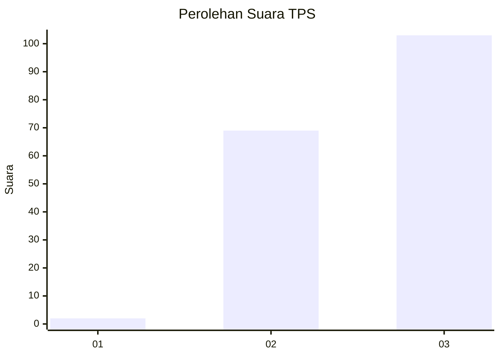
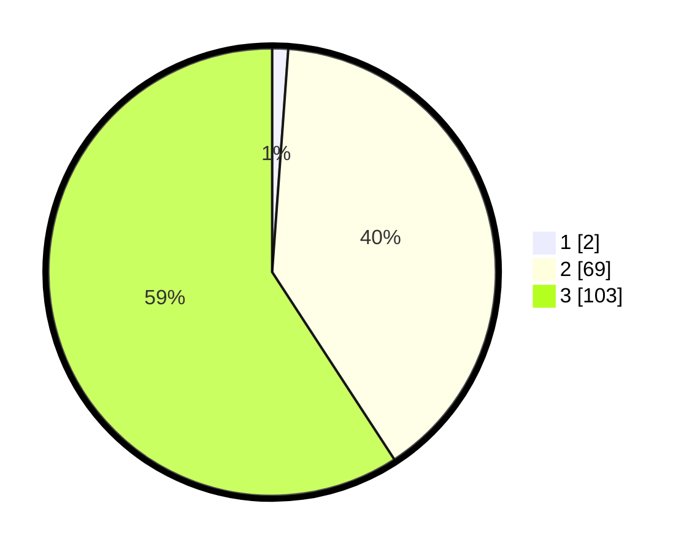

# Hasil

## Grafik

## Tabel

| No. | Nama Paslon    | Suara | Suara (raw) | Persentase |
|:--- |:-------------- | -----:| -----------:| ----------:|
| 1   | ANIES MUHAIMIN | 2     | [2][p-1]    | 1,15       |
| 2   | PRABOWO GIBRAN | 69    | [69][p-2]   | 39,66      |
| 3   | GANJAR MAHFUD  | 103   | [103][p-3]  | 59,20      |

[p-1]: https://github.com/gigit-pemilu/pemilu-2024-51-bali/blob/main/pilpres/hitung-suara/sub/51-bali/sub/02-tabanan/sub/02-selemadeg-timur/sub/2002-gadungan/sub/009-tps/sub/paslon-1.txt
[p-2]: https://github.com/gigit-pemilu/pemilu-2024-51-bali/blob/main/pilpres/hitung-suara/sub/51-bali/sub/02-tabanan/sub/02-selemadeg-timur/sub/2002-gadungan/sub/009-tps/sub/paslon-2.txt
[p-3]: https://github.com/gigit-pemilu/pemilu-2024-51-bali/blob/main/pilpres/hitung-suara/sub/51-bali/sub/02-tabanan/sub/02-selemadeg-timur/sub/2002-gadungan/sub/009-tps/sub/paslon-3.txt

## Foto C Plano

https://sirekap-obj-formc.kpu.go.id/0ba1/pemilu/ppwp/51/02/02/20/02/5102022002009-20240216-134635--8824a8b5-dda7-4b86-ab36-f8810f1cfa1f.jpg

https://sirekap-obj-formc.kpu.go.id/0ba1/pemilu/ppwp/51/02/02/20/02/5102022002009-20240216-134636--abcd46ad-a0c9-44f2-9e85-15b367eb1c27.jpg

https://sirekap-obj-formc.kpu.go.id/0ba1/pemilu/ppwp/51/02/02/20/02/5102022002009-20240216-134636--d7ee354f-ce9d-4541-ade9-dc599551c8e7.jpg

## Metadata

| Key        | Value               |
| ---------- | ------------------- |
| Time Stamp | 2024-02-16 14:00:34 |

## DATA PEMILIH TETAP

Jumlah pemilih dalam DPT: **189**.
 * L: **85**.
 * P: **104**.

## DATA PENGGUNA HAK PILIH

Jumlah pengguna hak pilih dalam DPT: **174**.
 * L: **76**.
 * P: **98**.

Jumlah pengguna hak pilih dalam DPTb: **2**.
 * L: **0**.
 * P: **2**.

Jumlah pengguna hak pilih dalam DPK: **0**.
 * L: **0**.
 * P: **0**.

Jumlah pengguna hak pilih: **176**.
 * L: **76**.
 * P: **100**.

## JUMLAH SUARA SAH DAN TIDAK SAH

JUMLAH SELURUH SUARA SAH: **174**.

JUMLAH SUARA TIDAK SAH: **2**.

JUMLAH SELURUH SUARA SAH DAN SUARA TIDAK SAH: **176**.

