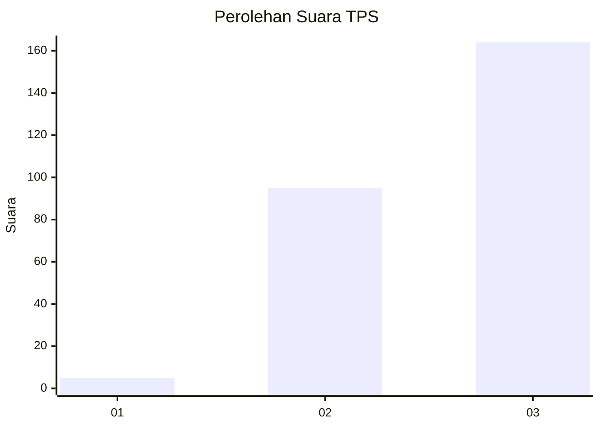
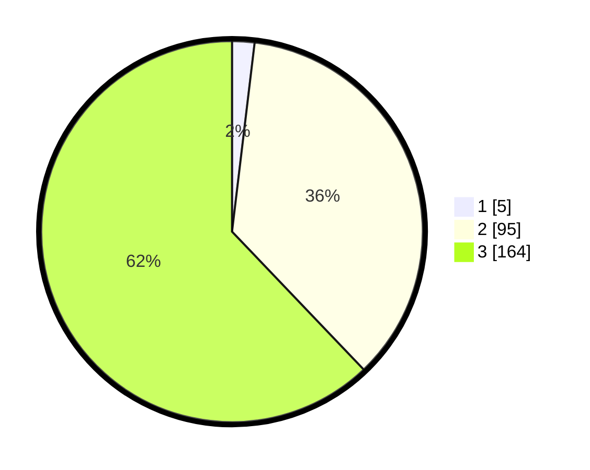

# Hasil

## Grafik

## Tabel

| No. | Nama Paslon    | Suara | Suara (raw) | Persentase |
|:--- |:-------------- | -----:| -----------:| ----------:|
| 1   | ANIES MUHAIMIN | 5     | [5][p-1]    | 1,89       |
| 2   | PRABOWO GIBRAN | 95    | [95][p-2]   | 35,98      |
| 3   | GANJAR MAHFUD  | 164   | [164][p-3]  | 62,12      |

[p-1]: https://github.com/gigit-pemilu/pemilu-2024-51-bali/blob/main/pilpres/hitung-suara/sub/51-bali/sub/02-tabanan/sub/02-selemadeg-timur/sub/2002-gadungan/sub/010-tps/sub/paslon-1.txt
[p-2]: https://github.com/gigit-pemilu/pemilu-2024-51-bali/blob/main/pilpres/hitung-suara/sub/51-bali/sub/02-tabanan/sub/02-selemadeg-timur/sub/2002-gadungan/sub/010-tps/sub/paslon-2.txt
[p-3]: https://github.com/gigit-pemilu/pemilu-2024-51-bali/blob/main/pilpres/hitung-suara/sub/51-bali/sub/02-tabanan/sub/02-selemadeg-timur/sub/2002-gadungan/sub/010-tps/sub/paslon-3.txt

## Foto C Plano

https://sirekap-obj-formc.kpu.go.id/0318/pemilu/ppwp/51/02/02/20/02/5102022002010-20240214-141752--b71bf1f4-f4c2-44b8-9225-6e8b264b17cb.jpg

https://sirekap-obj-formc.kpu.go.id/0318/pemilu/ppwp/51/02/02/20/02/5102022002010-20240214-141904--9568f5f0-f82d-476d-8844-b8e76f0938d3.jpg

https://sirekap-obj-formc.kpu.go.id/0318/pemilu/ppwp/51/02/02/20/02/5102022002010-20240214-141541--b438c7a0-61bf-4e1b-84bc-a85bb8484ebe.jpg

## Metadata

| Key        | Value               |
| ---------- | ------------------- |
| Time Stamp | 2024-02-15 21:30:27 |

