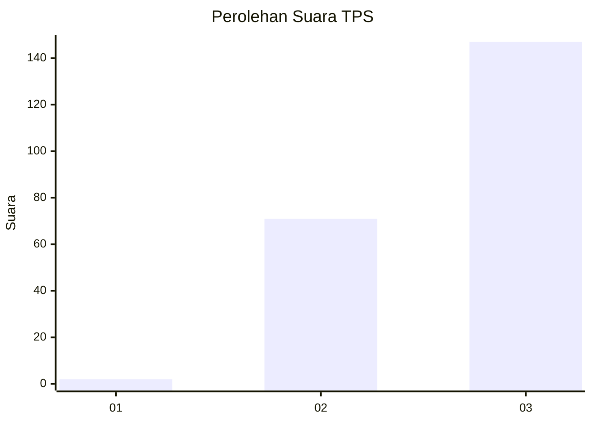
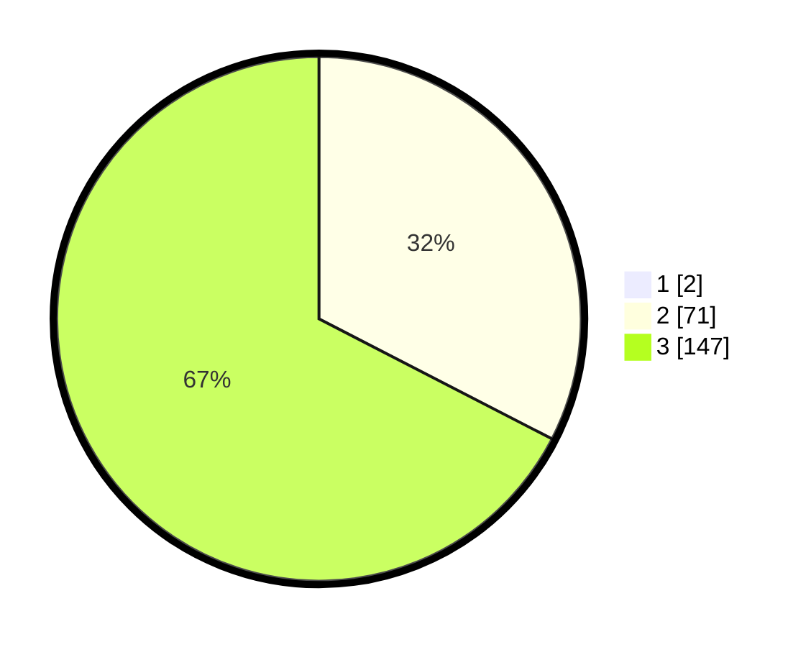

# Hasil

## Grafik

## Tabel

| No. | Nama Paslon    | Suara | Suara (raw) | Persentase |
|:--- |:-------------- | -----:| -----------:| ----------:|
| 1   | ANIES MUHAIMIN | 2     | [2][p-1]    | 0,91       |
| 2   | PRABOWO GIBRAN | 71    | [71][p-2]   | 32,27      |
| 3   | GANJAR MAHFUD  | 147   | [147][p-3]  | 66,82      |

[p-1]: https://github.com/gigit-pemilu/pemilu-2024-51-bali/blob/main/pilpres/hitung-suara/sub/51-bali/sub/02-tabanan/sub/02-selemadeg-timur/sub/2002-gadungan/sub/011-tps/sub/paslon-1.txt
[p-2]: https://github.com/gigit-pemilu/pemilu-2024-51-bali/blob/main/pilpres/hitung-suara/sub/51-bali/sub/02-tabanan/sub/02-selemadeg-timur/sub/2002-gadungan/sub/011-tps/sub/paslon-2.txt
[p-3]: https://github.com/gigit-pemilu/pemilu-2024-51-bali/blob/main/pilpres/hitung-suara/sub/51-bali/sub/02-tabanan/sub/02-selemadeg-timur/sub/2002-gadungan/sub/011-tps/sub/paslon-3.txt

## Foto C Plano

https://sirekap-obj-formc.kpu.go.id/cbe4/pemilu/ppwp/51/02/02/20/02/5102022002011-20240216-021537--00459de6-444e-41c8-909c-a0c743c3024d.jpg

https://sirekap-obj-formc.kpu.go.id/cbe4/pemilu/ppwp/51/02/02/20/02/5102022002011-20240216-021539--59dc6828-86fd-4a3f-9bdd-f3e166d16297.jpg

https://sirekap-obj-formc.kpu.go.id/cbe4/pemilu/ppwp/51/02/02/20/02/5102022002011-20240216-021538--6f180d38-ea08-4365-9d35-e44047e0bfc2.jpg

## Metadata

| Key        | Value               |
| ---------- | ------------------- |
| Time Stamp | 2024-02-16 09:30:28 |

## DATA PEMILIH TETAP

Jumlah pemilih dalam DPT: **256**.
 * L: **119**.
 * P: **137**.

## DATA PENGGUNA HAK PILIH

Jumlah pengguna hak pilih dalam DPT: **221**.
 * L: **104**.
 * P: **117**.

Jumlah pengguna hak pilih dalam DPTb: **222**.
 * L: **105**.
 * P: **117**.

Jumlah pengguna hak pilih dalam DPK: **0**.
 * L: **0**.
 * P: **0**.

Jumlah pengguna hak pilih: **222**.
 * L: **105**.
 * P: **117**.

## JUMLAH SUARA SAH DAN TIDAK SAH

JUMLAH SELURUH SUARA SAH: **220**.

JUMLAH SUARA TIDAK SAH: **2**.

JUMLAH SELURUH SUARA SAH DAN SUARA TIDAK SAH: **222**.

