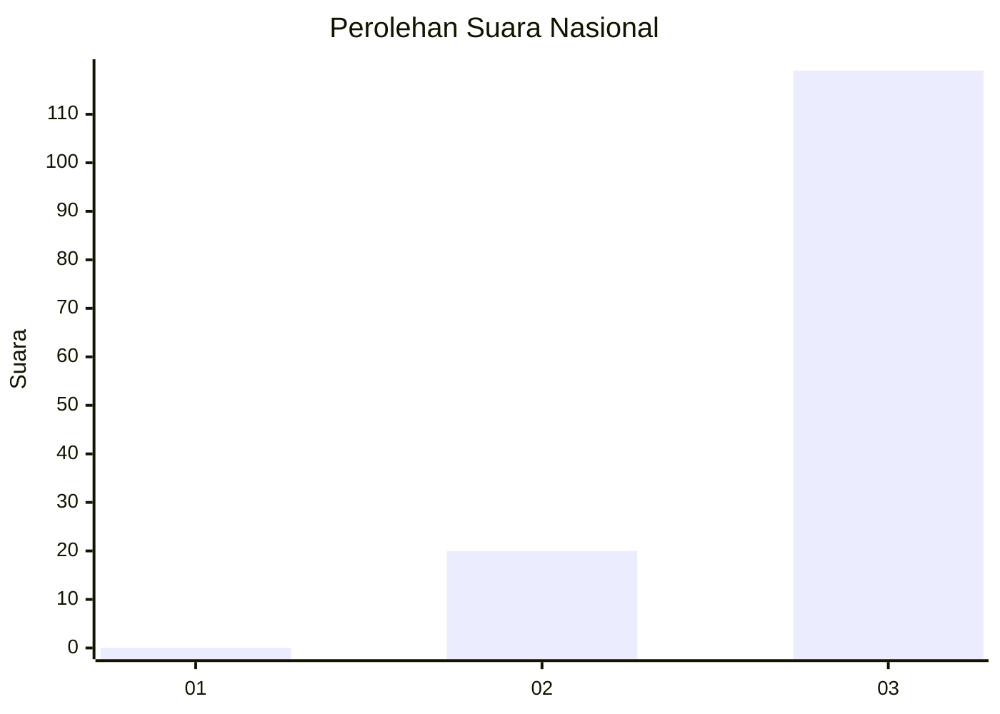
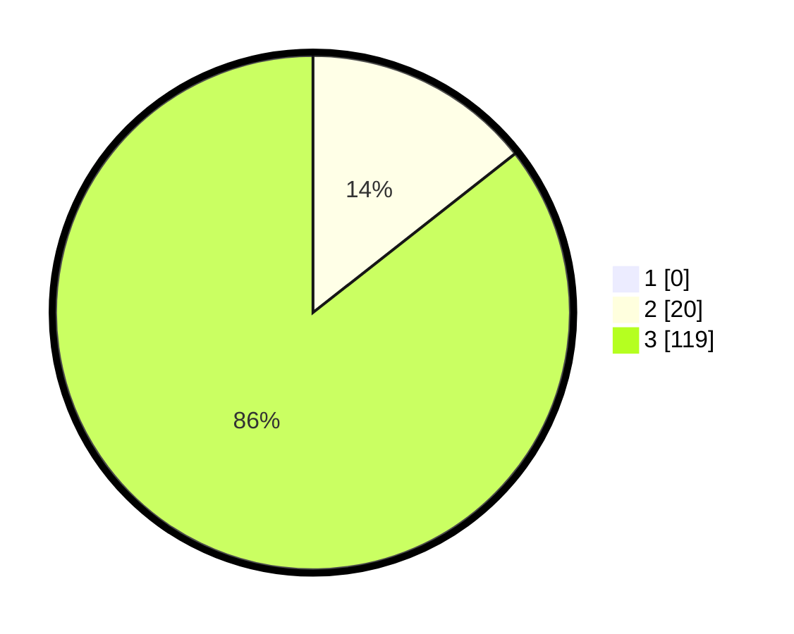

# Hasil

## Grafik

## Tabel

| No. | Nama Paslon    | Suara | Suara (raw) | Persentase |
|:--- |:-------------- | -----:| -----------:| ----------:|
| 1   | ANIES MUHAIMIN | 0     | [0][p-1]    | 0,00       |
| 2   | PRABOWO GIBRAN | 20    | [20][p-2]   | 14,39      |
| 3   | GANJAR MAHFUD  | 119   | [119][p-3]  | 85,61      |

[p-1]: https://github.com/gigit-pemilu/pemilu-2024/blob/main/pilpres/hitung-suara/sub/51-bali/sub/02-tabanan/sub/02-selemadeg-timur/sub/2002-gadungan/sub/012-tps/sub/paslon-1.txt
[p-2]: https://github.com/gigit-pemilu/pemilu-2024/blob/main/pilpres/hitung-suara/sub/51-bali/sub/02-tabanan/sub/02-selemadeg-timur/sub/2002-gadungan/sub/012-tps/sub/paslon-2.txt
[p-3]: https://github.com/gigit-pemilu/pemilu-2024/blob/main/pilpres/hitung-suara/sub/51-bali/sub/02-tabanan/sub/02-selemadeg-timur/sub/2002-gadungan/sub/012-tps/sub/paslon-3.txt

## Foto C Plano

https://sirekap-obj-formc.kpu.go.id/39b0/pemilu/ppwp/51/02/02/20/02/5102022002012-20240215-225905--6d43cefe-5c75-4435-95d8-8768752499c4.jpg

https://sirekap-obj-formc.kpu.go.id/39b0/pemilu/ppwp/51/02/02/20/02/5102022002012-20240215-225909--df9ccdad-3ecd-4e26-b5d3-9710d2ae0ec2.jpg

https://sirekap-obj-formc.kpu.go.id/39b0/pemilu/ppwp/51/02/02/20/02/5102022002012-20240215-225907--db48e969-097d-4f4d-b0c4-fb826c03814e.jpg

## Metadata

| Key        | Value               |
| ---------- | ------------------- |
| Time Stamp | 2024-02-16 09:30:28 |

## DATA PEMILIH TETAP

Jumlah pemilih dalam DPT: **143**.
 * L: **70**.
 * P: **73**.

## DATA PENGGUNA HAK PILIH

Jumlah pengguna hak pilih dalam DPT: **138**.
 * L: **68**.
 * P: **70**.

Jumlah pengguna hak pilih dalam DPTb: **1**.
 * L: **0**.
 * P: **1**.

Jumlah pengguna hak pilih dalam DPK: **0**.
 * L: **0**.
 * P: **0**.

Jumlah pengguna hak pilih: **139**.
 * L: **68**.
 * P: **71**.

## JUMLAH SUARA SAH DAN TIDAK SAH

JUMLAH SELURUH SUARA SAH: **139**.

JUMLAH SUARA TIDAK SAH: **0**.

JUMLAH SELURUH SUARA SAH DAN SUARA TIDAK SAH: **139**.

