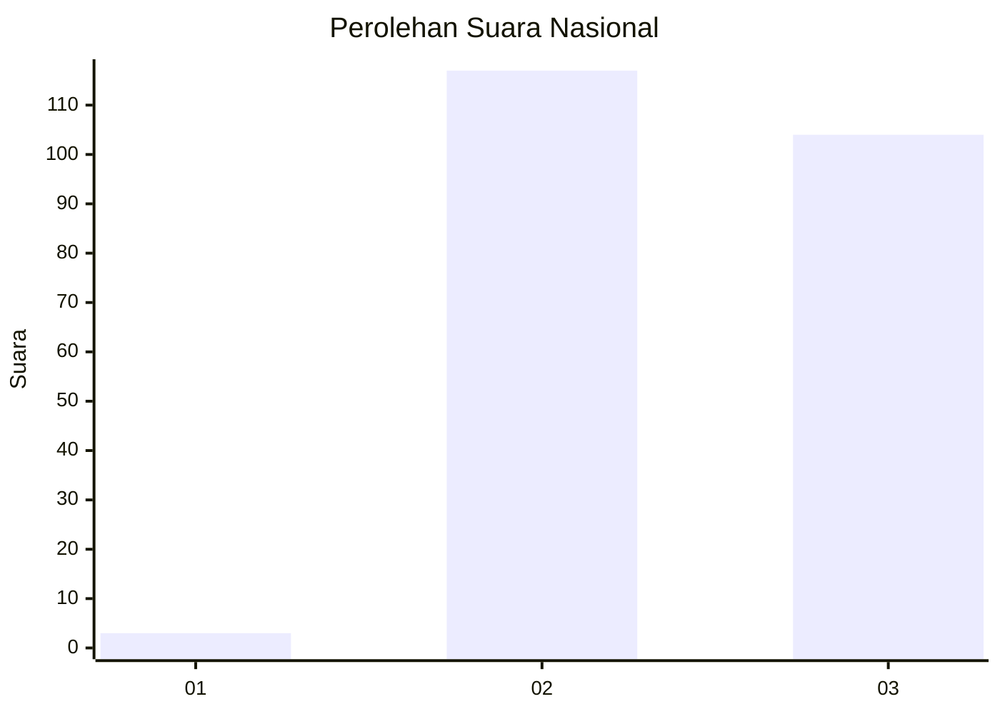
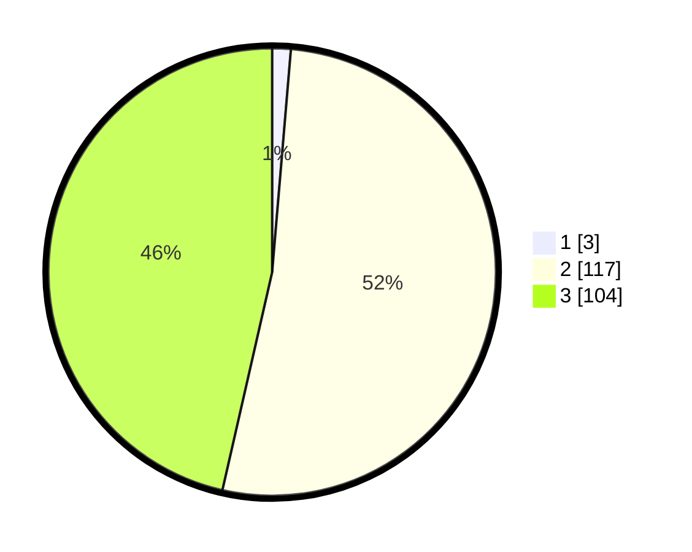

# Hasil

## Grafik

## Tabel

| No. | Nama Paslon    | Suara | Suara (raw) | Persentase |
|:--- |:-------------- | -----:| -----------:| ----------:|
| 1   | ANIES MUHAIMIN | 3     | [3][p-1]    | 1,34       |
| 2   | PRABOWO GIBRAN | 117   | [117][p-2]  | 52,23      |
| 3   | GANJAR MAHFUD  | 104   | [104][p-3]  | 46,43      |

[p-1]: https://github.com/gigit-pemilu/pemilu-2024/blob/main/pilpres/hitung-suara/sub/51-bali/sub/02-tabanan/sub/02-selemadeg-timur/sub/2003-bantas/sub/001-tps/sub/paslon-1.txt
[p-2]: https://github.com/gigit-pemilu/pemilu-2024/blob/main/pilpres/hitung-suara/sub/51-bali/sub/02-tabanan/sub/02-selemadeg-timur/sub/2003-bantas/sub/001-tps/sub/paslon-2.txt
[p-3]: https://github.com/gigit-pemilu/pemilu-2024/blob/main/pilpres/hitung-suara/sub/51-bali/sub/02-tabanan/sub/02-selemadeg-timur/sub/2003-bantas/sub/001-tps/sub/paslon-3.txt

## Foto C Plano

https://sirekap-obj-formc.kpu.go.id/d541/pemilu/ppwp/51/02/02/20/03/5102022003001-20240216-013635--9782bc84-bacc-4c5b-8df5-73f1955373b9.jpg

https://sirekap-obj-formc.kpu.go.id/d541/pemilu/ppwp/51/02/02/20/03/5102022003001-20240216-013636--1c366337-9d6b-458e-999f-e7ef1710a72c.jpg

https://sirekap-obj-formc.kpu.go.id/d541/pemilu/ppwp/51/02/02/20/03/5102022003001-20240216-013635--f74e53bd-258a-480a-8a88-64f274975e2e.jpg

## Metadata

| Key        | Value               |
| ---------- | ------------------- |
| Time Stamp | 2024-02-16 09:30:28 |

## DATA PEMILIH TETAP

Jumlah pemilih dalam DPT: **235**.
 * L: **114**.
 * P: **121**.

## DATA PENGGUNA HAK PILIH

Jumlah pengguna hak pilih dalam DPT: **215**.
 * L: **107**.
 * P: **108**.

Jumlah pengguna hak pilih dalam DPTb: **7**.
 * L: **4**.
 * P: **3**.

Jumlah pengguna hak pilih dalam DPK: **3**.
 * L: **2**.
 * P: **1**.

Jumlah pengguna hak pilih: **225**.
 * L: **113**.
 * P: **112**.

## JUMLAH SUARA SAH DAN TIDAK SAH

JUMLAH SELURUH SUARA SAH: **224**.

JUMLAH SUARA TIDAK SAH: **1**.

JUMLAH SELURUH SUARA SAH DAN SUARA TIDAK SAH: **225**.

