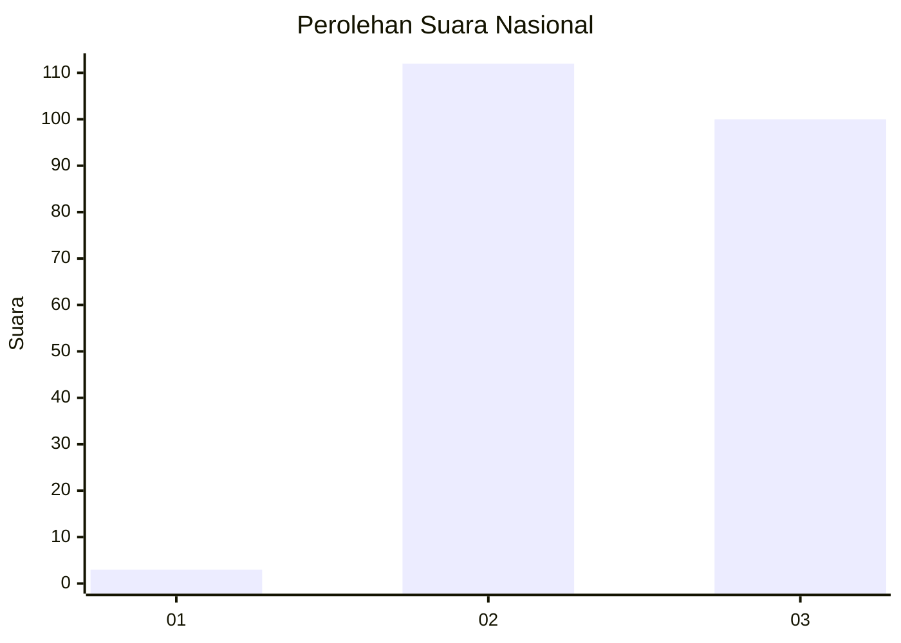
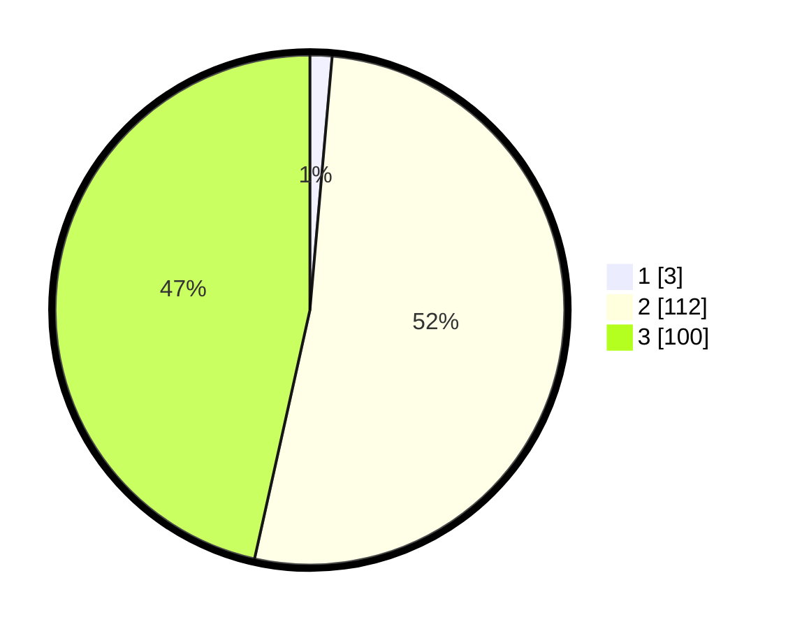

# Hasil

## Grafik

## Tabel

| No. | Nama Paslon    | Suara | Suara (raw) | Persentase |
|:--- |:-------------- | -----:| -----------:| ----------:|
| 1   | ANIES MUHAIMIN | 3     | [3][p-1]    | 1,40       |
| 2   | PRABOWO GIBRAN | 112   | [112][p-2]  | 52,09      |
| 3   | GANJAR MAHFUD  | 100   | [100][p-3]  | 46,51      |

[p-1]: https://github.com/gigit-pemilu/pemilu-2024/blob/main/pilpres/hitung-suara/sub/51-bali/sub/02-tabanan/sub/02-selemadeg-timur/sub/2003-bantas/sub/002-tps/sub/paslon-1.txt
[p-2]: https://github.com/gigit-pemilu/pemilu-2024/blob/main/pilpres/hitung-suara/sub/51-bali/sub/02-tabanan/sub/02-selemadeg-timur/sub/2003-bantas/sub/002-tps/sub/paslon-2.txt
[p-3]: https://github.com/gigit-pemilu/pemilu-2024/blob/main/pilpres/hitung-suara/sub/51-bali/sub/02-tabanan/sub/02-selemadeg-timur/sub/2003-bantas/sub/002-tps/sub/paslon-3.txt

## Foto C Plano

https://sirekap-obj-formc.kpu.go.id/25d9/pemilu/ppwp/51/02/02/20/03/5102022003002-20240215-085709--7644bc97-eb43-4824-9743-6e9f0d9011c7.jpg

https://sirekap-obj-formc.kpu.go.id/25d9/pemilu/ppwp/51/02/02/20/03/5102022003002-20240215-085730--acb09dc8-a516-41aa-9317-1da0a783eea7.jpg

https://sirekap-obj-formc.kpu.go.id/25d9/pemilu/ppwp/51/02/02/20/03/5102022003002-20240215-085720--df14205f-053f-4a16-afcc-eff0d722b8f7.jpg

## Metadata

| Key        | Value               |
| ---------- | ------------------- |
| Time Stamp | 2024-02-15 21:30:27 |

## DATA PEMILIH TETAP

Jumlah pemilih dalam DPT: **235**.
 * L: **116**.
 * P: **119**.

## DATA PENGGUNA HAK PILIH

Jumlah pengguna hak pilih dalam DPT: **212**.
 * L: **104**.
 * P: **108**.

Jumlah pengguna hak pilih dalam DPTb: **4**.
 * L: **1**.
 * P: **3**.

Jumlah pengguna hak pilih dalam DPK: **0**.
 * L: **0**.
 * P: **0**.

Jumlah pengguna hak pilih: **216**.
 * L: **105**.
 * P: **111**.

## JUMLAH SUARA SAH DAN TIDAK SAH

JUMLAH SELURUH SUARA SAH: **215**.

JUMLAH SUARA TIDAK SAH: **1**.

JUMLAH SELURUH SUARA SAH DAN SUARA TIDAK SAH: **216**.

