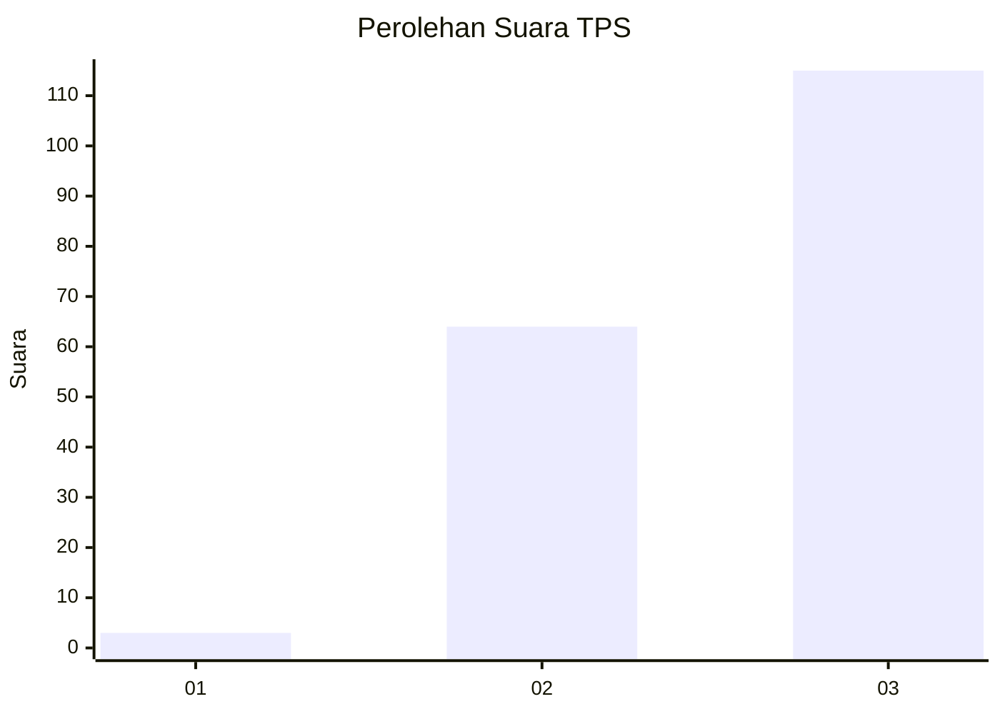
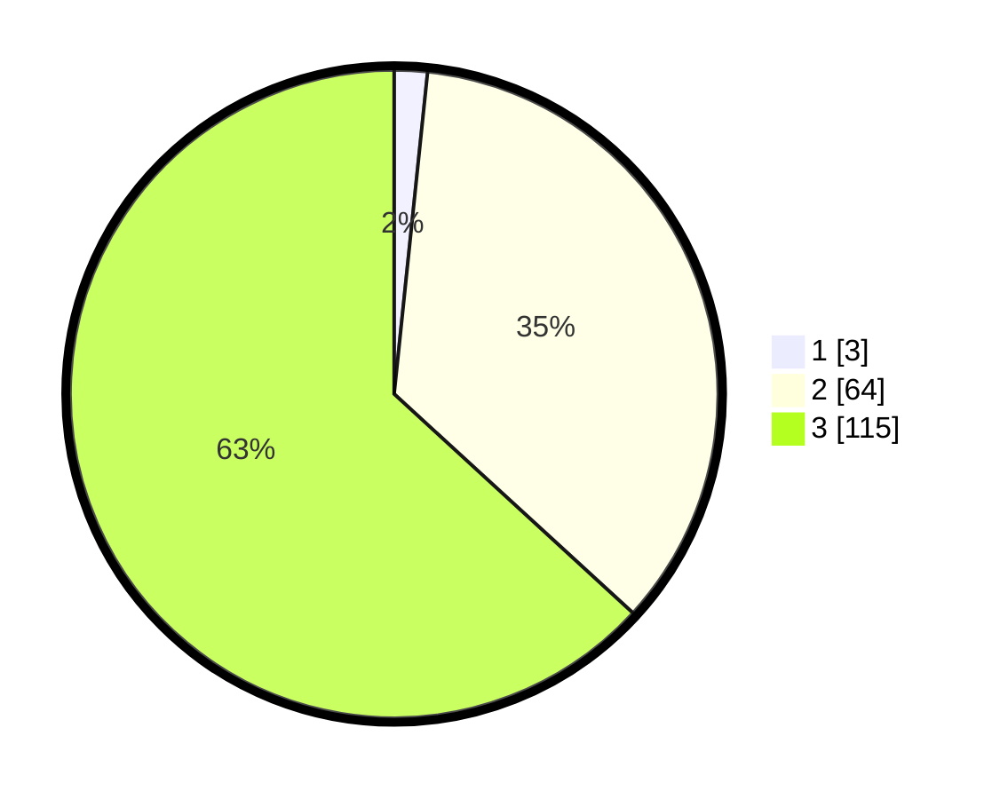

# Hasil

## Grafik

## Tabel

| No. | Nama Paslon    | Suara | Suara (raw) | Persentase |
|:--- |:-------------- | -----:| -----------:| ----------:|
| 1   | ANIES MUHAIMIN | 3     | [3][p-1]    | 1,65       |
| 2   | PRABOWO GIBRAN | 64    | [64][p-2]   | 35,16      |
| 3   | GANJAR MAHFUD  | 115   | [115][p-3]  | 63,19      |

[p-1]: https://github.com/gigit-pemilu/pemilu-2024-51-bali/blob/main/pilpres/hitung-suara/sub/51-bali/sub/02-tabanan/sub/02-selemadeg-timur/sub/2003-bantas/sub/004-tps/sub/paslon-1.txt
[p-2]: https://github.com/gigit-pemilu/pemilu-2024-51-bali/blob/main/pilpres/hitung-suara/sub/51-bali/sub/02-tabanan/sub/02-selemadeg-timur/sub/2003-bantas/sub/004-tps/sub/paslon-2.txt
[p-3]: https://github.com/gigit-pemilu/pemilu-2024-51-bali/blob/main/pilpres/hitung-suara/sub/51-bali/sub/02-tabanan/sub/02-selemadeg-timur/sub/2003-bantas/sub/004-tps/sub/paslon-3.txt

## Foto C Plano

https://sirekap-obj-formc.kpu.go.id/1d3e/pemilu/ppwp/51/02/02/20/03/5102022003004-20240216-143147--e73d1303-320b-43c0-b14f-df6a652bba12.jpg

https://sirekap-obj-formc.kpu.go.id/1d3e/pemilu/ppwp/51/02/02/20/03/5102022003004-20240216-143148--c95c83e7-70b8-4918-9fd7-0dd3da165bb4.jpg

https://sirekap-obj-formc.kpu.go.id/1d3e/pemilu/ppwp/51/02/02/20/03/5102022003004-20240216-143147--19c218ae-529e-46f0-9027-bf214b5a074f.jpg

## Metadata

| Key        | Value               |
| ---------- | ------------------- |
| Time Stamp | 2024-02-21 12:00:00 |

## DATA PEMILIH TETAP

Jumlah pemilih dalam DPT: **196**.
 * L: **92**.
 * P: **104**.

## DATA PENGGUNA HAK PILIH

Jumlah pengguna hak pilih dalam DPT: **181**.
 * L: **86**.
 * P: **95**.

Jumlah pengguna hak pilih dalam DPTb: **2**.
 * L: **0**.
 * P: **2**.

Jumlah pengguna hak pilih dalam DPK: **0**.
 * L: **0**.
 * P: **0**.

Jumlah pengguna hak pilih: **183**.
 * L: **86**.
 * P: **97**.

## JUMLAH SUARA SAH DAN TIDAK SAH

JUMLAH SELURUH SUARA SAH: **182**.

JUMLAH SUARA TIDAK SAH: **1**.

JUMLAH SELURUH SUARA SAH DAN SUARA TIDAK SAH: **183**.

