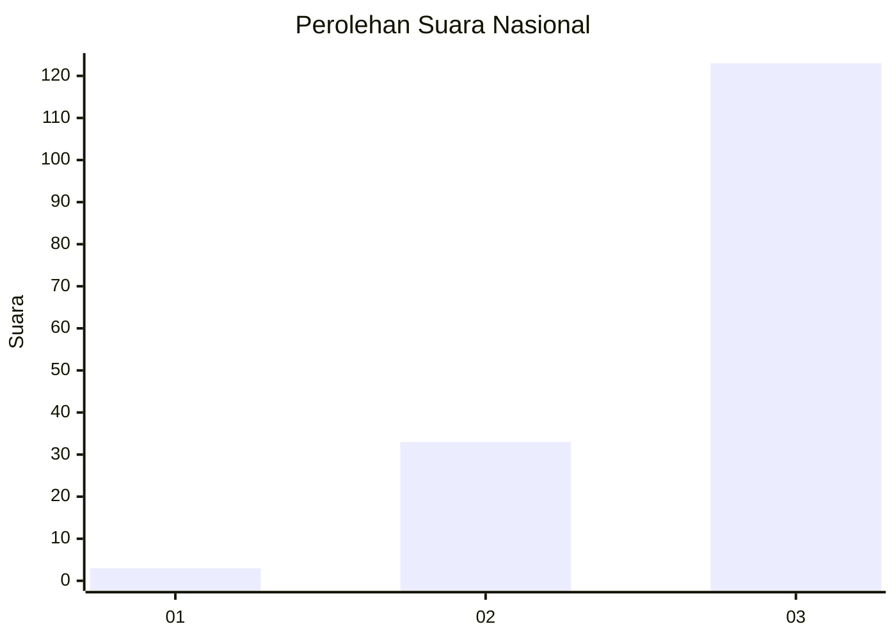
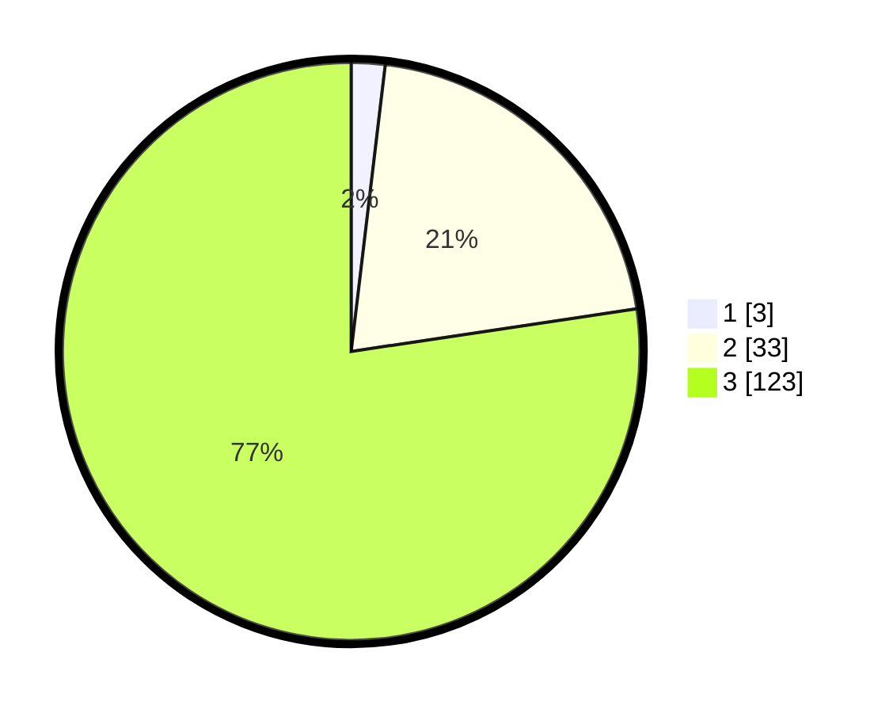

# Hasil

## Grafik

## Tabel

| No. | Nama Paslon    | Suara | Suara (raw) | Persentase |
|:--- |:-------------- | -----:| -----------:| ----------:|
| 1   | ANIES MUHAIMIN | 3     | [3][p-1]    | 1,89       |
| 2   | PRABOWO GIBRAN | 33    | [33][p-2]   | 20,75      |
| 3   | GANJAR MAHFUD  | 123   | [123][p-3]  | 77,36      |

[p-1]: https://github.com/gigit-pemilu/pemilu-2024/blob/main/pilpres/hitung-suara/sub/51-bali/sub/02-tabanan/sub/02-selemadeg-timur/sub/2003-bantas/sub/005-tps/sub/paslon-1.txt
[p-2]: https://github.com/gigit-pemilu/pemilu-2024/blob/main/pilpres/hitung-suara/sub/51-bali/sub/02-tabanan/sub/02-selemadeg-timur/sub/2003-bantas/sub/005-tps/sub/paslon-2.txt
[p-3]: https://github.com/gigit-pemilu/pemilu-2024/blob/main/pilpres/hitung-suara/sub/51-bali/sub/02-tabanan/sub/02-selemadeg-timur/sub/2003-bantas/sub/005-tps/sub/paslon-3.txt

## Foto C Plano

https://sirekap-obj-formc.kpu.go.id/150a/pemilu/ppwp/51/02/02/20/03/5102022003005-20240214-130250--ce67740c-762d-47ad-87be-c3703092b93e.jpg

https://sirekap-obj-formc.kpu.go.id/150a/pemilu/ppwp/51/02/02/20/03/5102022003005-20240214-130435--2c779c1e-2ba3-4aff-946f-7df932a8e12f.jpg

https://sirekap-obj-formc.kpu.go.id/150a/pemilu/ppwp/51/02/02/20/03/5102022003005-20240214-130617--1b5f33d6-ab37-4bbf-b369-b0b0c42058b5.jpg

## Metadata

| Key        | Value               |
| ---------- | ------------------- |
| Time Stamp | 2024-02-14 21:46:01 |

## DATA PEMILIH TETAP

Jumlah pemilih dalam DPT: **182**.
 * L: **95**.
 * P: **87**.

## DATA PENGGUNA HAK PILIH

Jumlah pengguna hak pilih dalam DPT: **161**.
 * L: **85**.
 * P: **76**.

Jumlah pengguna hak pilih dalam DPTb: **3**.
 * L: **1**.
 * P: **2**.

Jumlah pengguna hak pilih dalam DPK: **1**.
 * L: **0**.
 * P: **1**.

Jumlah pengguna hak pilih: **165**.
 * L: **86**.
 * P: **79**.

## JUMLAH SUARA SAH DAN TIDAK SAH

JUMLAH SELURUH SUARA SAH: **159**.

JUMLAH SUARA TIDAK SAH: **6**.

JUMLAH SELURUH SUARA SAH DAN SUARA TIDAK SAH: **165**.

