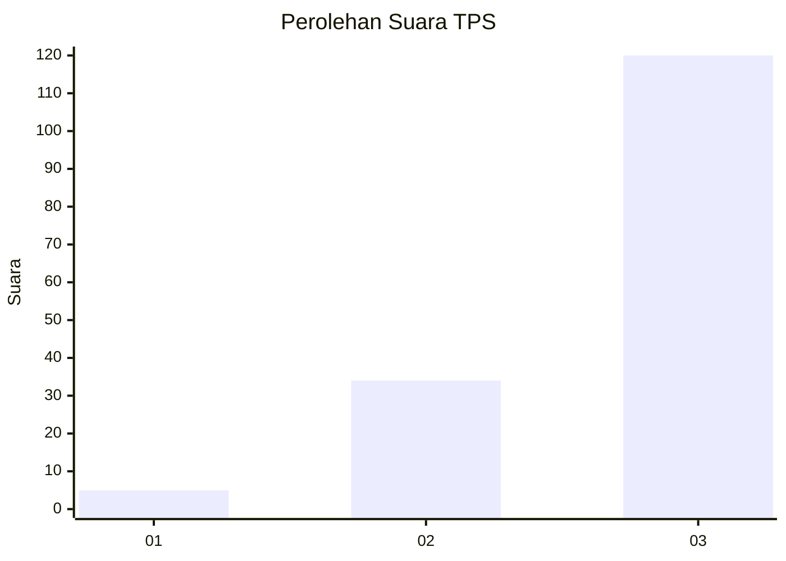
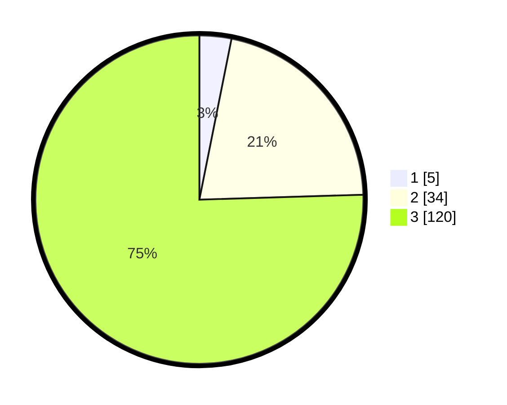

# Hasil

## Grafik

## Tabel

| No. | Nama Paslon    | Suara | Suara (raw) | Persentase |
|:--- |:-------------- | -----:| -----------:| ----------:|
| 1   | ANIES MUHAIMIN | 5     | [5][p-1]    | 3,14       |
| 2   | PRABOWO GIBRAN | 34    | [34][p-2]   | 21,38      |
| 3   | GANJAR MAHFUD  | 120   | [120][p-3]  | 75,47      |

[p-1]: https://github.com/gigit-pemilu/pemilu-2024-51-bali/blob/main/pilpres/hitung-suara/sub/51-bali/sub/02-tabanan/sub/02-selemadeg-timur/sub/2003-bantas/sub/006-tps/sub/paslon-1.txt
[p-2]: https://github.com/gigit-pemilu/pemilu-2024-51-bali/blob/main/pilpres/hitung-suara/sub/51-bali/sub/02-tabanan/sub/02-selemadeg-timur/sub/2003-bantas/sub/006-tps/sub/paslon-2.txt
[p-3]: https://github.com/gigit-pemilu/pemilu-2024-51-bali/blob/main/pilpres/hitung-suara/sub/51-bali/sub/02-tabanan/sub/02-selemadeg-timur/sub/2003-bantas/sub/006-tps/sub/paslon-3.txt

## Foto C Plano

https://sirekap-obj-formc.kpu.go.id/695b/pemilu/ppwp/51/02/02/20/03/5102022003006-20240216-022541--ba043f89-20a9-4154-98d6-80f8a5e5f7da.jpg

https://sirekap-obj-formc.kpu.go.id/695b/pemilu/ppwp/51/02/02/20/03/5102022003006-20240216-022542--93186a18-b85e-45bc-b2ab-eb0388f8c2e7.jpg

https://sirekap-obj-formc.kpu.go.id/695b/pemilu/ppwp/51/02/02/20/03/5102022003006-20240216-022542--af982327-8a41-45d3-a92c-ff103b41bdf4.jpg

## Metadata

| Key        | Value               |
| ---------- | ------------------- |
| Time Stamp | 2024-02-16 09:30:28 |

## DATA PEMILIH TETAP

Jumlah pemilih dalam DPT: **184**.
 * L: **100**.
 * P: **84**.

## DATA PENGGUNA HAK PILIH

Jumlah pengguna hak pilih dalam DPT: **162**.
 * L: **88**.
 * P: **74**.

Jumlah pengguna hak pilih dalam DPTb: **1**.
 * L: **0**.
 * P: **1**.

Jumlah pengguna hak pilih dalam DPK: **0**.
 * L: **0**.
 * P: **0**.

Jumlah pengguna hak pilih: **163**.
 * L: **88**.
 * P: **75**.

## JUMLAH SUARA SAH DAN TIDAK SAH

JUMLAH SELURUH SUARA SAH: **159**.

JUMLAH SUARA TIDAK SAH: **4**.

JUMLAH SELURUH SUARA SAH DAN SUARA TIDAK SAH: **163**.

