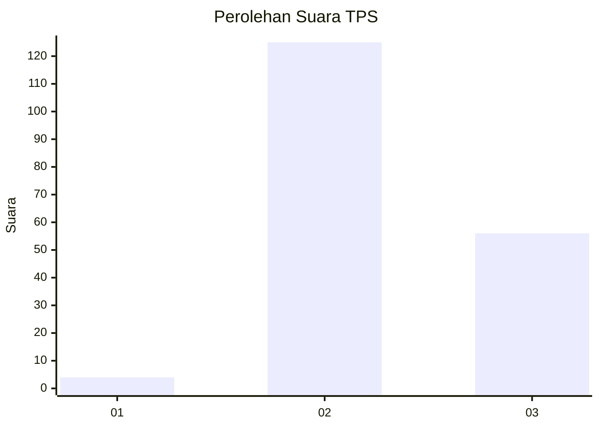

# Hasil

## Grafik

## Tabel

| No. | Nama Paslon    | Suara | Suara (raw) | Persentase |
|:--- |:-------------- | -----:| -----------:| ----------:|
| 1   | ANIES MUHAIMIN | 4     | [4][p-1]    | 2,16       |
| 2   | PRABOWO GIBRAN | 125   | [125][p-2]  | 67,57      |
| 3   | GANJAR MAHFUD  | 56    | [56][p-3]   | 30,27      |

[p-1]: https://github.com/gigit-pemilu/pemilu-2024-51-bali/blob/main/pilpres/hitung-suara/sub/51-bali/sub/02-tabanan/sub/02-selemadeg-timur/sub/2003-bantas/sub/007-tps/sub/paslon-1.txt
[p-2]: https://github.com/gigit-pemilu/pemilu-2024-51-bali/blob/main/pilpres/hitung-suara/sub/51-bali/sub/02-tabanan/sub/02-selemadeg-timur/sub/2003-bantas/sub/007-tps/sub/paslon-2.txt
[p-3]: https://github.com/gigit-pemilu/pemilu-2024-51-bali/blob/main/pilpres/hitung-suara/sub/51-bali/sub/02-tabanan/sub/02-selemadeg-timur/sub/2003-bantas/sub/007-tps/sub/paslon-3.txt

## Foto C Plano

https://sirekap-obj-formc.kpu.go.id/38ba/pemilu/ppwp/51/02/02/20/03/5102022003007-20240216-135111--7c20fee8-d3ac-4ca5-80f0-4f1ced7d04e0.jpg

https://sirekap-obj-formc.kpu.go.id/38ba/pemilu/ppwp/51/02/02/20/03/5102022003007-20240216-135113--71d07fc3-8222-4a7c-84bf-f6cf766597e3.jpg

https://sirekap-obj-formc.kpu.go.id/38ba/pemilu/ppwp/51/02/02/20/03/5102022003007-20240216-135112--df3c4a64-c785-4fc0-9973-d290ebc2e893.jpg

## Metadata

| Key        | Value               |
| ---------- | ------------------- |
| Time Stamp | 2024-02-16 14:30:33 |

## DATA PEMILIH TETAP

Jumlah pemilih dalam DPT: **203**.
 * L: **102**.
 * P: **101**.

## DATA PENGGUNA HAK PILIH

Jumlah pengguna hak pilih dalam DPT: **182**.
 * L: **90**.
 * P: **92**.

Jumlah pengguna hak pilih dalam DPTb: **5**.
 * L: **1**.
 * P: **4**.

Jumlah pengguna hak pilih dalam DPK: **0**.
 * L: **0**.
 * P: **0**.

Jumlah pengguna hak pilih: **187**.
 * L: **91**.
 * P: **96**.

## JUMLAH SUARA SAH DAN TIDAK SAH

JUMLAH SELURUH SUARA SAH: **185**.

JUMLAH SUARA TIDAK SAH: **2**.

JUMLAH SELURUH SUARA SAH DAN SUARA TIDAK SAH: **187**.

