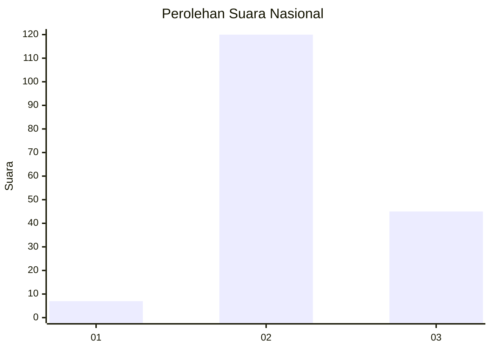

# Hasil

## Grafik

## Tabel

| No. | Nama Paslon    | Suara | Suara (raw) | Persentase |
|:--- |:-------------- | -----:| -----------:| ----------:|
| 1   | ANIES MUHAIMIN | 7     | [7][p-1]    | 4,07       |
| 2   | PRABOWO GIBRAN | 120   | [120][p-2]  | 69,77      |
| 3   | GANJAR MAHFUD  | 45    | [45][p-3]   | 26,16      |

[p-1]: https://github.com/gigit-pemilu/pemilu-2024/blob/main/pilpres/hitung-suara/sub/51-bali/sub/02-tabanan/sub/02-selemadeg-timur/sub/2003-bantas/sub/008-tps/sub/paslon-1.txt
[p-2]: https://github.com/gigit-pemilu/pemilu-2024/blob/main/pilpres/hitung-suara/sub/51-bali/sub/02-tabanan/sub/02-selemadeg-timur/sub/2003-bantas/sub/008-tps/sub/paslon-2.txt
[p-3]: https://github.com/gigit-pemilu/pemilu-2024/blob/main/pilpres/hitung-suara/sub/51-bali/sub/02-tabanan/sub/02-selemadeg-timur/sub/2003-bantas/sub/008-tps/sub/paslon-3.txt

## Foto C Plano

https://sirekap-obj-formc.kpu.go.id/5b11/pemilu/ppwp/51/02/02/20/03/5102022003008-20240216-034000--2b5e8cc2-e102-4c78-8b28-d9875eb18ae1.jpg

https://sirekap-obj-formc.kpu.go.id/5b11/pemilu/ppwp/51/02/02/20/03/5102022003008-20240216-034003--0715520d-8e8b-4e1d-9fc3-c41b9eb839ac.jpg

https://sirekap-obj-formc.kpu.go.id/5b11/pemilu/ppwp/51/02/02/20/03/5102022003008-20240216-034002--bb1fe816-66f7-4deb-b62d-1482bcbf774e.jpg

## Metadata

| Key        | Value               |
| ---------- | ------------------- |
| Time Stamp | 2024-02-16 09:30:28 |

## DATA PEMILIH TETAP

Jumlah pemilih dalam DPT: **203**.
 * L: **100**.
 * P: **103**.

## DATA PENGGUNA HAK PILIH

Jumlah pengguna hak pilih dalam DPT: **181**.
 * L: **91**.
 * P: **90**.

Jumlah pengguna hak pilih dalam DPTb: **2**.
 * L: **1**.
 * P: **1**.

Jumlah pengguna hak pilih dalam DPK: **0**.
 * L: **0**.
 * P: **0**.

Jumlah pengguna hak pilih: **183**.
 * L: **92**.
 * P: **91**.

## JUMLAH SUARA SAH DAN TIDAK SAH

JUMLAH SELURUH SUARA SAH: **172**.

JUMLAH SUARA TIDAK SAH: **11**.

JUMLAH SELURUH SUARA SAH DAN SUARA TIDAK SAH: **183**.

