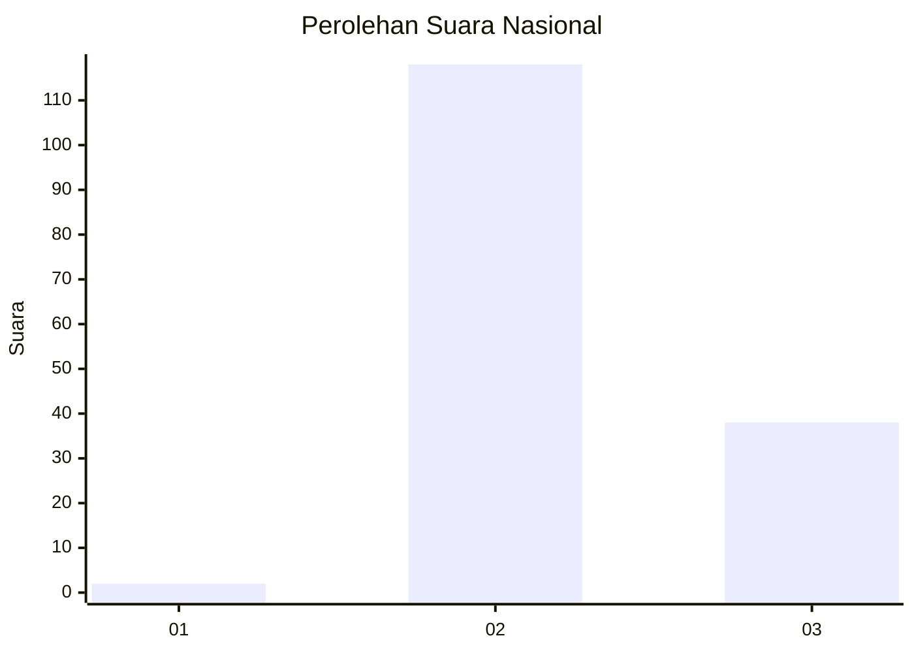
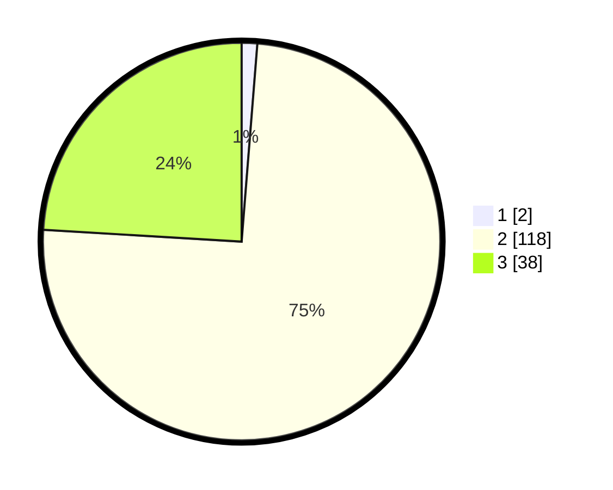

# Hasil

## Grafik

## Tabel

| No. | Nama Paslon    | Suara | Suara (raw) | Persentase |
|:--- |:-------------- | -----:| -----------:| ----------:|
| 1   | ANIES MUHAIMIN | 2     | [2][p-1]    | 1,27       |
| 2   | PRABOWO GIBRAN | 118   | [118][p-2]  | 74,68      |
| 3   | GANJAR MAHFUD  | 38    | [38][p-3]   | 24,05      |

[p-1]: https://github.com/gigit-pemilu/pemilu-2024/blob/main/pilpres/hitung-suara/sub/51-bali/sub/02-tabanan/sub/02-selemadeg-timur/sub/2003-bantas/sub/009-tps/sub/paslon-1.txt
[p-2]: https://github.com/gigit-pemilu/pemilu-2024/blob/main/pilpres/hitung-suara/sub/51-bali/sub/02-tabanan/sub/02-selemadeg-timur/sub/2003-bantas/sub/009-tps/sub/paslon-2.txt
[p-3]: https://github.com/gigit-pemilu/pemilu-2024/blob/main/pilpres/hitung-suara/sub/51-bali/sub/02-tabanan/sub/02-selemadeg-timur/sub/2003-bantas/sub/009-tps/sub/paslon-3.txt

## Foto C Plano

https://sirekap-obj-formc.kpu.go.id/bb12/pemilu/ppwp/51/02/02/20/03/5102022003009-20240216-141228--e03960cf-c9bb-451c-b86c-3490396079ed.jpg

https://sirekap-obj-formc.kpu.go.id/bb12/pemilu/ppwp/51/02/02/20/03/5102022003009-20240216-141229--a1331cdf-e8da-4f02-8057-f6f30e28ab6c.jpg

https://sirekap-obj-formc.kpu.go.id/bb12/pemilu/ppwp/51/02/02/20/03/5102022003009-20240216-141229--f00f491d-6dc4-4929-9c5b-900b9b13fdb6.jpg

## Metadata

| Key        | Value               |
| ---------- | ------------------- |
| Time Stamp | 2024-02-21 11:00:00 |

## DATA PEMILIH TETAP

Jumlah pemilih dalam DPT: **203**.
 * L: **95**.
 * P: **108**.

## DATA PENGGUNA HAK PILIH

Jumlah pengguna hak pilih dalam DPT: **174**.
 * L: **85**.
 * P: **89**.

Jumlah pengguna hak pilih dalam DPTb: **0**.
 * L: **0**.
 * P: **0**.

Jumlah pengguna hak pilih dalam DPK: **2**.
 * L: **2**.
 * P: **0**.

Jumlah pengguna hak pilih: **176**.
 * L: **87**.
 * P: **89**.

## JUMLAH SUARA SAH DAN TIDAK SAH

JUMLAH SELURUH SUARA SAH: **158**.

JUMLAH SUARA TIDAK SAH: **18**.

JUMLAH SELURUH SUARA SAH DAN SUARA TIDAK SAH: **176**.

