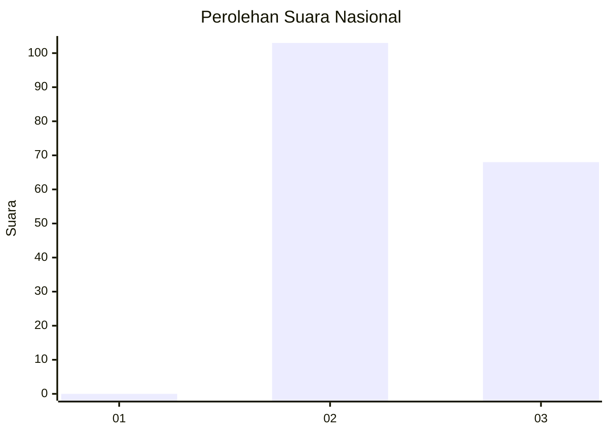
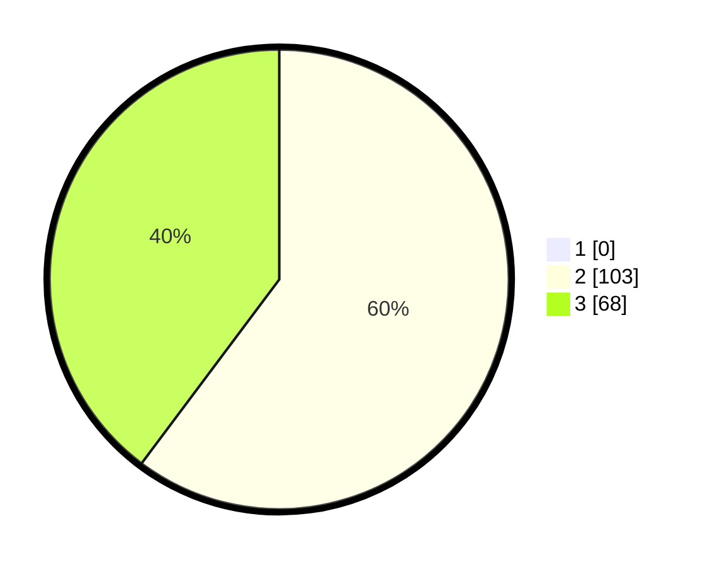

# Hasil

## Grafik

## Tabel

| No. | Nama Paslon    | Suara | Suara (raw) | Persentase |
|:--- |:-------------- | -----:| -----------:| ----------:|
| 1   | ANIES MUHAIMIN | 0     | [0][p-1]    | 0,00       |
| 2   | PRABOWO GIBRAN | 103   | [103][p-2]  | 60,23      |
| 3   | GANJAR MAHFUD  | 68    | [68][p-3]   | 39,77      |

[p-1]: https://github.com/gigit-pemilu/pemilu-2024/blob/main/pilpres/hitung-suara/sub/51-bali/sub/02-tabanan/sub/02-selemadeg-timur/sub/2003-bantas/sub/011-tps/sub/paslon-1.txt
[p-2]: https://github.com/gigit-pemilu/pemilu-2024/blob/main/pilpres/hitung-suara/sub/51-bali/sub/02-tabanan/sub/02-selemadeg-timur/sub/2003-bantas/sub/011-tps/sub/paslon-2.txt
[p-3]: https://github.com/gigit-pemilu/pemilu-2024/blob/main/pilpres/hitung-suara/sub/51-bali/sub/02-tabanan/sub/02-selemadeg-timur/sub/2003-bantas/sub/011-tps/sub/paslon-3.txt

## Foto C Plano

https://sirekap-obj-formc.kpu.go.id/4771/pemilu/ppwp/51/02/02/20/03/5102022003011-20240216-045510--6bd48c27-b89a-47ef-9cf4-e51f70e0602b.jpg

https://sirekap-obj-formc.kpu.go.id/4771/pemilu/ppwp/51/02/02/20/03/5102022003011-20240216-045511--1448eb90-dc7d-43fc-a84a-4a9a194490e3.jpg

https://sirekap-obj-formc.kpu.go.id/4771/pemilu/ppwp/51/02/02/20/03/5102022003011-20240216-045510--c080886f-eb33-4378-810f-6c8977dce32c.jpg

## Metadata

| Key        | Value               |
| ---------- | ------------------- |
| Time Stamp | 2024-02-16 09:30:28 |

## DATA PEMILIH TETAP

Jumlah pemilih dalam DPT: **211**.
 * L: **112**.
 * P: **99**.

## DATA PENGGUNA HAK PILIH

Jumlah pengguna hak pilih dalam DPT: **177**.
 * L: **101**.
 * P: **76**.

Jumlah pengguna hak pilih dalam DPTb: **0**.
 * L: **0**.
 * P: **0**.

Jumlah pengguna hak pilih dalam DPK: **0**.
 * L: **0**.
 * P: **0**.

Jumlah pengguna hak pilih: **177**.
 * L: **101**.
 * P: **76**.

## JUMLAH SUARA SAH DAN TIDAK SAH

JUMLAH SELURUH SUARA SAH: **171**.

JUMLAH SUARA TIDAK SAH: **6**.

JUMLAH SELURUH SUARA SAH DAN SUARA TIDAK SAH: **177**.

