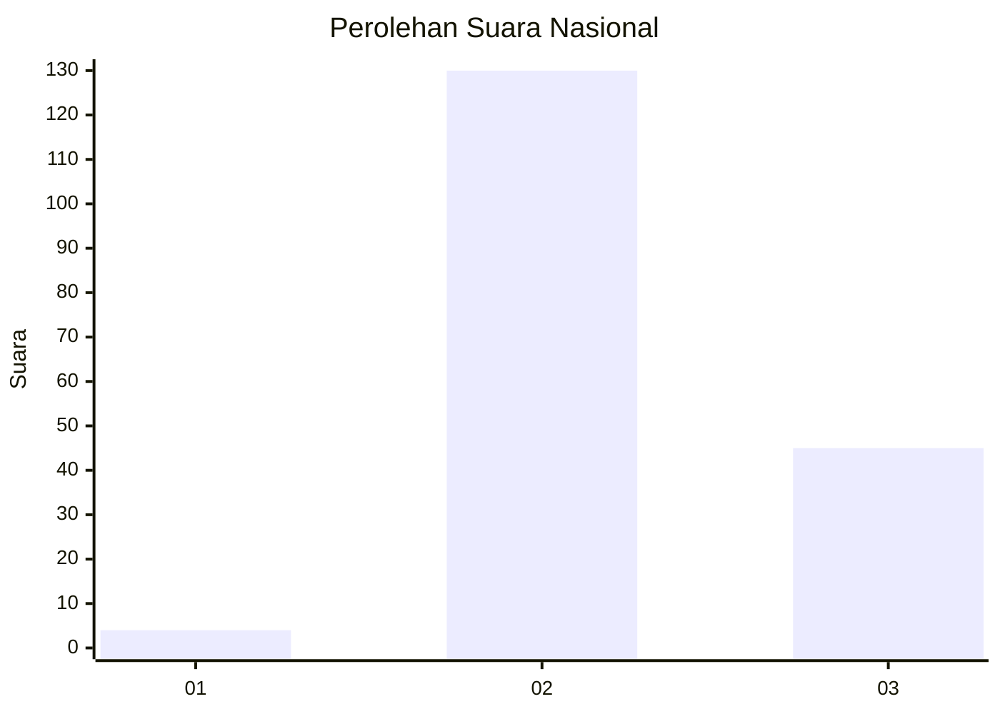
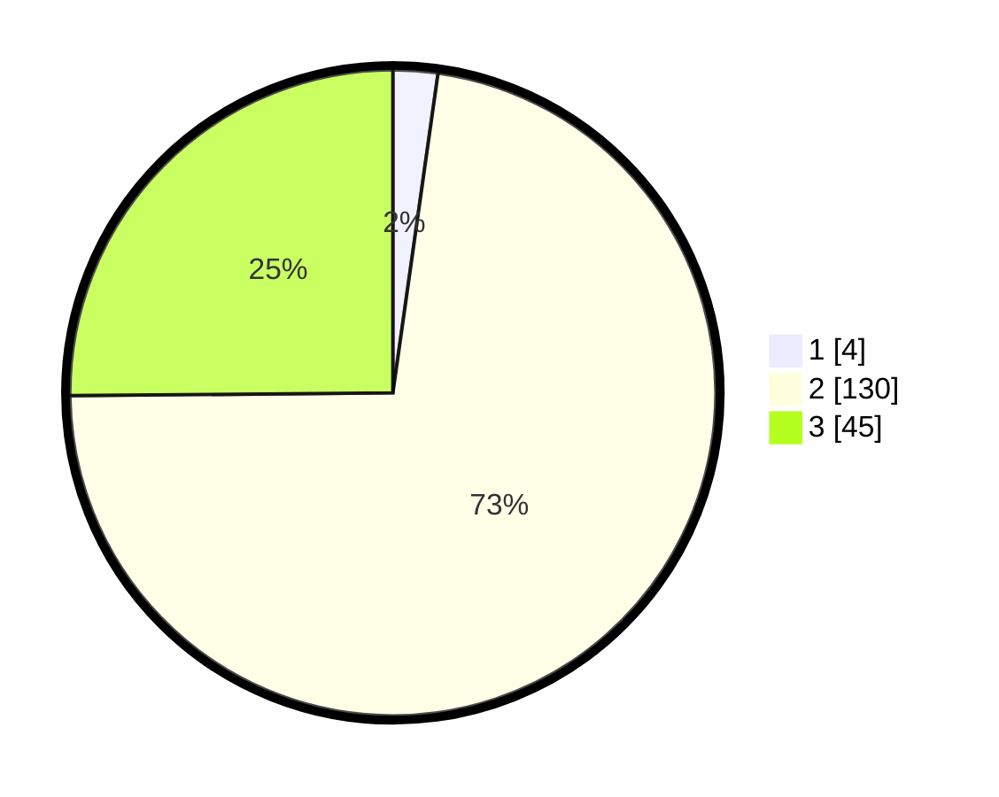

# Hasil

## Grafik

## Tabel

| No. | Nama Paslon    | Suara | Suara (raw) | Persentase |
|:--- |:-------------- | -----:| -----------:| ----------:|
| 1   | ANIES MUHAIMIN | 4     | [4][p-1]    | 2,23       |
| 2   | PRABOWO GIBRAN | 130   | [130][p-2]  | 72,63      |
| 3   | GANJAR MAHFUD  | 45    | [45][p-3]   | 25,14      |

[p-1]: https://github.com/gigit-pemilu/pemilu-2024/blob/main/pilpres/hitung-suara/sub/51-bali/sub/02-tabanan/sub/02-selemadeg-timur/sub/2003-bantas/sub/012-tps/sub/paslon-1.txt
[p-2]: https://github.com/gigit-pemilu/pemilu-2024/blob/main/pilpres/hitung-suara/sub/51-bali/sub/02-tabanan/sub/02-selemadeg-timur/sub/2003-bantas/sub/012-tps/sub/paslon-2.txt
[p-3]: https://github.com/gigit-pemilu/pemilu-2024/blob/main/pilpres/hitung-suara/sub/51-bali/sub/02-tabanan/sub/02-selemadeg-timur/sub/2003-bantas/sub/012-tps/sub/paslon-3.txt

## Foto C Plano

https://sirekap-obj-formc.kpu.go.id/97a0/pemilu/ppwp/51/02/02/20/03/5102022003012-20240215-222029--0651b894-4f91-49a4-99f7-91500409df3b.jpg

https://sirekap-obj-formc.kpu.go.id/97a0/pemilu/ppwp/51/02/02/20/03/5102022003012-20240215-222030--7901a6ba-56ca-4b69-b778-1b0402ac8909.jpg

https://sirekap-obj-formc.kpu.go.id/97a0/pemilu/ppwp/51/02/02/20/03/5102022003012-20240215-222029--5ce55b7c-ffc8-4650-a4c1-f6cb3361d92b.jpg

## Metadata

| Key        | Value               |
| ---------- | ------------------- |
| Time Stamp | 2024-02-16 09:30:28 |

## DATA PEMILIH TETAP

Jumlah pemilih dalam DPT: **206**.
 * L: **98**.
 * P: **108**.

## DATA PENGGUNA HAK PILIH

Jumlah pengguna hak pilih dalam DPT: **179**.
 * L: **84**.
 * P: **95**.

Jumlah pengguna hak pilih dalam DPTb: **1**.
 * L: **0**.
 * P: **1**.

Jumlah pengguna hak pilih dalam DPK: **0**.
 * L: **0**.
 * P: **0**.

Jumlah pengguna hak pilih: **180**.
 * L: **84**.
 * P: **96**.

## JUMLAH SUARA SAH DAN TIDAK SAH

JUMLAH SELURUH SUARA SAH: **179**.

JUMLAH SUARA TIDAK SAH: **1**.

JUMLAH SELURUH SUARA SAH DAN SUARA TIDAK SAH: **180**.

