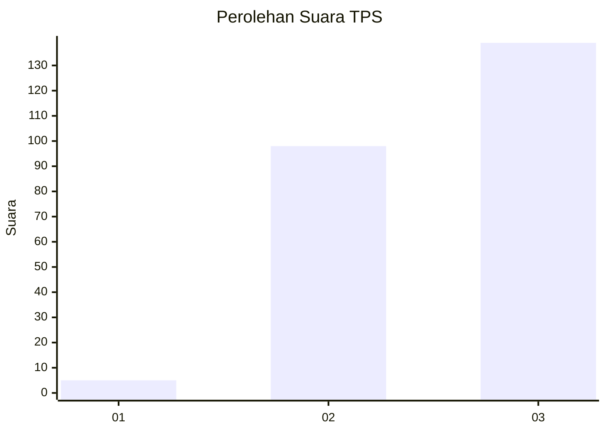
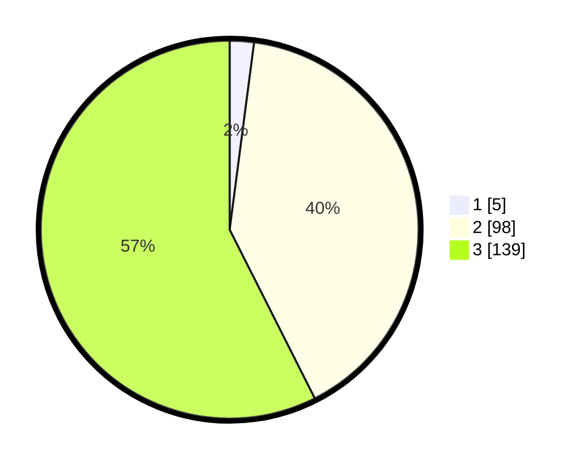

# Hasil

## Grafik

## Tabel

| No. | Nama Paslon    | Suara | Suara (raw) | Persentase |
|:--- |:-------------- | -----:| -----------:| ----------:|
| 1   | ANIES MUHAIMIN | 5     | [5][p-1]    | 2,07       |
| 2   | PRABOWO GIBRAN | 98    | [98][p-2]   | 40,50      |
| 3   | GANJAR MAHFUD  | 139   | [139][p-3]  | 57,44      |

[p-1]: https://github.com/gigit-pemilu/pemilu-2024-51-bali/blob/main/pilpres/hitung-suara/sub/51-bali/sub/02-tabanan/sub/02-selemadeg-timur/sub/2003-bantas/sub/013-tps/sub/paslon-1.txt
[p-2]: https://github.com/gigit-pemilu/pemilu-2024-51-bali/blob/main/pilpres/hitung-suara/sub/51-bali/sub/02-tabanan/sub/02-selemadeg-timur/sub/2003-bantas/sub/013-tps/sub/paslon-2.txt
[p-3]: https://github.com/gigit-pemilu/pemilu-2024-51-bali/blob/main/pilpres/hitung-suara/sub/51-bali/sub/02-tabanan/sub/02-selemadeg-timur/sub/2003-bantas/sub/013-tps/sub/paslon-3.txt

## Foto C Plano

https://sirekap-obj-formc.kpu.go.id/59ac/pemilu/ppwp/51/02/02/20/03/5102022003013-20240216-135843--1e13f02f-c878-41ad-aa22-a8d6b0b181a5.jpg

https://sirekap-obj-formc.kpu.go.id/59ac/pemilu/ppwp/51/02/02/20/03/5102022003013-20240216-135844--5dba0ff5-4346-4fba-a111-ccc035ff6766.jpg

https://sirekap-obj-formc.kpu.go.id/59ac/pemilu/ppwp/51/02/02/20/03/5102022003013-20240216-135843--e71c54dd-4cae-443b-8269-b956c5b11e5f.jpg

## Metadata

| Key        | Value               |
| ---------- | ------------------- |
| Time Stamp | 2024-02-16 14:30:33 |

## DATA PEMILIH TETAP

Jumlah pemilih dalam DPT: **262**.
 * L: **133**.
 * P: **129**.

## DATA PENGGUNA HAK PILIH

Jumlah pengguna hak pilih dalam DPT: **243**.
 * L: **123**.
 * P: **120**.

Jumlah pengguna hak pilih dalam DPTb: **0**.
 * L: **0**.
 * P: **0**.

Jumlah pengguna hak pilih dalam DPK: **1**.
 * L: **0**.
 * P: **1**.

Jumlah pengguna hak pilih: **244**.
 * L: **123**.
 * P: **121**.

## JUMLAH SUARA SAH DAN TIDAK SAH

JUMLAH SELURUH SUARA SAH: **242**.

JUMLAH SUARA TIDAK SAH: **2**.

JUMLAH SELURUH SUARA SAH DAN SUARA TIDAK SAH: **244**.

