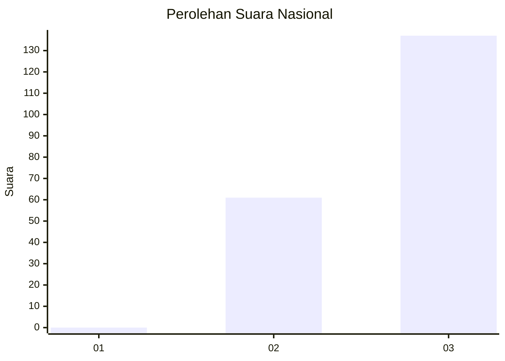
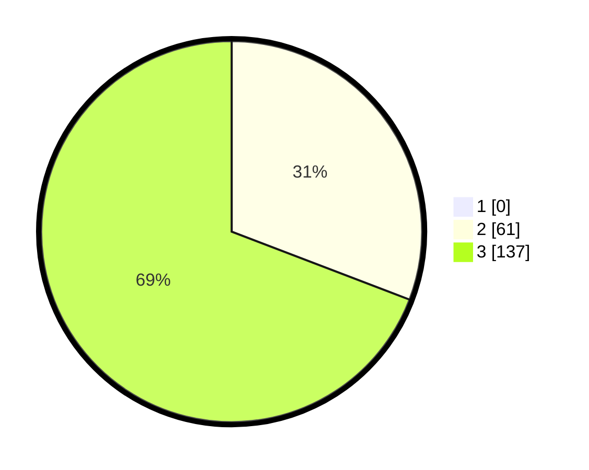

# Hasil

## Grafik

## Tabel

| No. | Nama Paslon    | Suara | Suara (raw) | Persentase |
|:--- |:-------------- | -----:| -----------:| ----------:|
| 1   | ANIES MUHAIMIN | 0     | [0][p-1]    | 0,00       |
| 2   | PRABOWO GIBRAN | 61    | [61][p-2]   | 30,81      |
| 3   | GANJAR MAHFUD  | 137   | [137][p-3]  | 69,19      |

[p-1]: https://github.com/gigit-pemilu/pemilu-2024/blob/main/pilpres/hitung-suara/sub/51-bali/sub/02-tabanan/sub/02-selemadeg-timur/sub/2004-mambang/sub/001-tps/sub/paslon-1.txt
[p-2]: https://github.com/gigit-pemilu/pemilu-2024/blob/main/pilpres/hitung-suara/sub/51-bali/sub/02-tabanan/sub/02-selemadeg-timur/sub/2004-mambang/sub/001-tps/sub/paslon-2.txt
[p-3]: https://github.com/gigit-pemilu/pemilu-2024/blob/main/pilpres/hitung-suara/sub/51-bali/sub/02-tabanan/sub/02-selemadeg-timur/sub/2004-mambang/sub/001-tps/sub/paslon-3.txt

## Foto C Plano

https://sirekap-obj-formc.kpu.go.id/e6b1/pemilu/ppwp/51/02/02/20/04/5102022004001-20240215-232800--c12a4aee-812f-48dc-a0ec-cf83b4f26af2.jpg

https://sirekap-obj-formc.kpu.go.id/e6b1/pemilu/ppwp/51/02/02/20/04/5102022004001-20240215-232804--06625a65-097e-495c-a95f-f5d1e6728cb1.jpg

https://sirekap-obj-formc.kpu.go.id/e6b1/pemilu/ppwp/51/02/02/20/04/5102022004001-20240215-232801--31c83c9f-ba8a-4512-b19b-1d48d196450b.jpg

## Metadata

| Key        | Value               |
| ---------- | ------------------- |
| Time Stamp | 2024-02-16 09:30:28 |

## DATA PEMILIH TETAP

Jumlah pemilih dalam DPT: **217**.
 * L: **113**.
 * P: **104**.

## DATA PENGGUNA HAK PILIH

Jumlah pengguna hak pilih dalam DPT: **199**.
 * L: **102**.
 * P: **97**.

Jumlah pengguna hak pilih dalam DPTb: **0**.
 * L: **0**.
 * P: **0**.

Jumlah pengguna hak pilih dalam DPK: **0**.
 * L: **0**.
 * P: **0**.

Jumlah pengguna hak pilih: **199**.
 * L: **102**.
 * P: **97**.

## JUMLAH SUARA SAH DAN TIDAK SAH

JUMLAH SELURUH SUARA SAH: **198**.

JUMLAH SUARA TIDAK SAH: **1**.

JUMLAH SELURUH SUARA SAH DAN SUARA TIDAK SAH: **199**.

