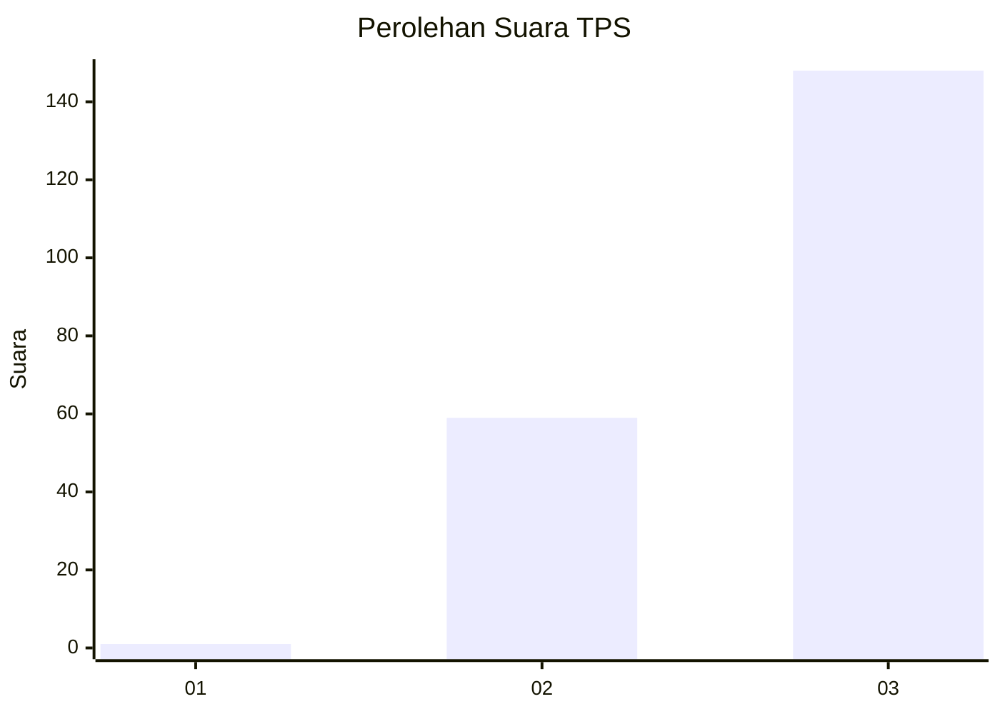
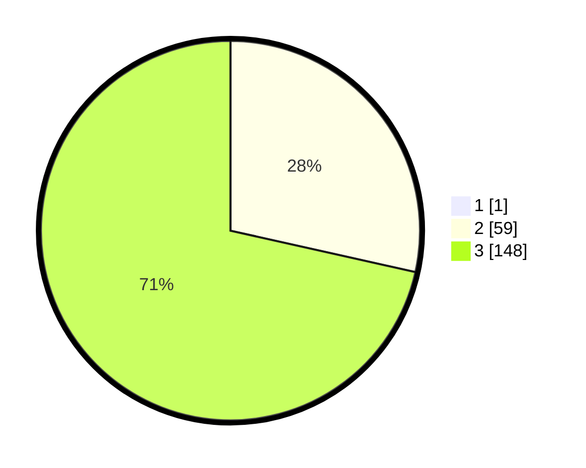

# Hasil

## Grafik

## Tabel

| No. | Nama Paslon    | Suara | Suara (raw) | Persentase |
|:--- |:-------------- | -----:| -----------:| ----------:|
| 1   | ANIES MUHAIMIN | 1     | [1][p-1]    | 0,48       |
| 2   | PRABOWO GIBRAN | 59    | [59][p-2]   | 28,37      |
| 3   | GANJAR MAHFUD  | 148   | [148][p-3]  | 71,15      |

[p-1]: https://github.com/gigit-pemilu/pemilu-2024-51-bali/blob/main/pilpres/hitung-suara/sub/51-bali/sub/02-tabanan/sub/02-selemadeg-timur/sub/2004-mambang/sub/002-tps/sub/paslon-1.txt
[p-2]: https://github.com/gigit-pemilu/pemilu-2024-51-bali/blob/main/pilpres/hitung-suara/sub/51-bali/sub/02-tabanan/sub/02-selemadeg-timur/sub/2004-mambang/sub/002-tps/sub/paslon-2.txt
[p-3]: https://github.com/gigit-pemilu/pemilu-2024-51-bali/blob/main/pilpres/hitung-suara/sub/51-bali/sub/02-tabanan/sub/02-selemadeg-timur/sub/2004-mambang/sub/002-tps/sub/paslon-3.txt

## Foto C Plano

https://sirekap-obj-formc.kpu.go.id/e837/pemilu/ppwp/51/02/02/20/04/5102022004002-20240216-135055--c618f8c6-d569-4ffa-a11a-f013480baebd.jpg

https://sirekap-obj-formc.kpu.go.id/e837/pemilu/ppwp/51/02/02/20/04/5102022004002-20240216-135056--f8f99460-550c-45b5-b312-83b844efff64.jpg

https://sirekap-obj-formc.kpu.go.id/e837/pemilu/ppwp/51/02/02/20/04/5102022004002-20240216-135056--fa53fe87-9f6e-4e0d-a2da-54444f3c430d.jpg

## Metadata

| Key        | Value               |
| ---------- | ------------------- |
| Time Stamp | 2024-02-16 14:30:33 |

## DATA PEMILIH TETAP

Jumlah pemilih dalam DPT: **217**.
 * L: **107**.
 * P: **110**.

## DATA PENGGUNA HAK PILIH

Jumlah pengguna hak pilih dalam DPT: **207**.
 * L: **105**.
 * P: **102**.

Jumlah pengguna hak pilih dalam DPTb: **1**.
 * L: **1**.
 * P: **0**.

Jumlah pengguna hak pilih dalam DPK: **0**.
 * L: **0**.
 * P: **0**.

Jumlah pengguna hak pilih: **208**.
 * L: **106**.
 * P: **102**.

## JUMLAH SUARA SAH DAN TIDAK SAH

JUMLAH SELURUH SUARA SAH: **208**.

JUMLAH SUARA TIDAK SAH: **0**.

JUMLAH SELURUH SUARA SAH DAN SUARA TIDAK SAH: **208**.

