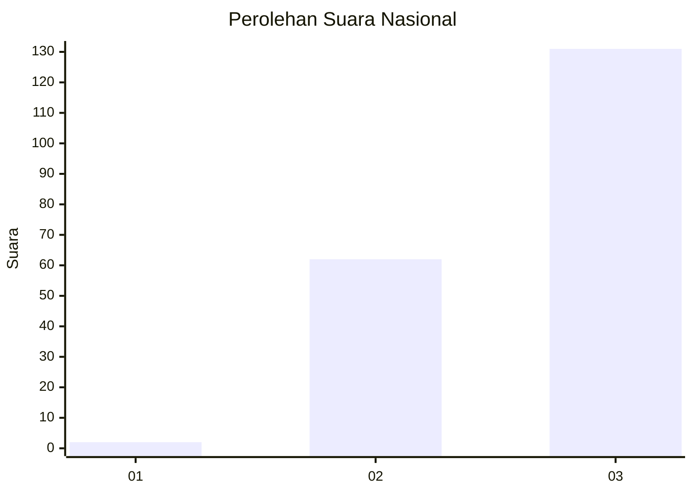
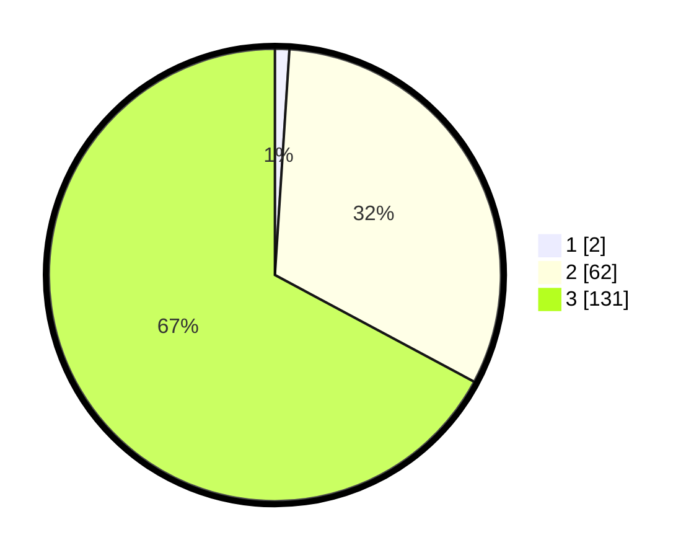

# Hasil

## Grafik

## Tabel

| No. | Nama Paslon    | Suara | Suara (raw) | Persentase |
|:--- |:-------------- | -----:| -----------:| ----------:|
| 1   | ANIES MUHAIMIN | 2     | [2][p-1]    | 1,03       |
| 2   | PRABOWO GIBRAN | 62    | [62][p-2]   | 31,79      |
| 3   | GANJAR MAHFUD  | 131   | [131][p-3]  | 67,18      |

[p-1]: https://github.com/gigit-pemilu/pemilu-2024/blob/main/pilpres/hitung-suara/sub/51-bali/sub/02-tabanan/sub/02-selemadeg-timur/sub/2004-mambang/sub/003-tps/sub/paslon-1.txt
[p-2]: https://github.com/gigit-pemilu/pemilu-2024/blob/main/pilpres/hitung-suara/sub/51-bali/sub/02-tabanan/sub/02-selemadeg-timur/sub/2004-mambang/sub/003-tps/sub/paslon-2.txt
[p-3]: https://github.com/gigit-pemilu/pemilu-2024/blob/main/pilpres/hitung-suara/sub/51-bali/sub/02-tabanan/sub/02-selemadeg-timur/sub/2004-mambang/sub/003-tps/sub/paslon-3.txt

## Foto C Plano

https://sirekap-obj-formc.kpu.go.id/4490/pemilu/ppwp/51/02/02/20/04/5102022004003-20240216-145004--c87b3af2-a21c-4f48-945b-3c9568d07fc6.jpg

https://sirekap-obj-formc.kpu.go.id/4490/pemilu/ppwp/51/02/02/20/04/5102022004003-20240216-145006--245e5642-ea51-4d16-b354-3ca747be194f.jpg

https://sirekap-obj-formc.kpu.go.id/4490/pemilu/ppwp/51/02/02/20/04/5102022004003-20240216-145005--a869dec9-6520-4f37-8922-b6a90ca93be6.jpg

## Metadata

| Key        | Value               |
| ---------- | ------------------- |
| Time Stamp | 2024-02-21 18:00:00 |

## DATA PEMILIH TETAP

Jumlah pemilih dalam DPT: **216**.
 * L: **98**.
 * P: **118**.

## DATA PENGGUNA HAK PILIH

Jumlah pengguna hak pilih dalam DPT: **196**.
 * L: **89**.
 * P: **107**.

Jumlah pengguna hak pilih dalam DPTb: **5**.
 * L: **3**.
 * P: **2**.

Jumlah pengguna hak pilih dalam DPK: **1**.
 * L: **0**.
 * P: **1**.

Jumlah pengguna hak pilih: **202**.
 * L: **92**.
 * P: **110**.

## JUMLAH SUARA SAH DAN TIDAK SAH

JUMLAH SELURUH SUARA SAH: **195**.

JUMLAH SUARA TIDAK SAH: **7**.

JUMLAH SELURUH SUARA SAH DAN SUARA TIDAK SAH: **202**.

