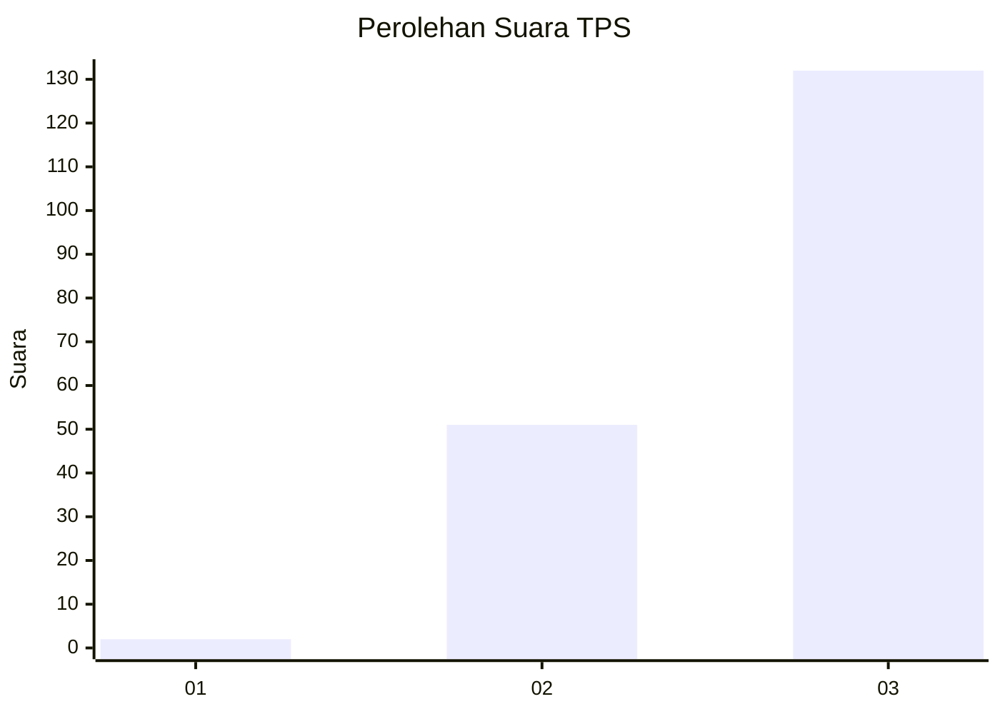
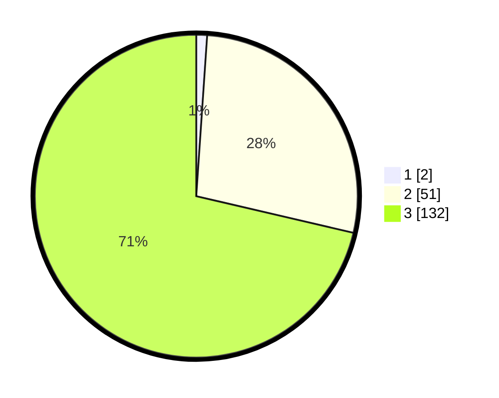

# Hasil

## Grafik

## Tabel

| No. | Nama Paslon    | Suara | Suara (raw) | Persentase |
|:--- |:-------------- | -----:| -----------:| ----------:|
| 1   | ANIES MUHAIMIN | 2     | [2][p-1]    | 1,08       |
| 2   | PRABOWO GIBRAN | 51    | [51][p-2]   | 27,57      |
| 3   | GANJAR MAHFUD  | 132   | [132][p-3]  | 71,35      |

[p-1]: https://github.com/gigit-pemilu/pemilu-2024-51-bali/blob/main/pilpres/hitung-suara/sub/51-bali/sub/02-tabanan/sub/02-selemadeg-timur/sub/2004-mambang/sub/004-tps/sub/paslon-1.txt
[p-2]: https://github.com/gigit-pemilu/pemilu-2024-51-bali/blob/main/pilpres/hitung-suara/sub/51-bali/sub/02-tabanan/sub/02-selemadeg-timur/sub/2004-mambang/sub/004-tps/sub/paslon-2.txt
[p-3]: https://github.com/gigit-pemilu/pemilu-2024-51-bali/blob/main/pilpres/hitung-suara/sub/51-bali/sub/02-tabanan/sub/02-selemadeg-timur/sub/2004-mambang/sub/004-tps/sub/paslon-3.txt

## Foto C Plano

https://sirekap-obj-formc.kpu.go.id/0ce9/pemilu/ppwp/51/02/02/20/04/5102022004004-20240216-133429--c8604069-936e-4c14-af37-ce6e0e1fcbbb.jpg

https://sirekap-obj-formc.kpu.go.id/0ce9/pemilu/ppwp/51/02/02/20/04/5102022004004-20240216-133430--1fee3253-ad90-4411-bd02-90730c762d28.jpg

https://sirekap-obj-formc.kpu.go.id/0ce9/pemilu/ppwp/51/02/02/20/04/5102022004004-20240216-133429--a2f50931-6a0d-4360-94b6-18b4a9613c70.jpg

## Metadata

| Key        | Value               |
| ---------- | ------------------- |
| Time Stamp | 2024-02-16 14:00:34 |

## DATA PEMILIH TETAP

Jumlah pemilih dalam DPT: **206**.
 * L: **106**.
 * P: **100**.

## DATA PENGGUNA HAK PILIH

Jumlah pengguna hak pilih dalam DPT: **192**.
 * L: **99**.
 * P: **93**.

Jumlah pengguna hak pilih dalam DPTb: **1**.
 * L: **0**.
 * P: **1**.

Jumlah pengguna hak pilih dalam DPK: **0**.
 * L: **0**.
 * P: **0**.

Jumlah pengguna hak pilih: **193**.
 * L: **99**.
 * P: **94**.

## JUMLAH SUARA SAH DAN TIDAK SAH

JUMLAH SELURUH SUARA SAH: **185**.

JUMLAH SUARA TIDAK SAH: **8**.

JUMLAH SELURUH SUARA SAH DAN SUARA TIDAK SAH: **193**.

